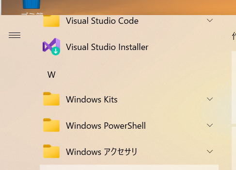

### ラズパイカメラの設定方法

#### （１）Win32 Disk Imagerのダウンロード

https://sourceforge.net/projects/win32diskimager/


#### （２）バックアップイメージの作成

出力先となるimgファイルを作成します。(指定しないと作成してくれません。)

raspi_camera.imgと名前を付けて適当なディレクトリに入れる。

バックアップ元（下図のF）とバックアップ先（raspi_camera.img）を指定する。

チェックをつけてreadを押す


read successfulが出たらOKを押す

#### （３）SDカードのフォーマット

先ほどのデータを新しいSDカードに入れる。

新しいSDカード内にデータがあるかもしれないのでフォーマットする。

SD Card Formatterを入れてなかったらダウンロード、インストールする。


フォーマットを選択。SDカードのデータが空になる。

#### （４）イメージのリストア

リストア元にラズパイのデータが入ったイメージを選択

リストア先に先ほどデータを空にしたSDカードを選択

「Write」を押せばOK


write successfulが出たらOKを押す

#### （５）ラズパイ組み立て

ファンを組付けて配線をする。


カバーをつけて、写真の小指あたりにSDカードをセット、電源をセット


USBカメラをセット、ランケーブルもさす


#### （６）ラズパイ電源ONとリモートアクセス

Windowsアクセサリのリモートデスクトップを選択



リモートデスクトップ画面でIPを記載


usernameとpasswordを記載


ラズパイのデスクトップ画面が表示される


#### （７）ラズパイ電源ONと直アクセス

ネットワーク経由ではなく直接ラズパイの中身を確認する場合は、ラズパイにディスプレイ、マウス、キーボードを接続する。


電源ONでラズパイの中身を確認することができる


#### （８）ラズパイのセッティング方法

##### 有線、無線の設定

ターミナル上で下記コマンドを打つ

```
sudo nano /etc/dhcpcd.conf
```


白塗している部分にIPアドレスと、デフォルトゲートウェイを打つ


上記は無線時の設定。有線の場合は

```
interface eth0
static ip_address=IPアドレス/24
static routers=デフォルトゲートウェイ
```

以上のように書く

##### IPアドレス、MACアドレスの確認

```
ifconfig
```


etherの横に記載されているdc:から始まっている番号

##### コンピュータ名、パスワードの変更

設定のraspberry piの設定をクリック


「ホスト名」と「パスワードを変更」を必要に応じて変更


##### 時刻設定

```
sudo nano /etc/systemd/timesyncd.conf 
```


NTP=172.21.28.101を追記

#### （９）プログラム内容の変更

##### 9-1.video3.pyの変更

thonnyで開く


MAX_CNTを変更すると/home/pi/video/save/ここに保存されている動画数が変更できる


##### 9-2.index.htmlの変更

geanyで開く


下記のipアドレスをラズパイのIPに変更する。

```
<a href="http://172.21.5.160:8080/stream_simple.html">動画1</a>
```

下記のタグ内の日本語を変更すると表示が変わる。

```
   <p class="news-item">
      半割ROD装置のリアルタイム動画サイトです。<br>
      動画1にリアルタイム動画<br>
      動画1ファイルに過去動画があります<br>
      よろしくお願いします。<br>    
  </p>
```


9-1.video3.pyの変更、9-2.index.htmlの変更ともに再起動することで設定が反映される

#### （１０）自動起動しているサービスについて

systemctl list-units --type=service

このコマンドで確認できる

または

systemctl status サービス名

で状態を確認できる。

（１）enginx.servise


5000ポートにアクセスしたらuwsgiで稼働中のサービスを表示させるようにしている


（２）uwsgi4.service

pythonのプログラムをuwsgiで動かしている。


（３）mjpg0.service

mjpg-streamerを自動起動させている


（４）mjpg_video.service 

mjpg_videoを自動起動している


状態確認方法

```
#状態確認
sudo systemctl status mjpg_video
#状態停止
sudo systemctl stop mjpg_video
#設定反映
sudo systemctl daemon-reload
#設定自動起動
sudo systemctl enable mjpg_video
#サービススタート
sudo systemctl start mjpg_video
```


#### （１１）crontab起動しているサービスについて

sudo nano /etc/logrotate.d/uwsgi4_log

sudo nano /home/pi/flask-test4/uwsgi4_log.sh

```
#!/bin/bash
sudo /usr/sbin/logrotate -f /etc/logrotate.d/uwsgi4_log
```

crontab -e

```
00 * * * * sudo bash /home/pi/flask-test4/uwsgi4_log.sh
```

#### （１２）ファイアウォールについて

ファイアウォールで許可しているポート

```
sudo ufw status numbered
```


