### ラズパイカメラの設定方法

#### （１）ip確認

192.168.128.143

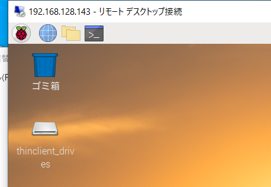

#### （２）mjpgの設定

/home/pi/mjpg/video2.sh

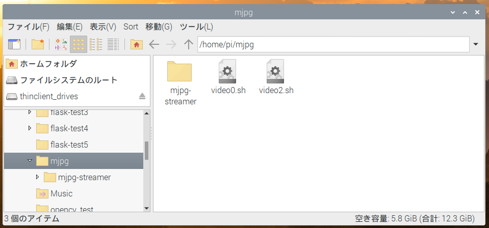

sudo nano /home/pi/mjpg/video2.sh

```bash
cd /home/pi/mjpg/mjpg-streamer/mjpg-streamer-experimental
mjpg_streamer -i "./input_uvc.so -f 10 -r 640x360 -d /dev/video2 -y" -o "./output_http.so -w ./www -p 8081"
```

/etc/systemd/system/mjpg2.service

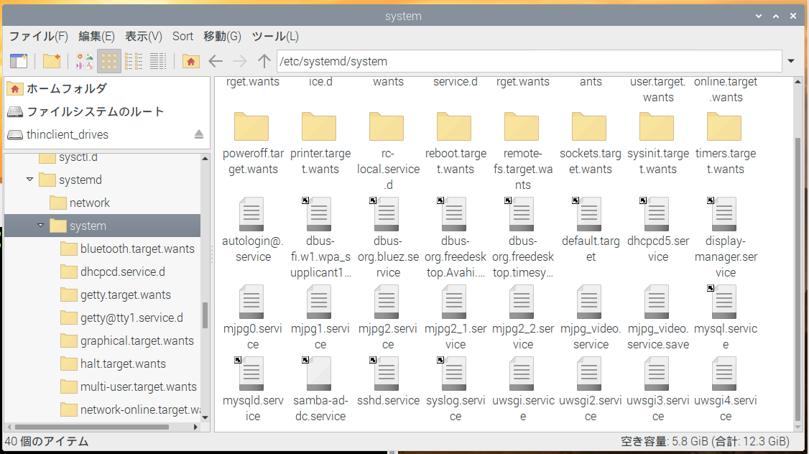

sudo nano /etc/systemd/system/mjpg2.service

```bash
[Unit]
Description = mjpg2
After = multi-user.target
[Service]
ExecStart = /bin/bash /home/pi/mjpg/video2.sh
User=root
Restart=always
#KillSignal=SIGQUIT
Type=simple
#StandardError=syslog
#NotifyAccess=all
[Install]
WantedBy=multi-user.target
```

```
sudo systemctl status mjpg2 //status確認
sudo systemctl daemon-reload
sudo systemctl start mjpg2
sudo systemctl enable mjpg2
```

/home/pi/flask-test4/templates/index.html

```html
<html>
  <head>
    <title>Takatuki Test</title>
  </head>
  <body>
    <h1>AKT Test</h1>
    <a href="http://192.168.128.143:8080/stream_simple.html">動画1</a>
    <a href="http://192.168.128.143:8081/stream_simple.html">動画2</a>
    <a href="/file1">動画1ファイル</a>
    <a href="/file2">動画2ファイル</a>
    <p class="news-item">
      詰替え機のリアルタイム動画サイトです。<br>
      動画1にリアルタイム動画<br>
      動画1ファイルに過去動画があります<br>
      よろしくお願いします。<br>
      
  </p>
  </body>
</html>
```

1025以降はここから

192.168.128.143:5000ブラウザにこれを打てば確認できるようになった

#### （３）flaskとビデオ保存見直し

/home/pi/flask-test4/app.py

```python
import cv2
from flask import Flask, render_template, Response,session
import threading
import numpy as np
from PIL import Image,ImageOps
import io
import time
import datetime
import os
import shutil
from datetime import timedelta
import zipfile
import logging
from logging.handlers import TimedRotatingFileHandler

#from camera import Camera

app = Flask(__name__)
#app.debug = False
app.use_reloader=False


@app.route("/")
def index():
    return render_template("index.html")


# Blueprintを読み込む
import dist
app.register_blueprint(dist.app)

import glob
@app.route('/file1')
def root():
    #files=glob.glob('save/1/20200101/*')
    files=glob.glob('video/save/*')
    files2 = sorted(files)
    html='<html><meta charset="utf-8"><body>'
    html+='<h1>ファイル一覧</h1>'
    for f in files2:
        html+='<p><a href="{0}">{0}</a></p>'.format(f)
    html+='</body></html>'
    return html
#211111追加
@app.route('/file2')
def root2():
    #files=glob.glob('save/1/20200101/*')
    files=glob.glob('video/save2/*')
    files2 = sorted(files)
    html='<html><meta charset="utf-8"><body>'
    html+='<h1>ファイル一覧</h1>'
    for f in files2:
        html+='<p><a href="{0}">{0}</a></p>'.format(f)
    html+='</body></html>'
    return html

if __name__ == "__main__":
    #rootロガーを取得
    logger = logging.getLogger()
    logger.setLevel(logging.DEBUG)
    #出力のフォーマットを定義
    formatter = logging.Formatter('%(asctime)s - %(levelname)s - %(message)s')
    #ファイルへ出力するハンドラーを定義
    #when='D','H','M'
    fh=logging.handlers.TimedRotatingFileHandler(filename='logs/log.txt',
                                                 when='D',
                                                 backupCount=7)
    fh.setLevel(logging.DEBUG)
    fh.setFormatter(formatter)
    #rootロガーにハンドラーを登録する
    logger.addHandler(fh)
    #app.run(host='127.0.0.1', port=8000,threaded=True)
    #app.run(host='192.168.100.111', port=8000,threaded=True, use_reloader=False)
    app.run(host='192.168.100.117', port=8000,threaded=True, use_reloader=False)
    #app.run(host='127.0.0.1', port=8000,threaded=True, use_reloader=False)
```

/home/pi/flask-test4/video4.py

```python
import cv2
import time
import datetime
import os
import shutil
import logging
from logging.handlers import TimedRotatingFileHandler
import sys

#保存
todaydetail = datetime.datetime.today()
t1=todaydetail.strftime("%Y%m%d%H%M")
if int(t1[-1])<5:
    t2=t1[:-1]+'0'
else:
    t2=t1[:-1]+'5'
videoname=t2+'.m4v'

#(1)workディレクトリがない場合は作る
woek_path='./video/work2'
if os.path.exists(woek_path)!=True:
    os.mkdir(woek_path)

#(2)workディレクトリに入っているデータはsaveへ移動最後にworkディレクトリ作成
files1 = os.listdir(woek_path)
for file in files1:
    #os.renames('../video/work2/'+file,'../video/save2/'+file)
    shutil.move('./video/work2/'+file,'./video/save2/'+file)
    if os.path.exists(woek_path)!=True:
        os.mkdir(woek_path)

fmt = cv2.VideoWriter_fourcc('m', 'p', '4', 'v')
fps = 10.0
size = (640, 360)
writer = cv2.VideoWriter('./video/work2/'+videoname, fmt, fps, size)

URL ="http://127.0.0.1:8081/?action=stream"
s_video = cv2.VideoCapture(URL)
err_count=0

#--------------------------
#rootロガーを取得
logger = logging.getLogger()
logger.setLevel(logging.DEBUG)
#出力のフォーマットを定義
formatter = logging.Formatter('%(asctime)s - %(levelname)s - %(message)s')
#ファイルへ出力するハンドラーを定義
#when='D','H','M'
fh=logging.handlers.TimedRotatingFileHandler(filename='logs/videolog2.txt',
                                             when='H',
                                             backupCount=7)
fh.setLevel(logging.DEBUG)
fh.setFormatter(formatter)
#rootロガーにハンドラーを登録する
logger.addHandler(fh)
logger.debug('ロギング 開始')
#--------------------------
logger.info(t1)

try:
    while True:
        #logging.basicConfig(filename='logs/'+t1+'error.log',level=logging.DEBUG)
        
        #t3 = time.perf_counter() * 1000
        start = time.time()
        try:
            ret, frame = s_video.read()
            frame = cv2.resize(frame, size)
        except:
            logger.info('通信エラー')
            logger.info(t1)
            time.sleep(20)
            err_count=err_count+1
            logger.info(err_count)
            s_video = cv2.VideoCapture(URL)
            if err_count==5:
                logger.info('再起動してください')
                break
            continue            
        
        todaydetail = datetime.datetime.today()
        t=todaydetail.strftime("%Y/%m/%d/ %H:%M:%S")
        cv2.putText(frame,t,(2,26),cv2.FONT_HERSHEY_PLAIN, 1, (0,0,255), 2)
        
        #cv2.imshow('frame',frame) 
        writer.write(frame)
        
        nametime1=todaydetail.strftime("%Y%m%d%H%M")
        if int(nametime1[-1])<5:
                nametime2=nametime1[:-1]+'0'
        else:
            nametime2=nametime1[:-1]+'5'
        
        if nametime2!=t2:
                #保存
            writer.release()
            shutil.move('./video/work2/'+videoname,'./video/save2/'+videoname)#20210329変更
            path='./video/save2/'
            files = os.listdir(path)
            files2 = sorted(files)
            MAX_CNT = 10
            for i in range(len(files)-MAX_CNT):
                    logger.info('{}は削除します'.format(files2[i]))
                    os.remove('./video/save2/'+files2[i])
            
            if os.path.exists(woek_path)!=True:
                os.mkdir(woek_path)
            fmt = cv2.VideoWriter_fourcc('m', 'p', '4', 'v')
            fps = 10.0
            size = (640, 360)
            t2=nametime2
            videoname=t2+'.m4v'
            writer = cv2.VideoWriter('./video/work2/'+videoname, fmt, fps, size)
        p_time=time.time() - start    
        sleep_secs = 1 / fps - p_time
        #1/1000は微調整用
        if sleep_secs > 0:
            time.sleep(sleep_secs)
            #print(1)
            #waittime=int(sleep_secs*1000)
        else:
            time.sleep(1/1000)
            #waittime=int((1 / fps)*1000)
            #print(p_time)
        if cv2.waitKey(1) & 0xFF == 13:   
            break
except:
    logger.exception(sys.exc_info())
```

ディレクトリも作っておく

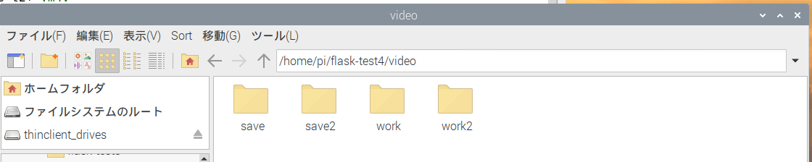

sudo nano /home/pi/flask-test4/video4.sh

```bash
cd /home/pi/flask-test4/
python3 /home/pi/flask-test4/video4.py
```

sudo nano /etc/systemd/system/mjpg_video2.service 

```bash
[Unit]
Description = mjpg_video2
After = multi-user.target
[Service]
WorkingDirectory=/home/pi/flask-test4
ExecStart = /bin/bash /home/pi/flask-test4/video4.sh
User=root
Restart=always
#KillSignal=SIGQUIT
Type=simple
#StandardError=syslog
#NotifyAccess=all
[Install]
WantedBy=multi-user.target
```


```
sudo systemctl status mjpg_video2 //status確認
sudo systemctl daemon-reload
sudo systemctl start mjpg_video2
sudo systemctl enable mjpg_video2
```


#### （※）ラズパイのセッティング方法

##### 有線、無線の設定

ターミナル上で下記コマンドを打つ

```
sudo nano /etc/dhcpcd.conf
```


白塗している部分にIPアドレスと、デフォルトゲートウェイを打つ

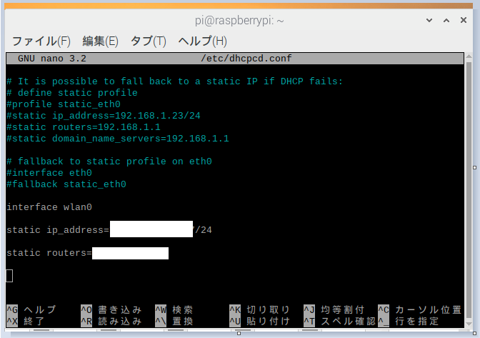

上記は無線時の設定。有線の場合は

```
interface eth0
static ip_address=IPアドレス/24
static routers=デフォルトゲートウェイ
```

以上のように書く

##### IPアドレス、MACアドレスの確認

```
ifconfig
```

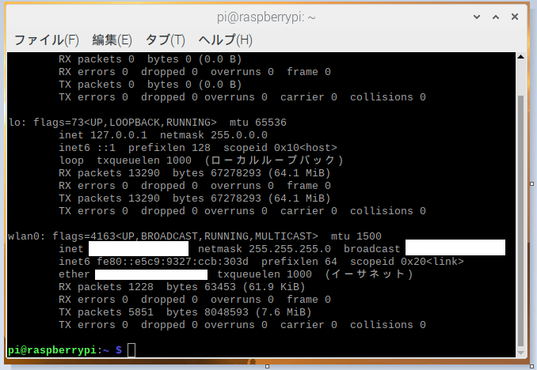

etherの横に記載されているdc:から始まっている番号

##### コンピュータ名、パスワードの変更

設定のraspberry piの設定をクリック

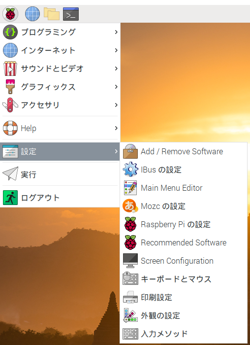

「ホスト名」と「パスワードを変更」を必要に応じて変更

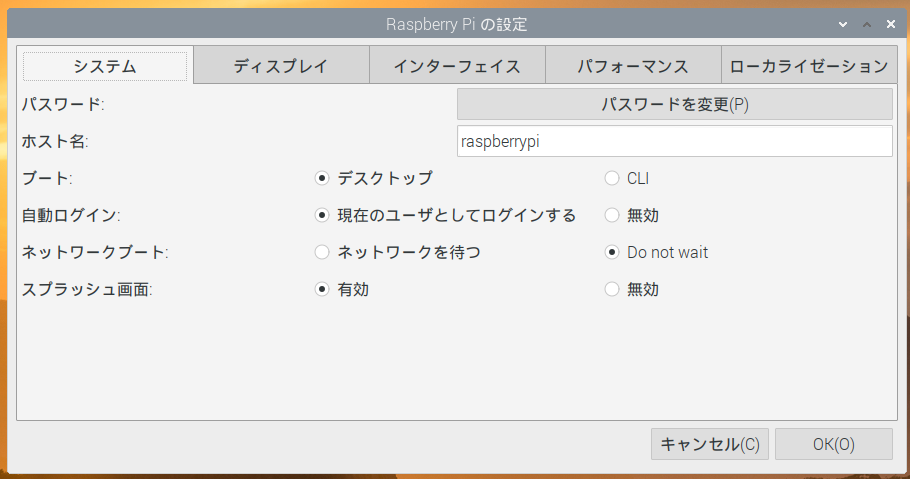

##### 時刻設定

```
sudo nano /etc/systemd/timesyncd.conf 
```

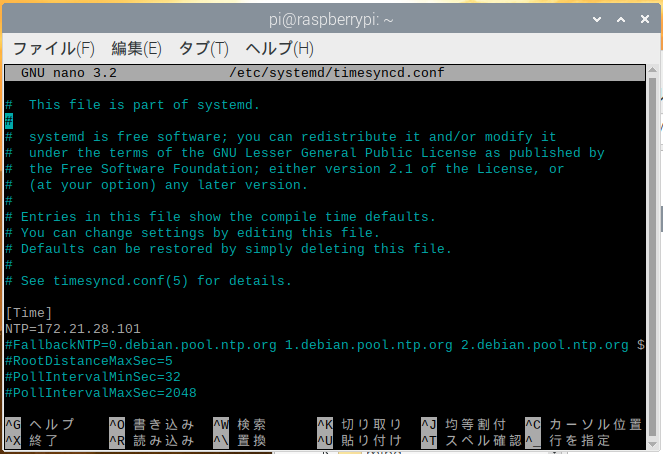

NTP=172.21.28.101を追記

#### （※）プログラム内容の変更

##### 9-1.video3.pyの変更

thonnyで開く

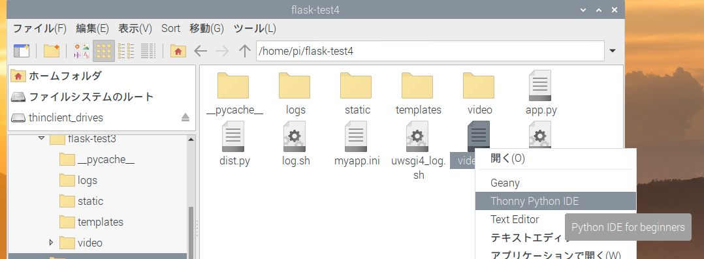

MAX_CNTを変更すると/home/pi/video/save/ここに保存されている動画数が変更できる

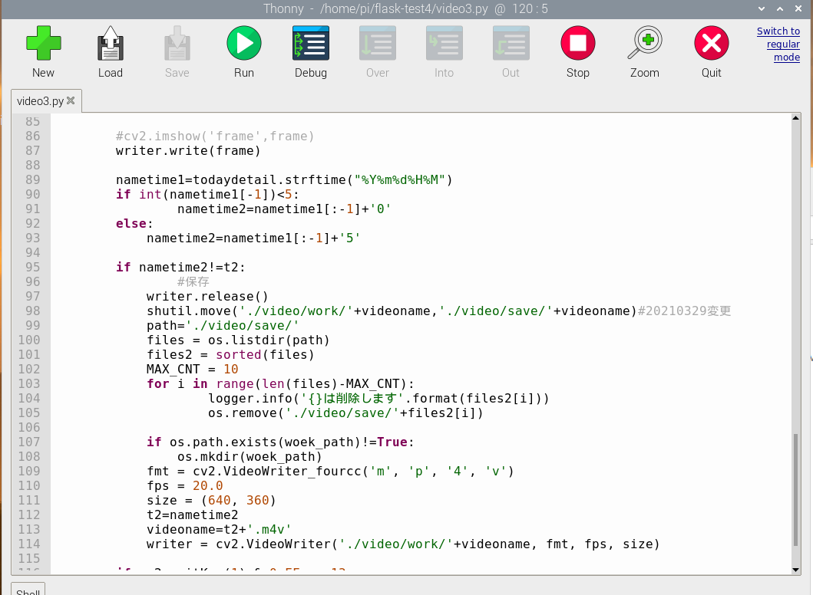

##### 9-2.index.htmlの変更

geanyで開く

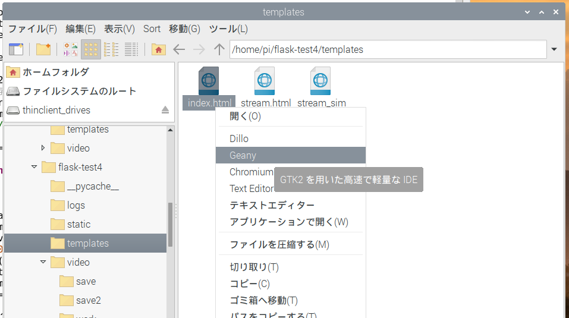

下記のipアドレスをラズパイのIPに変更する。

```
<a href="http://172.21.5.160:8080/stream_simple.html">動画1</a>
```

下記のタグ内の日本語を変更すると表示が変わる。

```
   <p class="news-item">
      半割ROD装置のリアルタイム動画サイトです。<br>
      動画1にリアルタイム動画<br>
      動画1ファイルに過去動画があります<br>
      よろしくお願いします。<br>    
  </p>
```

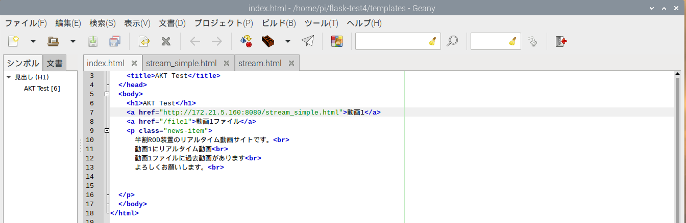

9-1.video3.pyの変更、9-2.index.htmlの変更ともに再起動することで設定が反映される

#### （※）自動起動しているサービスについて

systemctl list-units --type=service

このコマンドで確認できる

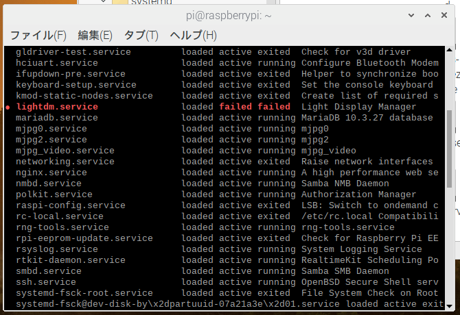

または

systemctl status サービス名

で状態を確認できる。

（１）enginx.servise

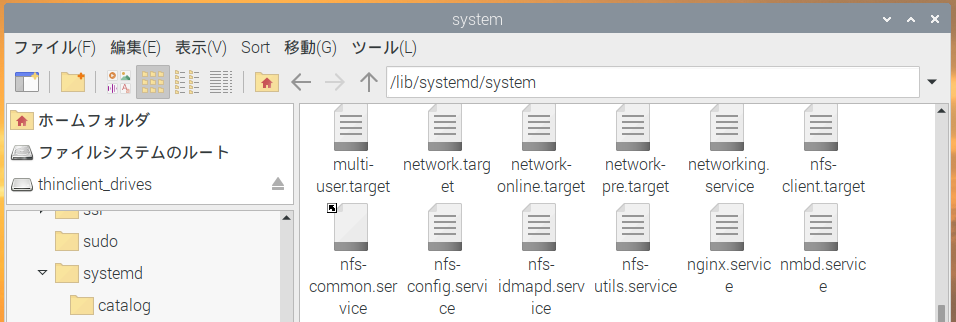

5000ポートにアクセスしたらuwsgiで稼働中のサービスを表示させるようにしている

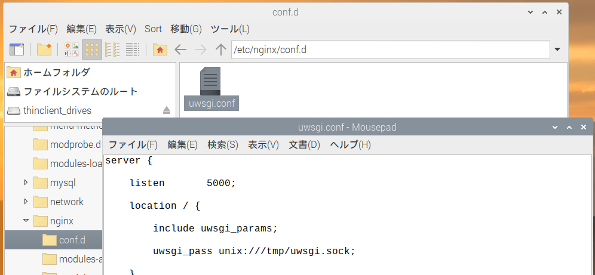

（２）uwsgi4.service

pythonのプログラムをuwsgiで動かしている。

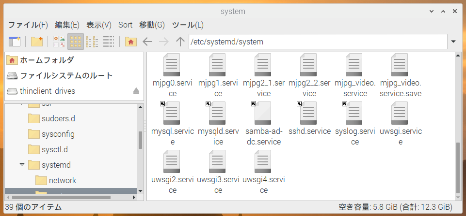

（３）mjpg0.service

mjpg-streamerを自動起動させている

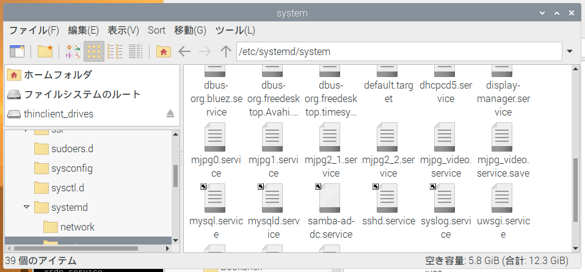


（４）mjpg_video.service 

mjpg_videoを自動起動している


sudo nano /etc/systemd/system/mjpg_video.service 

状態確認方法

```
#状態確認
sudo systemctl status mjpg_video
#状態停止
sudo systemctl stop mjpg_video
#設定反映
sudo systemctl daemon-reload
#設定自動起動
sudo systemctl enable mjpg_video
#サービススタート
sudo systemctl start mjpg_video
```

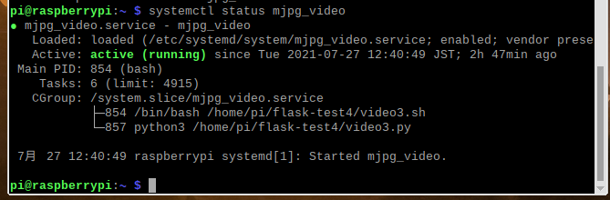

#### （※）crontab起動しているサービスについて

sudo nano /etc/logrotate.d/uwsgi4_log

sudo nano /home/pi/flask-test4/uwsgi4_log.sh

```
#!/bin/bash
sudo /usr/sbin/logrotate -f /etc/logrotate.d/uwsgi4_log
```

crontab -e

```
00 * * * * sudo bash /home/pi/flask-test4/uwsgi4_log.sh
```

#### （※）ファイアウォールについて

ファイアウォールで許可しているポート

```
sudo ufw status numbered
```

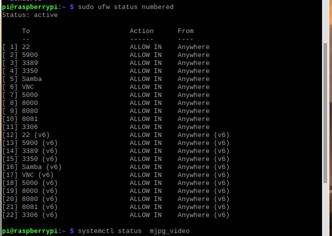


