### csharpの設定方法

VisualStudioSetup.exeのダウンロード、インストール

.NET デスクトップ開発を選択

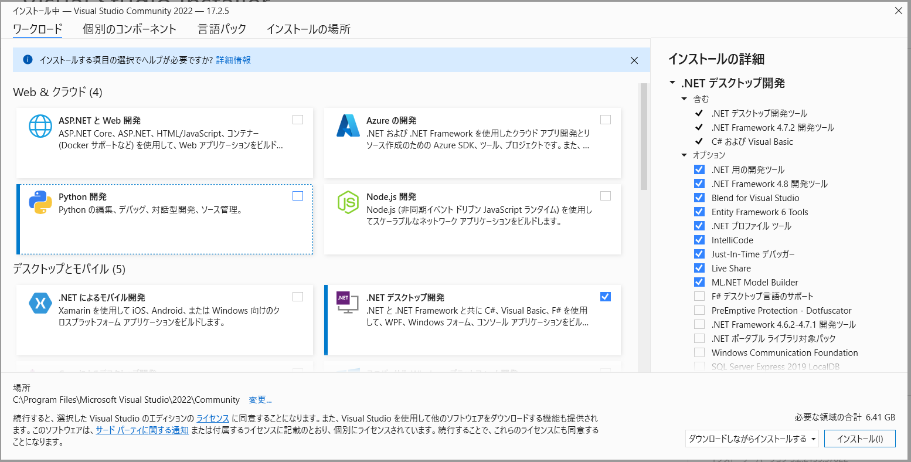

完了するまで待ちます。


コンソールアプリケーションを作ってみる。プロジェクトを作成

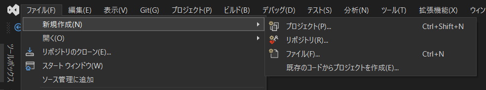

コンソールアプリを選択する。

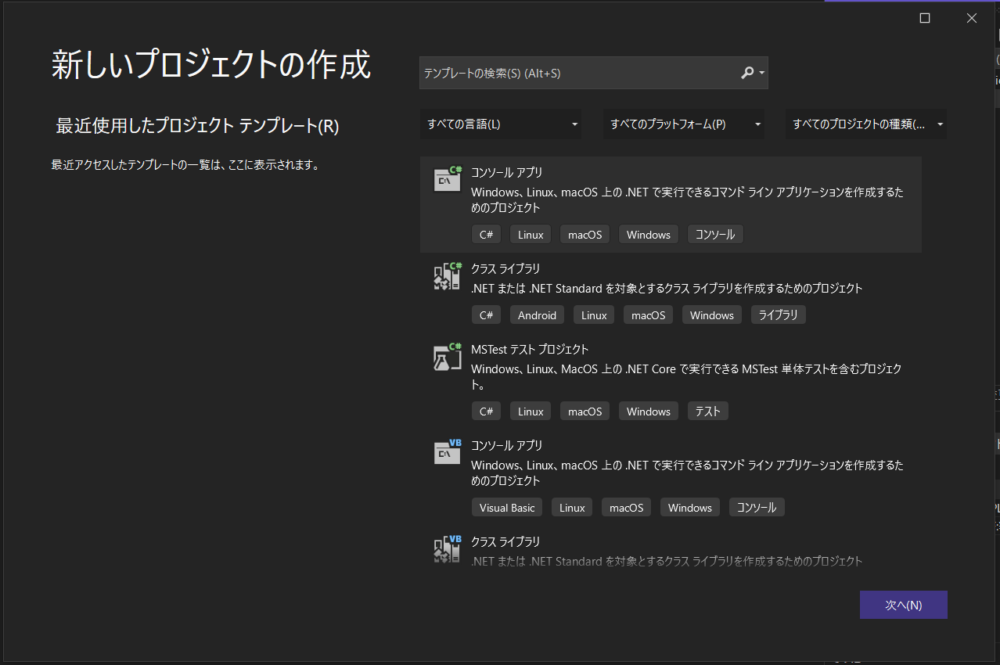

プロジェクト名と保存場所を決める。

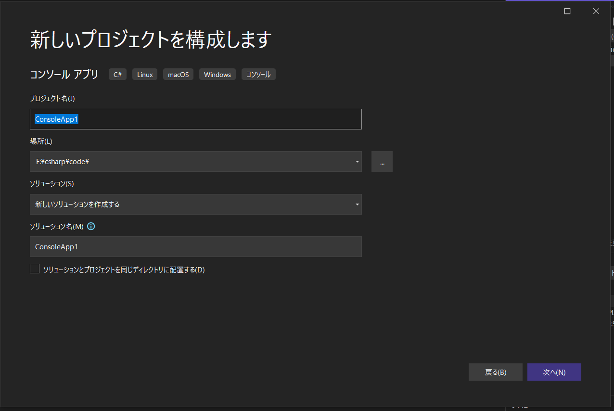

フレームワークの選択

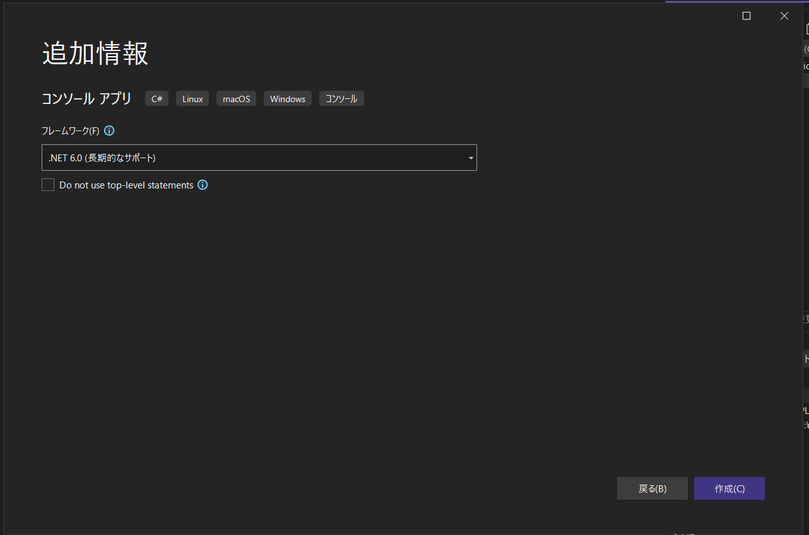

作成を押すと下記画面が現れる

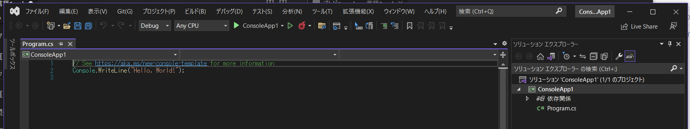

名前を付けて保存

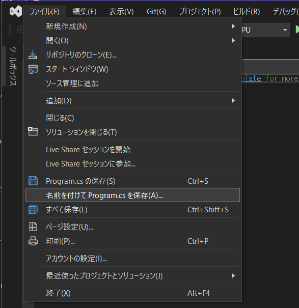

上書き保存する。

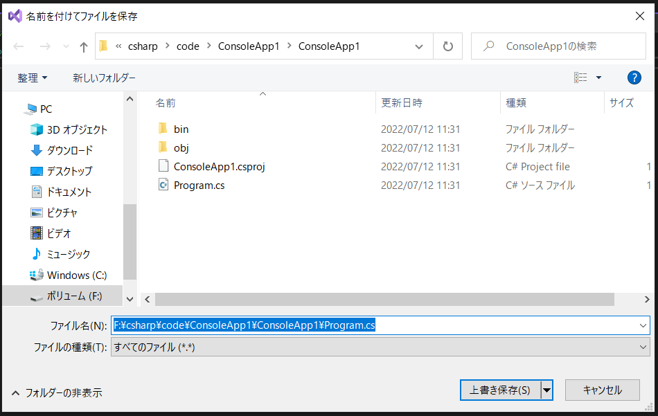

デバッグ前ではまだコンパイル前なので下記フォルダは空だった。

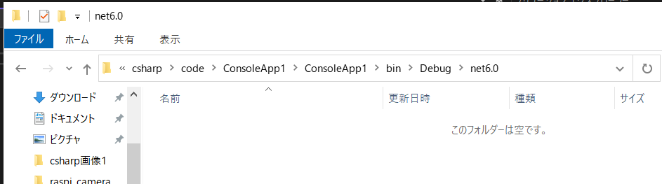

実行してみる

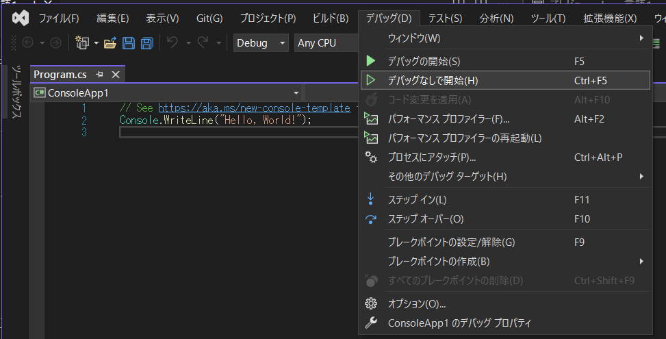

コンソールが立ち上がってHello, World!が表示された。

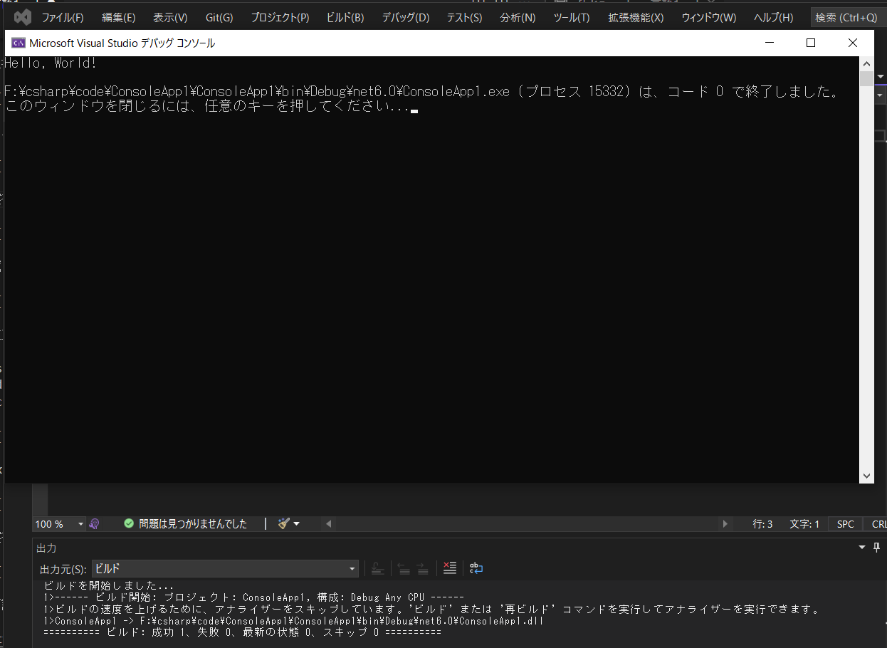

コンパイルが終わったので下記に実行ファイルが作成された。

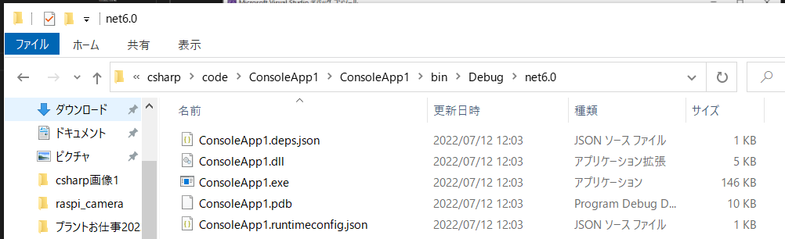

CSVを読み取るプログラムを書いてみた。まずはライブラリ読み込み

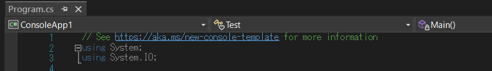

それ以外のコードを書いてみる。

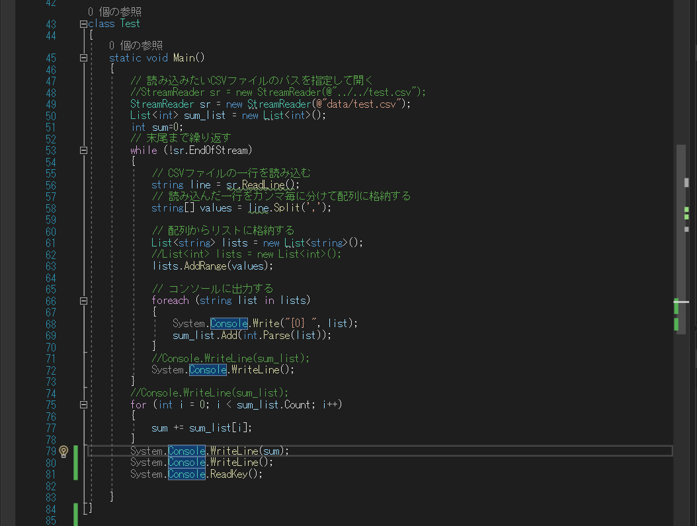

クラス定義しないといけなかった。Testというクラスを作った。

実行してみた

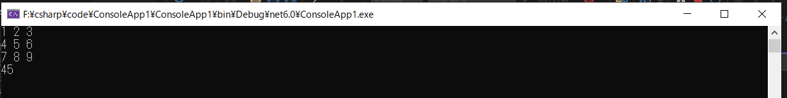

```c#
System.Console.WriteLine();
System.Console.ReadKey();
```

この２行を追加することでコマンドプロンプトが消えなくなる。


