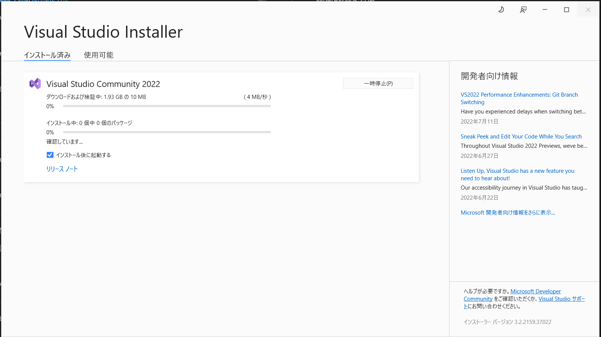

### csharpの設定方法

VisualStudioSetup.exeのダウンロード、インストール

.NET デスクトップ開発を選択


完了するまで待ちます。



コンソールアプリケーションを作ってみる。プロジェクトを作成


コンソールアプリを選択する。


プロジェクト名と保存場所を決める。


フレームワークの選択


作成を押すと下記画面が現れる


名前を付けて保存


上書き保存する。


デバッグ前ではまだコンパイル前なので下記フォルダは空だった。


実行してみる


コンソールが立ち上がってHello, World!が表示された。


コンパイルが終わったので下記に実行ファイルが作成された。


CSVを読み取るプログラムを書いてみた。まずはライブラリ読み込み


それ以外のコードを書いてみる。


クラス定義しないといけなかった。Testというクラスを作った。

実行してみた


```c#
System.Console.WriteLine();
System.Console.ReadKey();
```

この２行を追加することでコマンドプロンプトが消えなくなる。


