### csharpの設定方法

フォームアプリケーションを作ってみる。プロジェクトを作成

windowsフォームアプリケーション開発を選択

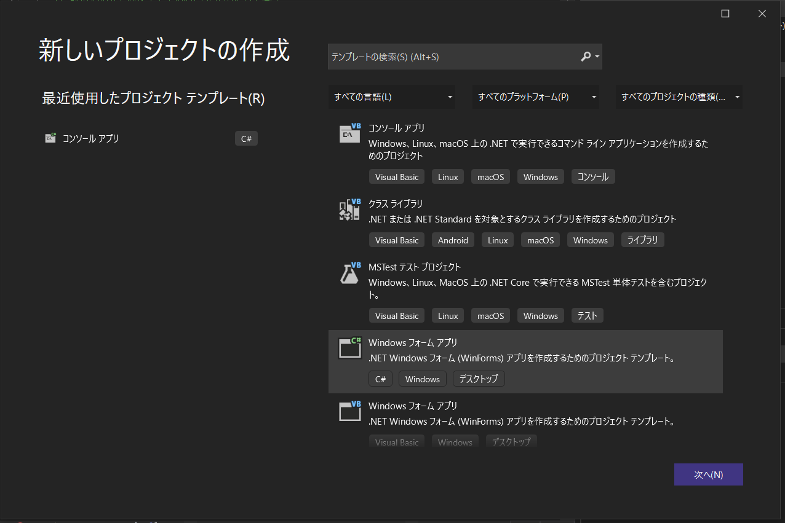

プロジェクト名と保存場所を決める。

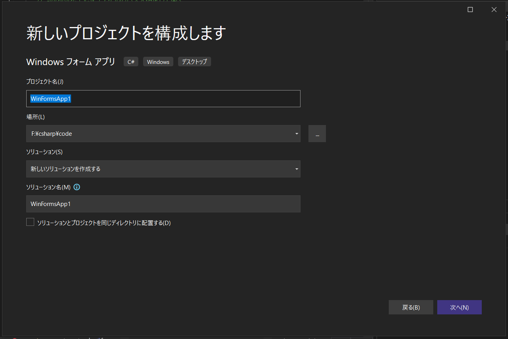

フレームワークの選択

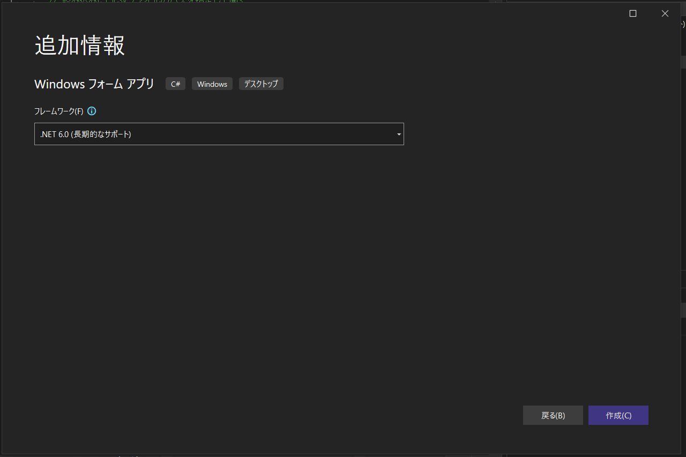

作成を押すと下記画面が現れる

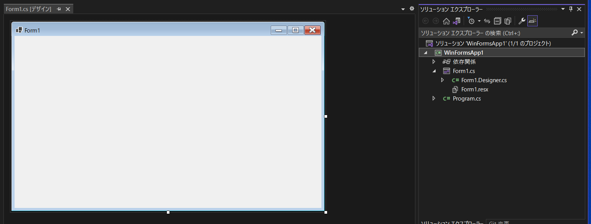

名前を付けて保存。上書き保存する。

初期段階のコード　フォーム用　（Form1.Designer.cs）

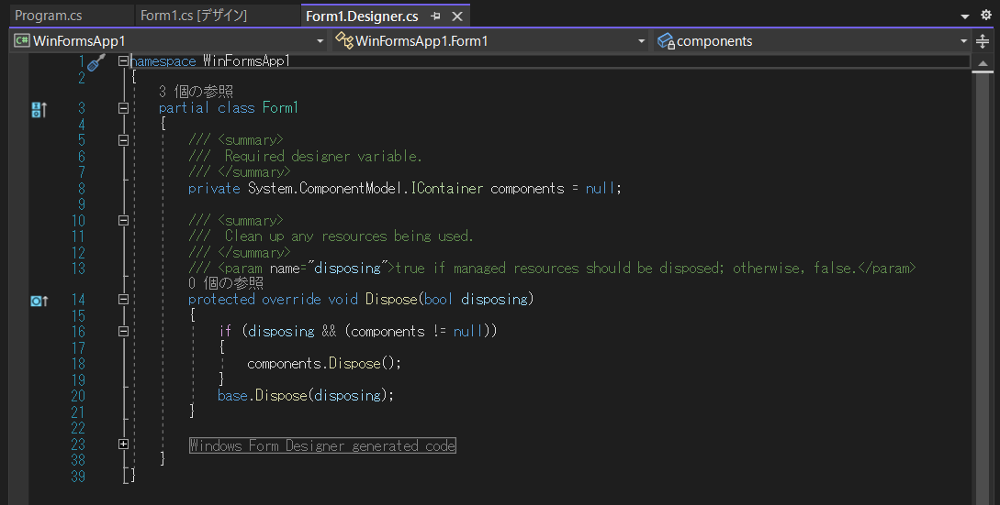

初期段階のコード　プログラム用（Program.cs）

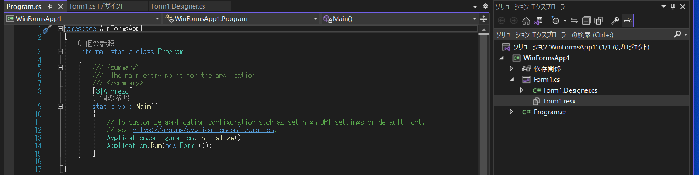

流れとしてはprogram.csが実行されて、form1.csが実行されるという流れになる。

まずはこの状態で実行してみる。

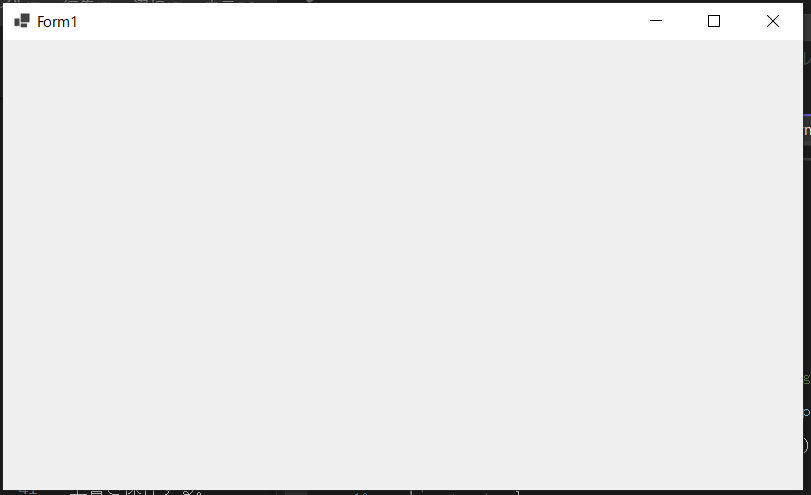

ウィンドウフォーム画面が出た。

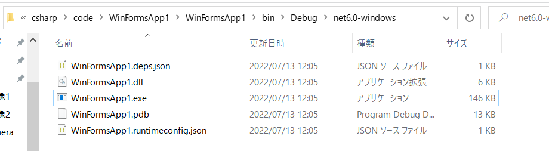

また、実行ファイルが作成されたのも確認できた。

ボタンを配置してみる

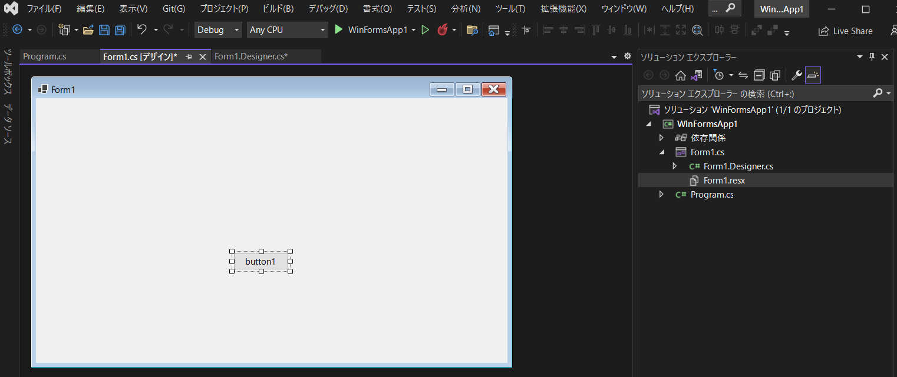

Form1.Designer.csにプログラムが追記された。

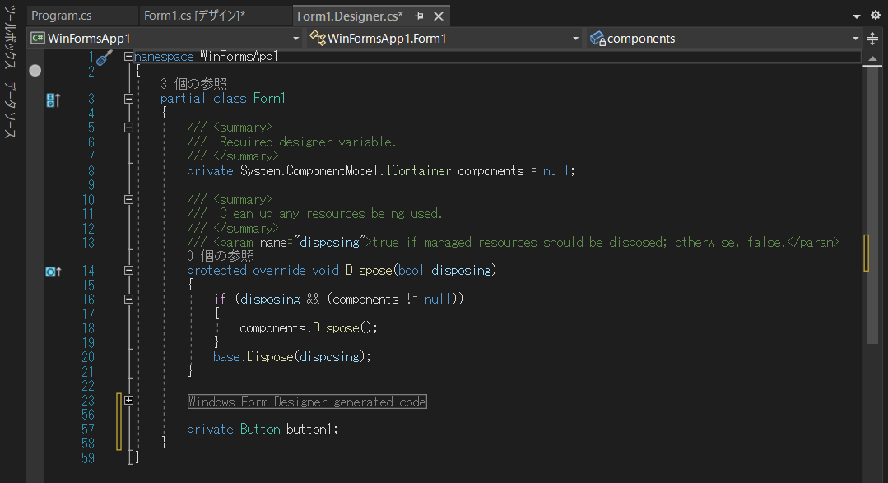

form1のボタンを選択した状態でプロパティを確認し、nameをhellobuttonにする。

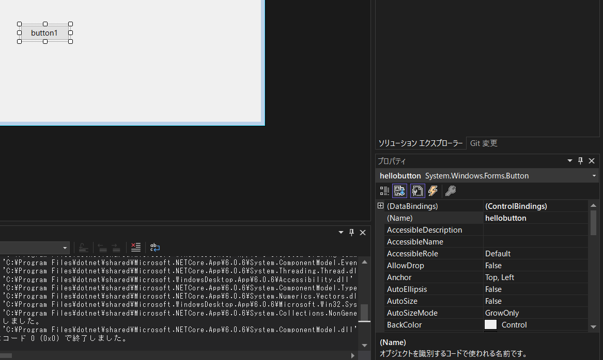

ラベルを貼り付け、nameをhellolabelにする

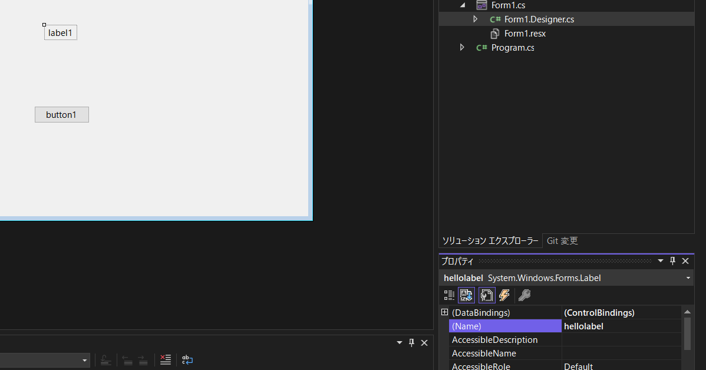

button1を選択した状態でイベントタブを選択しhellobuttonclickと打つ

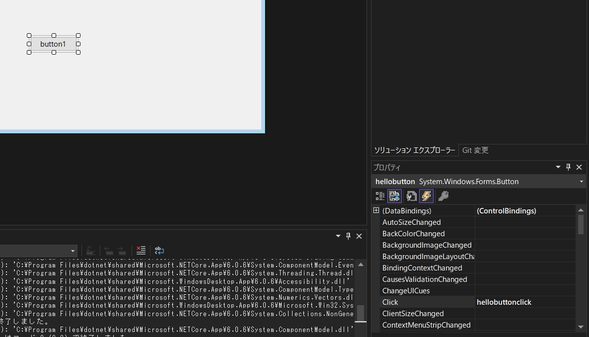

form1.csにprivate void hellobuttonclick(object sender, EventArgs e)という関数が生成された。

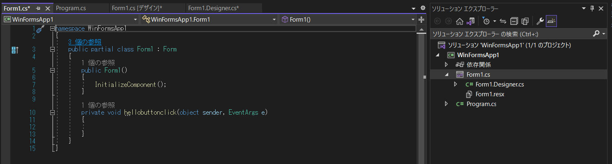

ボタンクリックするとラベルがhelloworldになるアプリができた。

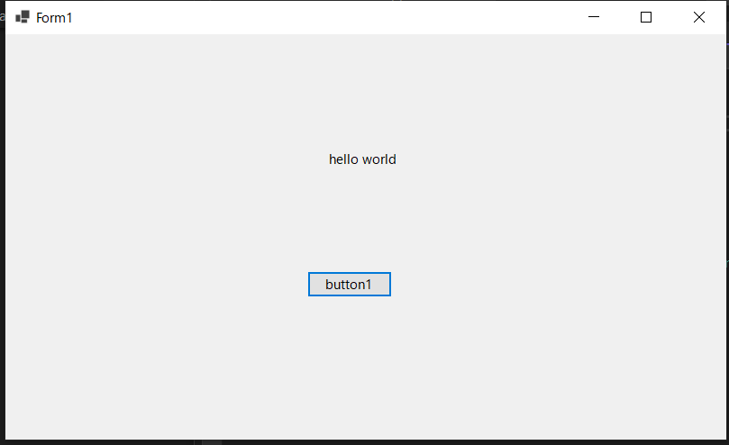

