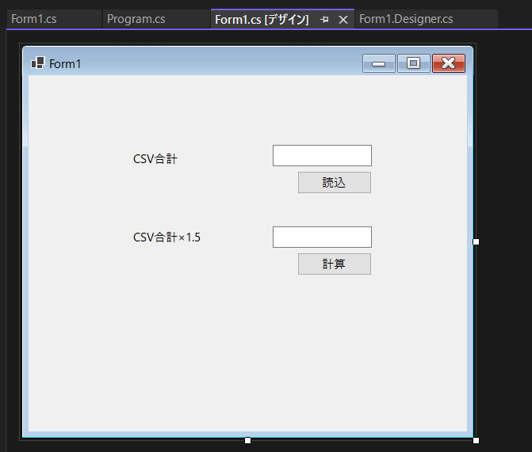
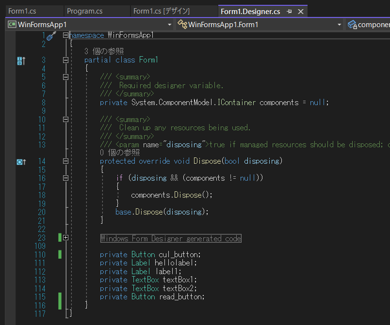
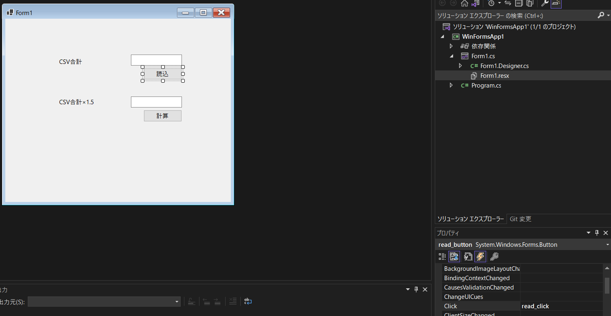
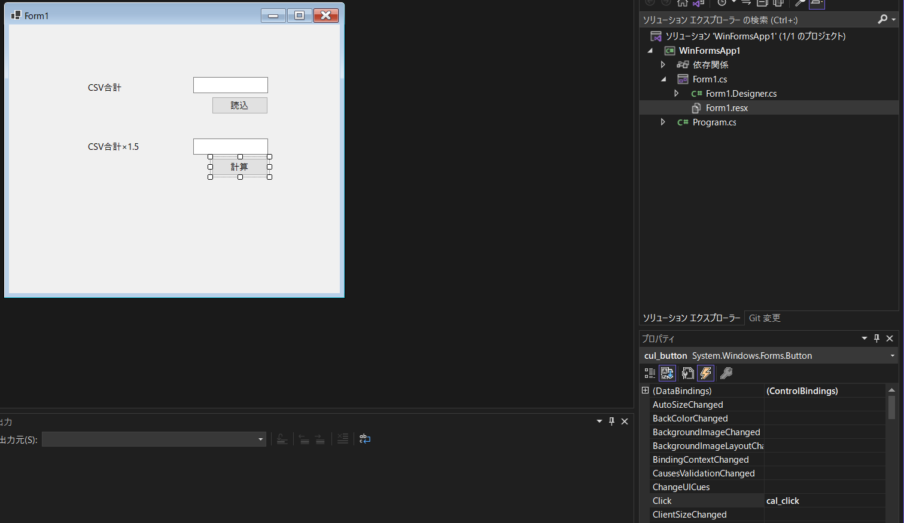
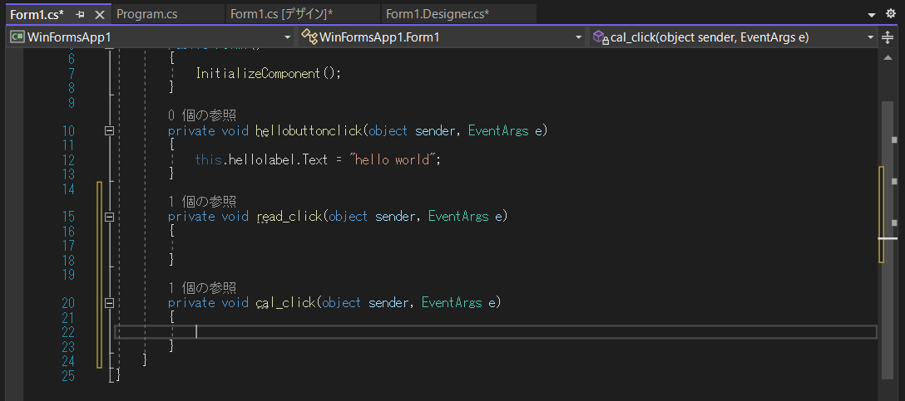
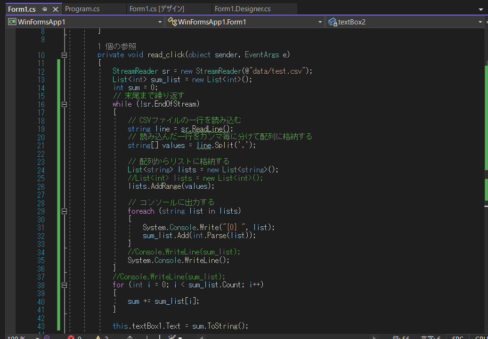
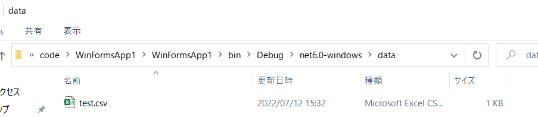
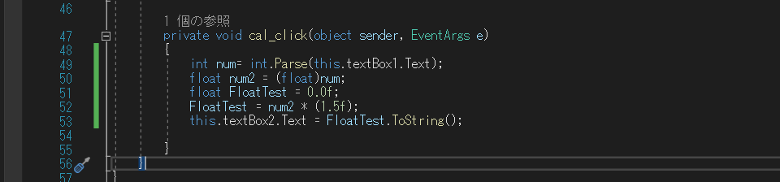
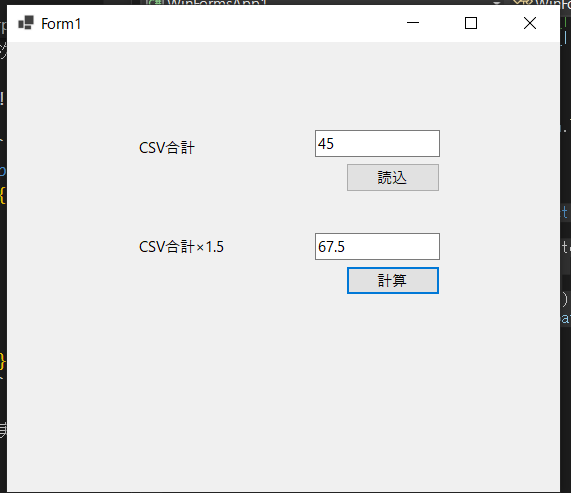

### csharpの設定方法

フォームアプリケーションを作ってみる。

CSVを読み込んで計算するアプリを作ってみる。

画面構成は以下のようにした



その時のForm1.Designer.cs



それぞれのボタンに関数を記載していく。

イベントタブに名称を記載する。read_click



cal_click



Form1.cs



private void hellobuttonclick(object sender, EventArgs e)は無くなったので消しておく。

読込ボタンを押してCSVデータが読み取れるように関数を記載する。



またdataフォルダにtest.csvを保存した。このデータを読む



次に計算ボタンを押してCSVの合計値に1.5倍する関数を作る。



```c#
private void cal_click(object sender, EventArgs e)
{
    int num= int.Parse(this.textBox1.Text);
    float num2 = (float)num;
    float FloatTest = 0.0f;
    FloatTest = num2 * (1.5f);
    this.textBox2.Text = FloatTest.ToString();

}
```

実行させてみた。




CSVの読み取り、計算すべて実行することができた。


