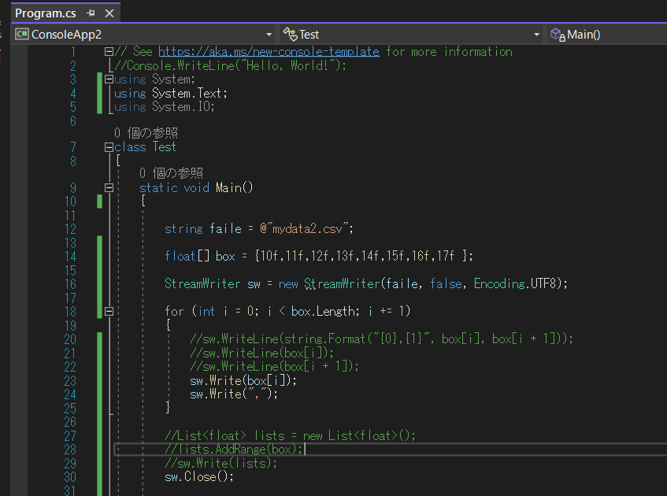
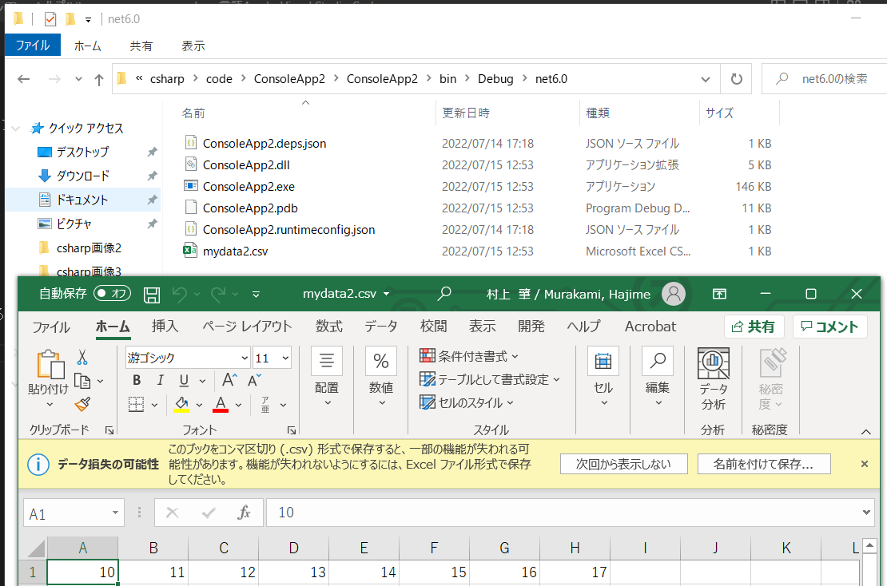
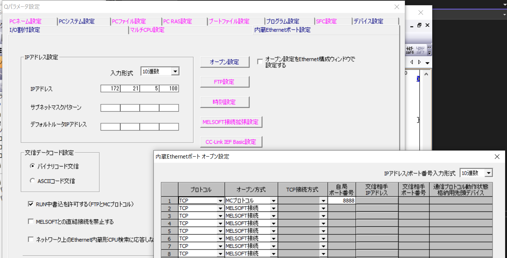
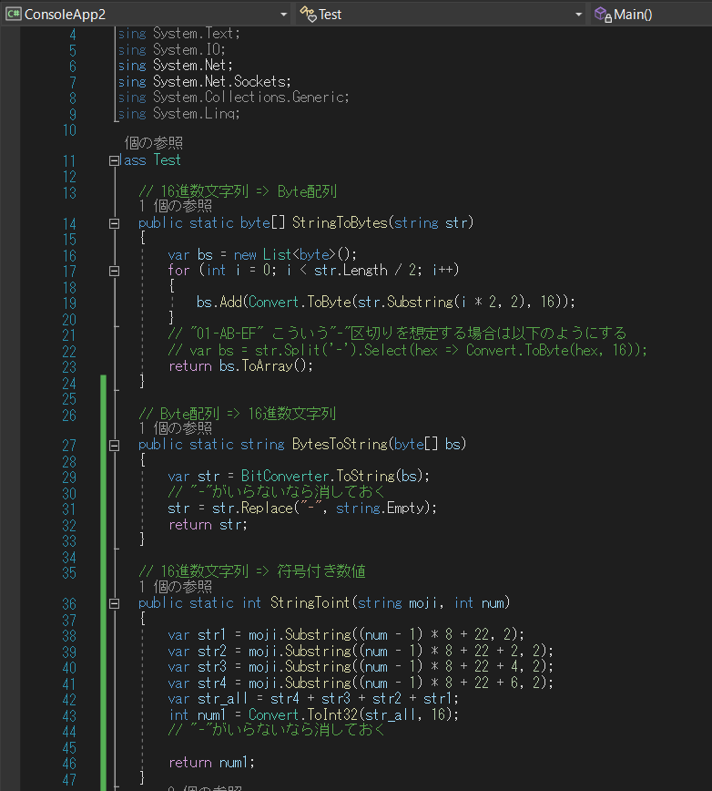
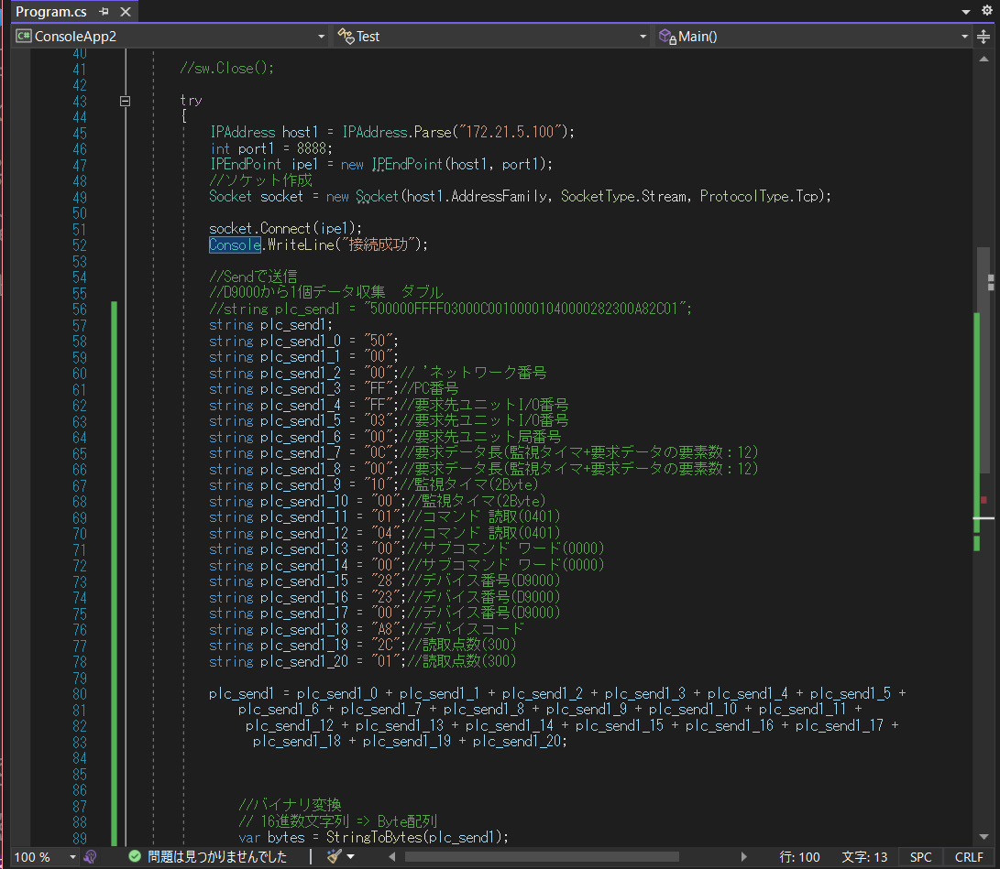
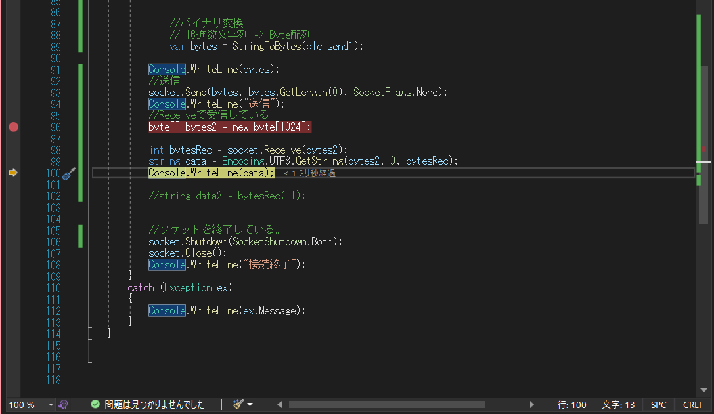
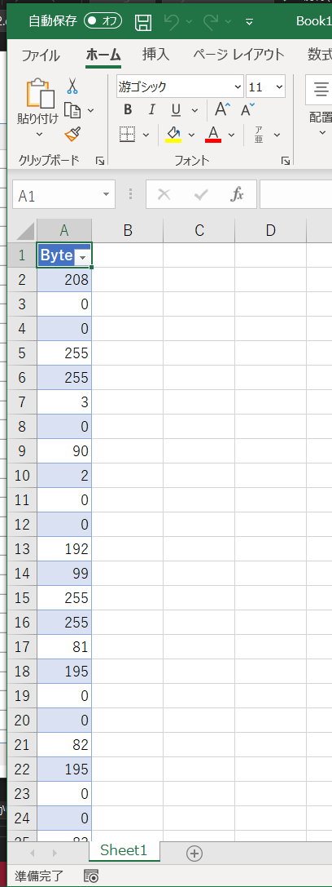
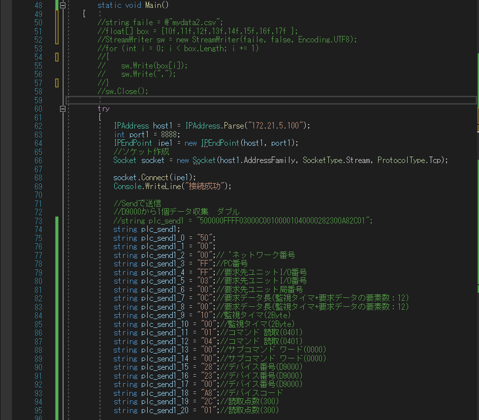
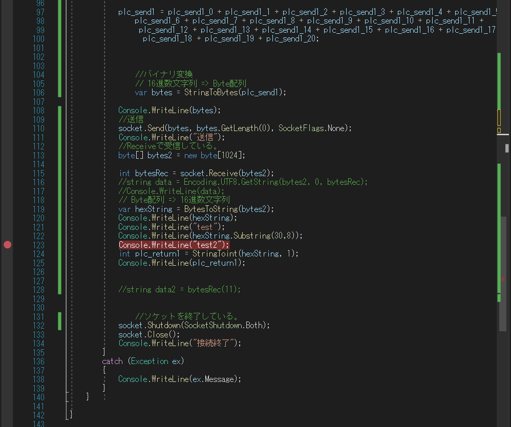
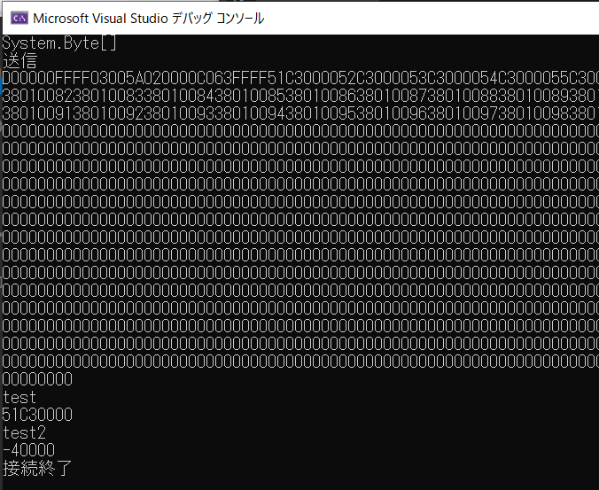

### csharpの設定方法

PLCのデータを収集するコンソールアプリケーションを作ってみる。

まずはCSVに吐き出すプログラムを記載



```c#
using System.Text;
```

これを記載することでEncoding.UTF8が使用できるようになる。

実行させてみた。



無事にCSVが出力された。

次にPLCとの通信プログラムを作っていく。

まずはPLCの設定を確認する。



IP　172.21.5.100 ポート　8888

バイナリコード通信ということが分かった。

次にC＃のプログラムを作成する。



ソケット通信するためのライブラリ読込

送信用の電文をbyteにする関数を作成。

Byte配列 => 16進数文字列の関数作成。

16進数文字列 => 符号付き数値関数の作成。

https://webbibouroku.com/Blog/Article/byte-hex

https://takap-tech.com/entry/2020/07/09/002557

参照





とりあえず作った。

https://momomo-97.com/vb-net-mc-protocol-read-write-commands/#toc7

https://momomo-97.com/communicate-with-mitsubishi-plc-using-vb-net-mc-protocol/

参照

返信された電文の中身を確認する。



ちゃんと返信が返ってきた。

電文を符号付き数値として出力できるようにプログラム修正。





実行してみた。



符号付き数値として出力することができた。


