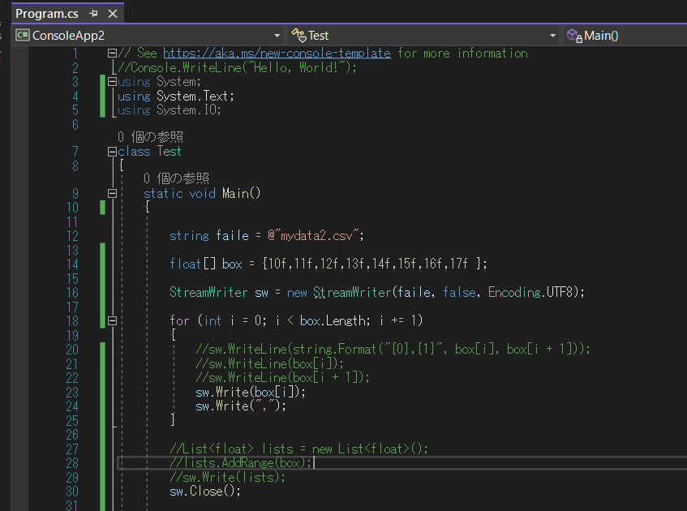
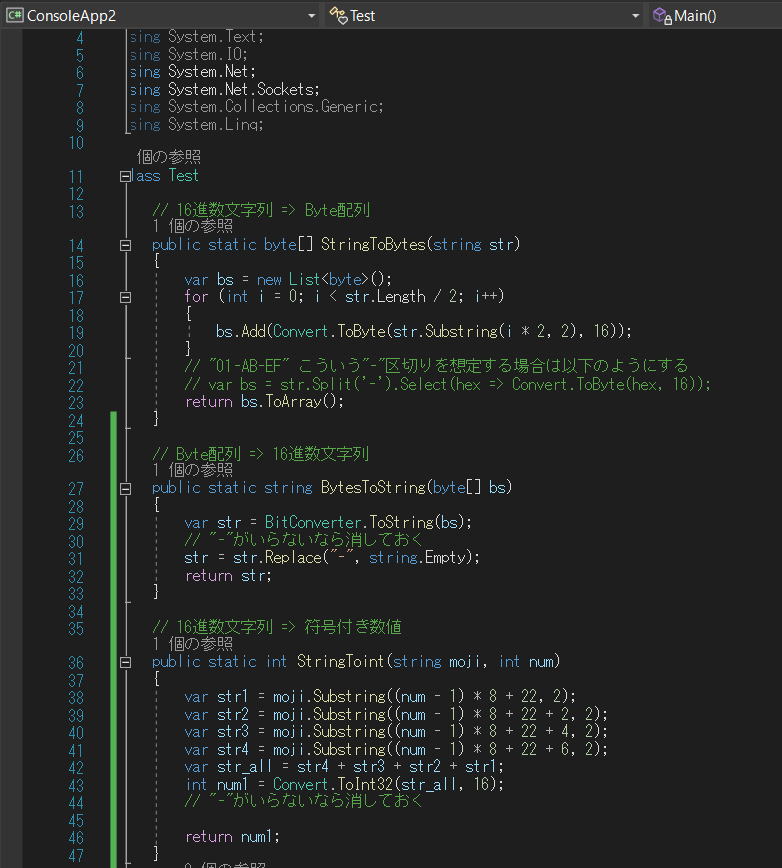
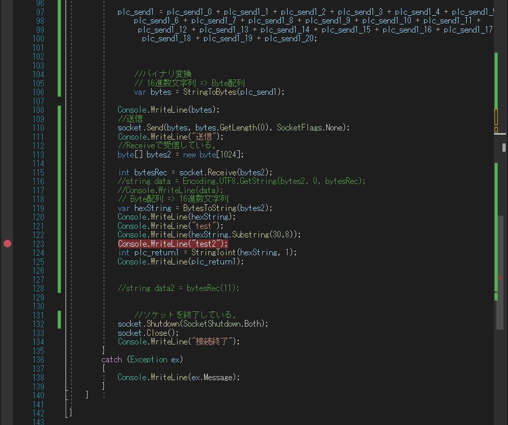
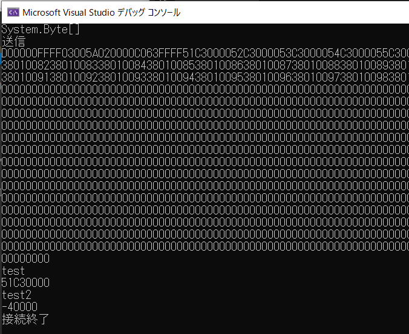

### csharpの設定方法

C#でmysqlを使用してみる。

nugetの参照でmysqlと打つ

プロジェクトを選択してインストール


変更のプレビューが出てくるのでOK


ライセンス同意もOK


```c#
using MySql.Data.MySqlClient;
using System;

class Test
{
    static void Main(string[] args)
    {
        // MySQLへの接続情報を設定
        string server = "localhost";
        string database = "testdb";    // デフォルトで存在するデーターベース
        string user = "root";
        string pass = "123456";
        string charset = "utf8";    // 文字コードセット
        string connectionString = string.Format("Server={0};Database={1};Uid={2};Pwd={3};Charset={4}", 
            server, database, user, pass, charset);
        
        string sql = "CREATE TABLE IF NOT EXISTS sampletb (id int, name varchar(20))";

        // MySQLへの接続
        try
        {
            MySqlConnection connection = new MySqlConnection(connectionString);
            connection.Open();  // 接続
            Console.WriteLine("MySQLに接続しました！");
            connection.Close(); // 接続の解除
        }
        catch (MySqlException me)
        {
            Console.WriteLine("ERROR: " + me.Message);
        }
        System.Console.WriteLine();
        System.Console.ReadKey();
    }

}
```

上記でDBに接続してみた。


次にテーブルを生成してみた

```c#
using MySql.Data.MySqlClient;
using System;

class Test
{
    static void Main(string[] args)
    {
        // MySQLへの接続情報を設定
        string server = "localhost";
        string database = "testdb";    // デフォルトで存在するデーターベース
        string user = "root";
        string pass = "123456";
        string charset = "utf8";    // 文字コードセット
        string connectionString = string.Format("Server={0};Database={1};Uid={2};Pwd={3};Charset={4}", 
            server, database, user, pass, charset);
        //string sql = "CREATE TABLE IF NOT EXISTS " +
        //    "testtable20220822 (id int NOT NULL AUTO_INCREMENT" +
        //    ", datetime DEFAULT NULL" +
        //    ",value float DEFAULT NULL)";
        string sql = "CREATE TABLE IF NOT EXISTS sampletb (id int, name varchar(20))";
        MySqlConnection connection = new MySqlConnection(connectionString);
        // MySQLへの接続
        try
        {
            
            connection.Open();  // 接続
            Console.WriteLine("MySQLに接続しました！");

            // SQLコマンドを宣言する
            MySqlCommand cmd = connection.CreateCommand();
            cmd.CommandText = sql;
            cmd.ExecuteNonQuery();
            Console.WriteLine("SQL文成功！");
        }

        catch (MySqlException me)
        {
            Console.WriteLine("ERROR: " + me.Message);

        }
        finally
        {
            connection.Close(); // 接続の解除

        }
        System.Console.WriteLine();
        System.Console.ReadKey();

    }

}
```


テーブルが生成されていることも確認できた。


テーブルにデータ挿入もしてみる。

```c#
using MySql.Data.MySqlClient;
using System;

class Test
{
    static void Main(string[] args)
    {
        // MySQLへの接続情報を設定
        string server = "localhost";
        string database = "testdb";    // デフォルトで存在するデーターベース
        string user = "root";
        string pass = "123456";
        string charset = "utf8";    // 文字コードセット
        string connectionString = string.Format("Server={0};Database={1};Uid={2};Pwd={3};Charset={4}", 
            server, database, user, pass, charset);
        MySqlConnection connection = new MySqlConnection(connectionString);

        //時刻
        DateTime dt = DateTime.Now;
        string result = dt.ToString("yyyyMMdd");
        Console.WriteLine(result);
        string table = "testtable"+ result;
        Console.WriteLine(table);
        //テーブル作成
        string sql_1 = "CREATE TABLE IF NOT EXISTS "+ table;
        string sql_2 = " (id int NOT NULL AUTO_INCREMENT," +
            "time datetime DEFAULT NULL," +
            "value float DEFAULT NULL," +
            "PRIMARY KEY (id))";
        string sql = sql_1 + sql_2;


        // MySQLへの接続、テーブル作成
        try
        {
            connection.Open();  // 接続
            Console.WriteLine("MySQLに接続しました！");
            // SQLコマンドを宣言する
            MySqlCommand cmd = connection.CreateCommand();
            cmd.CommandText = sql;
            cmd.ExecuteNonQuery();
            Console.WriteLine("SQL文成功！");
        }
        catch (MySqlException me)
        {
            Console.WriteLine("ERROR: " + me.Message);
        }
        finally
        {
            connection.Close(); // 接続の解除
        }
        // MySQLへの接続、テーブル値代入

        string sql1_1 = "INSERT INTO " + table;
        string sql1_2 = " (time,value) VALUES (@time, @value)";
        string sql1 = sql1_1 + sql1_2;

        try
        {
            connection.Open();  // 接続
            MySqlCommand cmd = connection.CreateCommand();
            cmd.CommandText = sql1;
            cmd.Parameters.AddWithValue("@time", dt);
            cmd.Parameters.AddWithValue("@value", 1);
            cmd.ExecuteNonQuery();
            Console.WriteLine("SQL文成功！挿入");
        }
        catch (MySqlException me)
        {
            Console.WriteLine("ERROR: " + me.Message);
        }
        finally
        {
            connection.Close(); // 接続の解除
        }
        System.Console.WriteLine();
        System.Console.ReadKey();

    }

}
```


テーブルにデータが挿入されたことを確認できた。

次に別ファイルからの関数を実行してみる。

まずは別のCSファイルを追加する。

ソリューションエクスプローラーで追加を押す。


空のクラスを追加する。


空のClass1.csが作成された。


C#のエントリーポイントについて

static void Main(string[] args)

エントリポイントになっているようだ。

空のクラスを利用してメインプログラムとサブプログラムを分けた。


PLCのデータを収集するコンソールアプリケーションを作ってみる。

まずはCSVに吐き出すプログラムを記載



```c#
using System.Text;
```

これを記載することでEncoding.UTF8が使用できるようになる。

実行させてみた。


無事にCSVが出力された。

次にPLCとの通信プログラムを作っていく。

まずはPLCの設定を確認する。


IP　172.21.5.100 ポート　8888

バイナリコード通信ということが分かった。

次にC＃のプログラムを作成する。



ソケット通信するためのライブラリ読込

送信用の電文をbyteにする関数を作成。

Byte配列 => 16進数文字列の関数作成。

16進数文字列 => 符号付き数値関数の作成。

https://webbibouroku.com/Blog/Article/byte-hex

https://takap-tech.com/entry/2020/07/09/002557

参照


とりあえず作った。

https://momomo-97.com/vb-net-mc-protocol-read-write-commands/#toc7

https://momomo-97.com/communicate-with-mitsubishi-plc-using-vb-net-mc-protocol/

参照

返信された電文の中身を確認する。


ちゃんと返信が返ってきた。

電文を符号付き数値として出力できるようにプログラム修正。




実行してみた。



符号付き数値として出力することができた。


