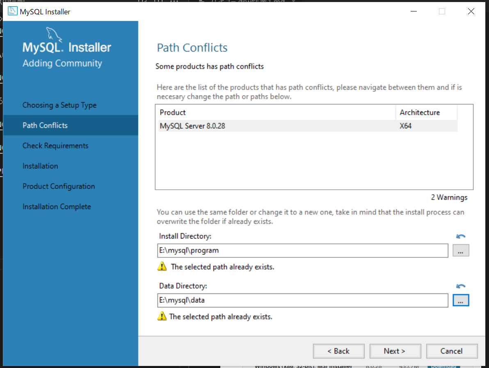

# drw作業１

pipが使えなくなったのでhttps://qiita.com/yasthon/items/954dc1aef9752838a0f0
を参考にpipを入れなおした


https://github.com/hajime-123/pythonsetup/blob/main/pythonsetup/python%E8%A8%AD%E5%AE%9A.md

以上のサイトのプログラムを実行。ライブラリをダウンロード


```
jupyter notebook
```
上記のコマンドでjupyterが使用できる。

画像表示がおかしかった。
バージョンのせい？


以前は3.4.1だったのでバージョンを変更してみる

```
pip uninstall matplotlib
pip install matplotlib==3.4.1
```


vscodeのjupyterのデバッグで動かすとおかしくなるみたい
pythonデバックで動かすと問題なかった


# mysqlをインストールする
まずは隠しフォルダを表示する


C:\ProgramData\MySQL\MySQL Server 8.0\Data

以上を作成するこれでディレクトリを選択できる


またE:\mysql\data、E:\mysql\programも作っておく


mysqlをインストールする


プログラムの保存先とデータの保存先の指定



確認がある


serverを選択してexcuteを押す　c++を入れる


なぜかいろいろ選択されてしまった。serverだけでよかったがとりあえずインストールする


パスを通す


保存先がどこになっているか確認


C:\ProgramData\MySQL\MySQL Server 8.0\my.ini

```
datadir=C:/ProgramData/MySQL/MySQL Server 8.0\Data
datadir=E:/mysql/data
```


コマンドプロンプトで下記を打つ

```
mysql -u root -p
show databases;
show variables like 'datadir'
exit
```


保存場所が変わっていなったのでサービス再起動

最初にデータ移動


サービス再起動


無事データ保存先を変更できた


