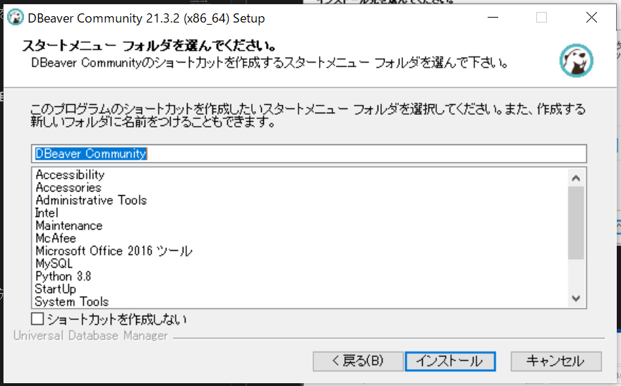
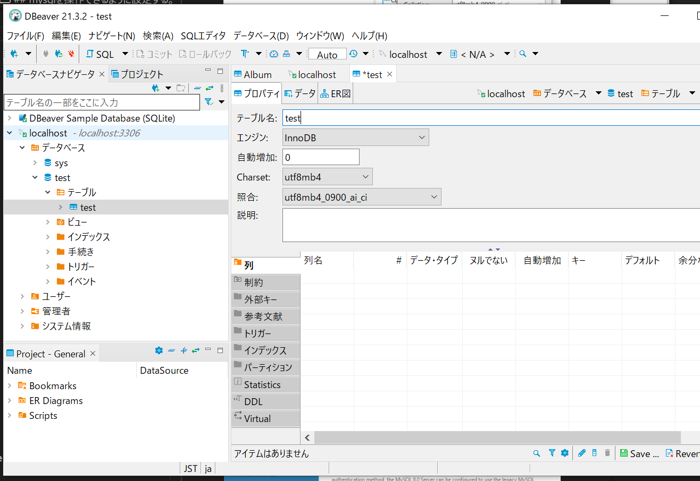

# drw作業2

## dbeverを入れてみる


セットアップを行う





## mysqlを操作できるように設定する。

まずはsqlite使えるようにドライバインストール


次にmysqlのセッティング


ドライバインストール


JDBCドライバのプロパティ[allowPublicKeyRetrieval]をTrue、[useSSL]をfalseにする


テストとしてdbを作ってみる


テーブルを作ってみる



カラムを作ってみる


カラムに制約をつける


その他のカラムの作成する。


saveボタンを押して完成。


## mysqlをpythonで操作できるように設定する。

```
pip install mysql-connector-python
import mysql.connector as mydb
```

以上のコマンドでエラー出ないことを確認

確認後下記のプログラム実行

mysql_insert.py

```python
import mysql.connector as mydb
import time
import datetime

todaydetail = datetime.datetime.today()
start = time.time()
todaydetail_str=str(todaydetail)
# コネクションの作成
conn = mydb.connect(
    host='127.0.0.1',
    port='3306',
    user='root',
    password='tkroyc123',
    database='test'
)

conn.ping(reconnect=True)
print(conn.is_connected())

cur = conn.cursor()

sql ='insert into test (time,col1) values (%s, %s)'
cur.execute(sql, (todaydetail, 3, ))
conn.commit()

cur.close()
conn.close()
```


データ入っているか確認。


## PLCの中身をpythonプログラムで取り出す

plcの情報の確認

ip番号　172.21.5.100

D9000に-40000という値が入っている

ポート　8888を開放


pingが通るようにPCのIPを変更する。


ping確認


plc_test.py

```python
import socket

plc_send1=str("500000FFFF03000C00100001040000282300A82C01")#D9000から1個データ収集　ダブル
byte_data1=bytes.fromhex(plc_send1)

host = "172.21.5.100" #お使いのサーバーのホスト名を入れます
port = 8888 #適当なPORTを指定してあげます

def s32(value):return -(value & 0b10000000000000000000000000000000) | \
(value & 0b01111111111111111111111111111111)#0,1の数重要31個
def s16(value):return -(value & 0b1000000000000000) | (value & 0b0111111111111111)

client = socket.socket(socket.AF_INET, socket.SOCK_STREAM) #オブジェクトの作成をします
client.connect((host, port)) #これでサーバーに接続します
plc_ret1_0=client.send(byte_data1) #適当なデータを送信します（届く側にわかるように）
plc_ret1_0=client.recv(4096) #レシーブは適当な2の累乗にします（大きすぎるとダメ）
plc_ret1=plc_ret1_0.hex()
client.close()

def func1(x,y):       
    h=22+x*4
    plc16_val1=y[h+2]+y[h+3]+y[h]+y[h+1]
    plc16_val2=y[h+6]+y[h+7]+y[h+4]+y[h+5]
    plc32_val=plc16_val2+plc16_val1
    b=int(plc32_val,16) #16進数文字列を数値に変換
    plc10_num1=s32(b) #10進数符号付きに変換
    return plc10_num1

def func2(x,y):       
    h=22+x*4
    plc16_val1=y[h+2]+y[h+3]+y[h]+y[h+1]
    b=int(plc16_val1,16) #16進数文字列を数値に変換
    plc10_num1=s16(b) #10進数符号付きに変換
    return plc10_num1

v1=func1(0,plc_ret1)
```

実行結果


-40000が取得できた


