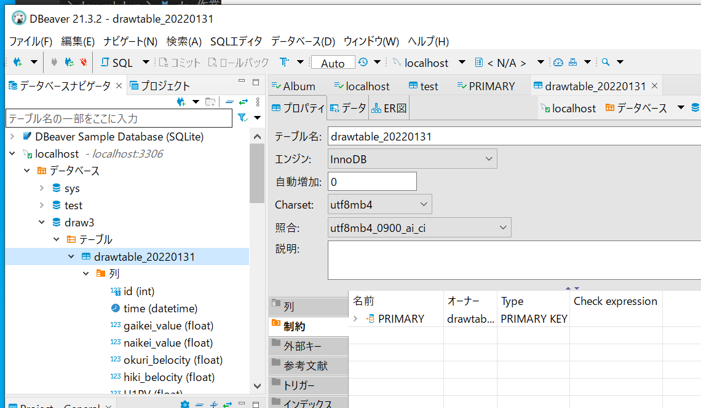
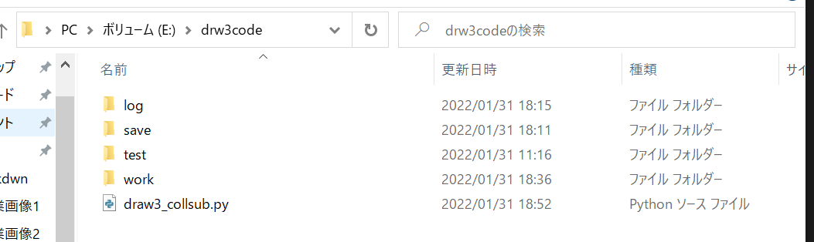
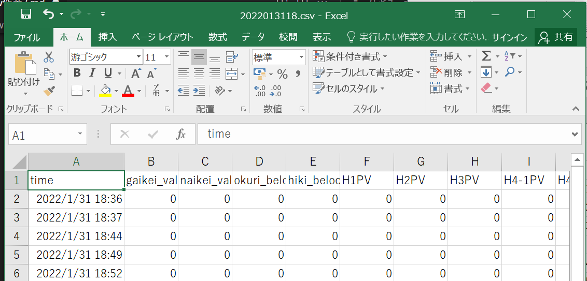
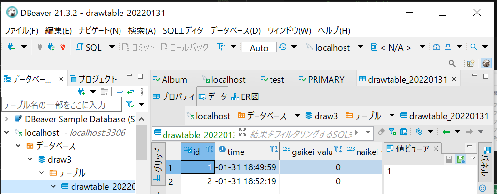

# drw作業3

## dbeverでdbとテーブルを作成



draw3_collsub.pyを作成
```python
# 標準モジュールをインポート
import csv
import sqlite3
import os
import datetime
import socket
import time
import pandas as pd
import mysql.connector as mydb#220111
# import threading
# import tkinter as tk
# import matplotlib
# matplotlib.use('TkAgg')
# from matplotlib.backends.backend_tkagg import FigureCanvasTkAgg
# import matplotlib.pyplot as plt
# from PIL import Image, ImageTk

import logging
from logging.handlers import TimedRotatingFileHandler
import sys

#--------------------------
#rootロガーを取得
logger = logging.getLogger()#インスタンス化
# ログレベルを DEBUG に変更 デフォルトは値は warning info, debug はコンソールに出力されない
logger.setLevel(logging.DEBUG)#fh.setLevel(logging.DEBUG)に加えて必要
#出力のフォーマットを定義
formatter = logging.Formatter('%(asctime)s - %(levelname)s - %(message)s')
#ファイルへ出力するハンドラーを定義
#when='D','H','M'
fh=logging.handlers.TimedRotatingFileHandler(filename='log/drawlog.txt',
                                             when='H',
                                             backupCount=7)
# ログレベルを DEBUG に変更 デフォルトは値は warning info, debug はコンソールに出力されない
fh.setLevel(logging.DEBUG)
fh.setFormatter(formatter)
#rootロガーにハンドラーを登録する
logger.addHandler(fh)
logger.debug('ロギング 開始')
#--------------------------

#変数等の準備
plc_send1=str("500000FFFF03000C00100001040000B41400A82C01")#D5300から300個データ収集　バイナリ
plc_send2=str("500000FF03FF000018000A04010000D*005000012C")#D5000から300個データを取得　アスキー
byte_data1=bytes.fromhex(plc_send1)
byte_data2=plc_send1.encode("UTF-8")
#host = "192.168.0.1" #お使いのサーバーのホスト名を入れます
host = "172.21.5.100" #お使いのサーバーのホスト名を入れます
host2 = "192.168.0.2" #お使いのサーバーのホスト名を入れます
port = 8888 #適当なPORTを指定してあげます
def s32(value):return -(value & 0b100000000000000000000000) | \
(value & 0b011111111111111111111111)
def s16(value):return -(value & 0b1000000000000000) | (value & 0b0111111111111111)
flag=True
err_count=0#210115

todaydetail = datetime.datetime.today()#210921
t1=todaydetail.strftime("%Y%m%d%H")
todaydetail_str=todaydetail.strftime('%Y%m%d')#211119

#ファイルのパス
joined_path = './work'
joined_path2= './save'
#dbpath = 'sample_db.sqlite'

mode='a'
# box=[0,0,0,0,0,0,0,0,0,0,0,0,0,0,0,0,0,0,0,0,\
#      0,0,0,0,0,0,0,0,0,0,0,0,0,0,0,0,0,0,0,0,0,0,0,0,0,0,0,0,0,0]
box=[0 for i in range(35)]
#conn=sqlite3.connect(joined_path0_1)
#conn.execute("VACUUM")
#conn.close()
#データベース生成
def func_dbcreate():
    print('db作ります')
    try:
        conn = mydb.connect(
            host='127.0.0.1',
            port='3306',
            user='root',
            password='tkroyc123',
            database='draw3'
        )
        cur = conn.cursor()
        sql ="CREATE TABLE %s (\
    `id` int NOT NULL AUTO_INCREMENT,\
    `time` datetime DEFAULT NULL,\
    `gaikei_value` float DEFAULT NULL,\
    `naikei_value` float DEFAULT NULL,\
    `okuri_belocity` float DEFAULT NULL,\
    `hiki_belocity` float DEFAULT NULL,\
    `H1PV` float DEFAULT NULL,\
    `H2PV` float DEFAULT NULL,\
    `H3PV` float DEFAULT NULL,\
    `H4-1PV` float DEFAULT NULL,\
    `H4-2PV` float DEFAULT NULL,\
    `H4-3PV` float DEFAULT NULL,\
    `H4-4PV` float DEFAULT NULL,\
    `H5PV` float DEFAULT NULL,\
    `H6PV` float DEFAULT NULL,\
    `H7PV` float DEFAULT NULL,\
    `H1MV` float DEFAULT NULL,\
    `H2MV` float DEFAULT NULL,\
    `H3MV` float DEFAULT NULL,\
    `H4-1MV` float DEFAULT NULL,\
    `H4-2MV` float DEFAULT NULL,\
    `H4-3MV` float DEFAULT NULL,\
    `H4-4MV` float DEFAULT NULL,\
    `H5MV` float DEFAULT NULL,\
    `H6MV` float DEFAULT NULL,\
    `H7MV` float DEFAULT NULL,\
    `roshinkann_PV1` float DEFAULT NULL,\
    `roshinkann_PV2` float DEFAULT NULL,\
    `roshinkann_PV3` float DEFAULT NULL,\
    `roshinkann_PV4` float DEFAULT NULL,\
    `roshinkann_PV5` float DEFAULT NULL,\
    `roshinkann_PV6` float DEFAULT NULL,\
    `roshinkann_PV7` float DEFAULT NULL,\
    `roshinkann_PV8` float DEFAULT NULL,\
    `roshinkann_PV9` float DEFAULT NULL,\
    `roshinkann_PV10` float DEFAULT NULL,\
    PRIMARY KEY (`id`)) "
        tablename05='drawtable_'+todaydetail_str
        cur.execute(sql % tablename05)
        conn.commit()
        cur.close()
    except:
        print(sys.exc_info())
        #pass
    finally:
        conn.close()
func_dbcreate()

def func_dbdel():
    try:
        # コネクションの作成
        conn = mydb.connect(
            host='127.0.0.1',
            port='3306',
            user='root',
            password='tkroyc123',
            database='draw3'
        )
        cur = conn.cursor()
        sql ="show tables like 'drawtable%'"
        cur.execute(sql)
        rows = cur.fetchall()
        df = pd.DataFrame(rows)
        print('テーブル数')
        print(len(df))
        if len(df)>= 10:
            print('テーブル数')
            print(len(df))
            for i in range(0,len(df)-10):
                #print (df.iloc[i,0])
                print('テーブル削除2')
                sql ='drop table if exists %s'
                cur.execute(sql % df.iloc[i,0])
                conn.commit()
        cur.close()
        conn.close()
    except:
        print(sys.exc_info())
    finally:
        conn.close()
func_dbdel()
todaydetail_str_old=todaydetail_str

#binary
def func1_b(x,y):       
    h=22+x*4
    plc16_val1=y[h+2]+y[h+3]+y[h]+y[h+1]
    plc16_val2=y[h+6]+y[h+7]+y[h+4]+y[h+5]
    plc32_val=plc16_val2+plc16_val1
    b=int(plc32_val,16) #16進数文字列を数値に変換
    plc10_num1=s32(b) #10進数符号付きに変換
    return plc10_num1
#binary
def func2_b(x,y):       
    h=22+x*4
    plc16_val1=y[h+2]+y[h+3]+y[h]+y[h+1]
    b=int(plc16_val1,16) #16進数文字列を数値に変換
    plc10_num1=s16(b) #10進数符号付きに変換
    return plc10_num1
#アスキー
def func1_a(x,y):       
    h=22+x*4
    startp1=h
    endp1=h+4
    startp2=h+4
    endp2=h+8
    plc16_val1=y[startp1:endp1]
    plc16_val2=y[startp2:endp2]
    plc32_val=plc16_val2+plc16_val1
    b=int(plc32_val,16) #16進数文字列を数値に変換
    c=hex(b) #16進数の文字列に変換　b''の添え字を消す
    d=int(c, 16) #16進数の数値に変換　b''の添え字を消す
    plc10_num1=s32(d) #10進数符号付きに変換
    return plc10_num1
#アスキー
def func2_a(x,y):       
    h=22+x*4
    startp1=h
    endp1=h+4
    plc16_val1=y[startp1:endp1]
    b=int(plc16_val1,16) #16進数文字列を数値に変換
    c=hex(b) #16進数の文字列に変換　b''の添え字を消す
    d=int(c, 16) #16進数の数値に変換　b''の添え字を消す
    plc10_num2=s16(d) #10進数符号付きに変換
    return plc10_num2

def csvcreate():
    global todaydetail_str_old
    todaydetail = datetime.datetime.today()
    todaydetail_str=todaydetail.strftime('%Y%m%d')
    if todaydetail_str_old!=todaydetail_str:
        #データベース生成
        func_dbcreate()
        #データベース削除
        func_dbdel()
        todaydetail_str_old=todaydetail_str
    #(1)空のcsvファイル生成
    t1=todaydetail.strftime("%Y%m%d%H")
    fname=t1+'.csv'
    file_name=joined_path+'/'+fname
    with open(file_name,mode,newline='')as file_obj:
        csv_writer=csv.writer(file_obj)
    #(2)フォルダの中身を確認
    #ファイル名!＝現在時刻のファイルがあるときリネイムする
    files = os.listdir(joined_path)
    for file in files:
        dtime=file[0:4]+'/'+file[4:6]+'/'+file[6:8]+' '+file[8:10]#12018/4/27 15のような表記
        com_dtime=datetime.datetime.strptime(dtime, '%Y/%m/%d %H')#文字列を日付に変更
        todaydetail = datetime.datetime.today()
        t2=todaydetail.strftime("%Y/%m/%d %H")
        com_t2=datetime.datetime.strptime(t2, '%Y/%m/%d %H')
    #    com_t3=com_t2 - datetime.timedelta(minutes=1)#日付の加算・減算を行うには、datetime.timedeltaを使用する。
        if com_dtime!=com_t2:
            os.renames(joined_path+'/'+file,joined_path2+'/'+file[:8]+'/'+file)
    #(3)ファイルサイズが０の場合タイトルをつける
    filesize=os.path.getsize(file_name)
    if filesize==0:
        box1=['time','gaikei_value','naikei_value','okuri_belocity','hiki_belocity',\
            'H1PV','H2PV','H3PV','H4-1PV','H4-2PV','H4-3PV','H4-4PV','H5PV','H6PV','H7PV',\
            'H1MV','H2MV','H3MV','H4-1MV','H4-2MV','H4-3MV','H4-4MV','H5MV','H6MV','H7MV',\
            'roshinkann_PV1','roshinkann_PV2','roshinkann_PV3','roshinkann_PV4','roshinkann_PV5',\
            'roshinkann_PV6','roshinkann_PV7','roshinkann_PV8','roshinkann_PV9','roshinkann_PV10']                      
        with open(file_name,mode,newline='')as file_obj:
            csv_writer=csv.writer(file_obj)
            csv_writer.writerow(box1)
    print('csv出力')
    return file_name,todaydetail

def func_10():
    start=time.time()
    file_name,todaydetail=csvcreate()
    time1=todaydetail.strftime('%Y-%m-%d %H:%M:%S')
    #(5)PLCと通信
    #host = "192.168.0.1"バイナリー
    try:
        client = socket.socket(socket.AF_INET, socket.SOCK_STREAM) #オブジェクトの作成をします
        client.connect((host, port)) #これでサーバーに接続します
        plc_ret1=client.send(byte_data1) #適当なデータを送信します（届く側にわかるように）
        plc_ret1=client.recv(4096) #レシーブは適当な2の累乗にします（大きすぎるとダメ）
        plc_ret1=plc_ret1.hex()#バイナリーの場合必要でアスキーの場合不要
        client.close()
    except:#211222追加
        print('通信エラー')
        print(time1)
        #print(err_count)
        print(sys.exc_info())
        print('host',host,'host2',host2,'port',port)
        logger.debug('通信エラー')
        logger.debug(time1)
        #logger.debug(err_count)
        logger.exception(sys.exc_info())
        time.sleep(2)
        client.close()#211222追加
        
    # try:    
    #     client2 = socket.socket(socket.AF_INET, socket.SOCK_STREAM) #オブジェクトの作成をします
    #     client2.connect((host2, port)) #これでサーバーに接続します
    #     plc_ret2=client2.send(byte_data2) #適当なデータを送信します（届く側にわかるように）
    #     plc_ret2=client2.recv(4096) #レシーブは適当な2の累乗にします（大きすぎるとダメ）
    #     client2.close()
    # except:
    #         print('通信エラー')
    #         print(time1)
    #         #print(err_count)
    #         print(sys.exc_info())
    #         #print('host',host,'host2',host2,'port',port)
    #         logger.debug('通信エラー')
    #         logger.debug(time1)
    #         #logger.debug(err_count)
    #         logger.exception(sys.exc_info())
    #         time.sleep(2)
    #         client.close()#211222追加
    #         client2.close()#211222追加
    #         #err_count=err_count+1
    #         # if err_count==100:
    #         #     print('再起動してください')
    #         #     logger.debug('再起動してください')
    #         #     break
    #         # continue

    #(6)PLCの値をCSVに入れる
    box[0]=time1
    box[1]=func1_b(10,plc_ret1)
    box[2]=func1_b(12,plc_ret1)
    box[3]=func1_b(0,plc_ret1)
    box[4]=func1_b(2,plc_ret1)

    # box[5]=func2_a(106,plc_ret2)
    # box[6]=func2_a(116,plc_ret2)
    # box[7]=func2_a(126,plc_ret2)
    # box[8]=func2_a(136,plc_ret2)
    # box[9]=func2_a(146,plc_ret2)
    # box[10]=func2_a(156,plc_ret2)
    # box[11]=func2_a(166,plc_ret2)
    # box[12]=func2_a(176,plc_ret2)
    # box[13]=func2_a(186,plc_ret2)
    # box[14]=func2_a(196,plc_ret2)
    # box[15]=func2_a(102,plc_ret2)
    # box[16]=func2_a(112,plc_ret2)
    # box[17]=func2_a(122,plc_ret2)
    # box[18]=func2_a(132,plc_ret2)
    # box[19]=func2_a(142,plc_ret2)
    # box[20]=func2_a(152,plc_ret2)
    # box[21]=func2_a(162,plc_ret2)
    # box[22]=func2_a(172,plc_ret2)
    # box[23]=func2_a(182,plc_ret2)
    # box[24]=func2_a(192,plc_ret2)
    # box[25]=func2_a(206,plc_ret2)
    # box[26]=func2_a(216,plc_ret2)
    # box[27]=func2_a(226,plc_ret2)
    # box[28]=func2_a(236,plc_ret2)
    # box[29]=func2_a(246,plc_ret2)
    # box[30]=func2_a(256,plc_ret2)
    # box[31]=func2_a(266,plc_ret2)
    # box[32]=func2_a(276,plc_ret2)
    # box[33]=func2_a(286,plc_ret2)
    # box[34]=func2_a(296,plc_ret2)
    with open(file_name,mode,newline='')as file_obj:
        csv_writer=csv.writer(file_obj)
        csv_writer.writerow(box)
    try:
        # データベース接続とカーソル生成
        conn = mydb.connect(
            host='127.0.0.1',
            port='3306',
            user='root',
            password='tkroyc123',
            database='draw3'
        )
        cur = conn.cursor()
        tablename10='drawtable_'+todaydetail_str
        sql_1 = 'insert into '+tablename10
        # sql_2 = '(time,gaikei_value,naikei_value,okuri_belocity,hiki_belocity,\
        #             H1PV,H2PV,H3PV,H4-1PV,H4-2PV,H4-3PV,H4-4PV,H5PV,H6PV,H7PV,\
        #             H1MV,H2MV,H3MV,H4-1MV,H4-2MV,H4-3MV,H4-4MV,H5MV,H6MV,H7MV,\
        #             roshinkann_PV1,roshinkann_PV2,roshinkann_PV3,roshinkann_PV4,roshinkann_PV5,\
        #             roshinkann_PV6,roshinkann_PV7,roshinkann_PV8,roshinkann_PV9,roshinkann_PV10) \
        #     values (%s,%s,%s,%s,%s,\
        #         %s,%s,%s,%s,%s,%s,%s,%s,%s,%s,\
        #         %s,%s,%s,%s,%s,%s,%s,%s,%s,%s,\
        #         %s,%s,%s,%s,%s,%s,%s,%s,%s,%s)'
        sql_2 = '(`time`, gaikei_value, naikei_value, okuri_belocity, hiki_belocity,\
             H1PV, H2PV, H3PV, `H4-1PV`, `H4-2PV`, `H4-3PV`, `H4-4PV`, H5PV, H6PV, H7PV,\
             H1MV, H2MV, H3MV, `H4-1MV`, `H4-2MV`, `H4-3MV`, `H4-4MV`, H5MV, H6MV, H7MV,\
             roshinkann_PV1, roshinkann_PV2, roshinkann_PV3, roshinkann_PV4, roshinkann_PV5,\
             roshinkann_PV6, roshinkann_PV7, roshinkann_PV8, roshinkann_PV9, roshinkann_PV10)\
            values (%s,%s,%s,%s,%s,\
                %s,%s,%s,%s,%s,%s,%s,%s,%s,%s,\
                %s,%s,%s,%s,%s,%s,%s,%s,%s,%s,\
                %s,%s,%s,%s,%s,%s,%s,%s,%s,%s)'
        sql_3 = sql_1+sql_2
        data = (todaydetail,box[1],box[2],box[3],box[4],\
            box[5],box[6],box[7],box[8],box[9],box[10],box[11],box[12],box[13],box[14],\
            box[15],box[16],box[17],box[18],box[19],box[20],box[21],box[22],box[23],box[24],\
            box[25],box[26],box[27],box[28],box[29],box[30],box[31],box[32],box[33],box[34])
        print(sql_3)
        print(data)
        cur.execute(sql_3,data)
        conn.commit()
        cur.close()
    except:
        print(sys.exc_info())
    finally:
        conn.close()
    p_time=time.time()-start
    print(p_time)

if __name__ == '__main__':
    func_10()
    #func_dbdel()

```

ディレクトリ構造は下記のようにする。



CSVが出力されている。



またdbにもデータが入っている。




