# drw作業4

## グラフ化

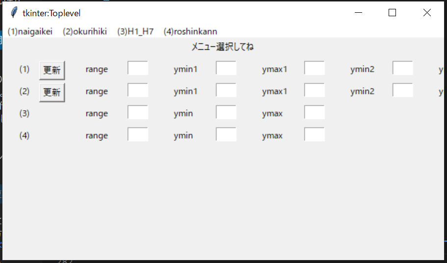
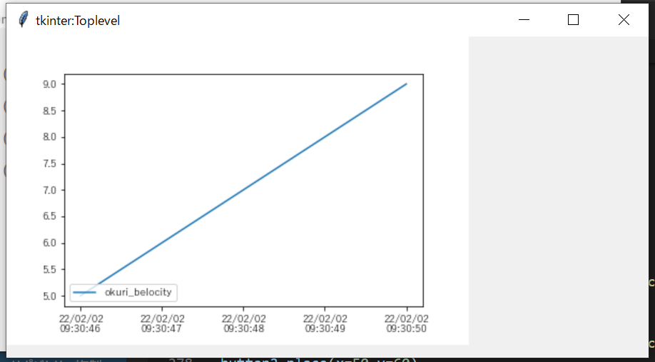


draw3_graph.pyを作成
```python

#%%
import tkinter as tk

from matplotlib.backends.backend_tkagg import FigureCanvasTkAgg
import time

import pandas as pd
import mysql.connector as mydb
import matplotlib.pyplot as plt
import matplotlib.dates as mdates
import datetime

todaydetail = datetime.datetime.today()#210921
todaydetail_str=todaydetail.strftime('%Y%m%d')#211119

from matplotlib import rcParams
rcParams['font.family'] = 'sans-serif'
rcParams['font.sans-serif'] = ['Hiragino Maru Gothic Pro', 'Yu Gothic', 'Meirio', 'Takao', 'IPAexGothic', 'IPAPGothic', 'VL PGothic', 'Noto Sans CJK JP']

# rootメインウィンドウの設定
root = tk.Tk()
root.title("tkinter:Toplevel")
root.geometry("600x300")

# sub_winを定義する
sub_win = None
sub_win2 = None
sub_win3 = None
sub_win4 = None
fig = plt.figure()

def sub_window():
    global sub_win
    if sub_win == None or not sub_win.winfo_exists():
        sub_win = tk.Toplevel()#(master=root)いらない
        sub_win.geometry("600x300")
        
        #(1)figを生成します。
        #fig = plt.figure()#これを外で宣言したほうがいいかも？ 
        #(2) 実際のグラフを描画するAxesインスタスを生成
        ax1 = fig.add_subplot(1, 1, 1)
        #label_sub = tk.Label(sub_win, text="サブウィンドウ")
        #label_sub.pack()
        canvas = FigureCanvasTkAgg(fig, master=sub_win)#(fig, master=root)
        plot_widget = canvas.get_tk_widget()

        def func_1():
            fig.clf()# Clear figure グラフを消している

            conn = mydb.connect(
                    host='127.0.0.1',
                    port='3306',
                    user='root',
                    password='testneg',
                    database='draw_database'
                )
            cur = conn.cursor()
            db_get0 = 'SELECT time,col1 from test order by id desc limit '
            db_get1='5'
            db_get = db_get0+db_get1
            cur.execute(db_get)
            result_g = cur.fetchall()
            cur.close()
            conn.close()
            
            boxpd = pd.DataFrame(result_g)
            boxpd_x = pd.to_datetime(boxpd[0])
            boxpd_x = boxpd_x.sort_index(ascending=False)
            
            boxpd_y1 = boxpd[1]
            boxpd_y1 = boxpd_y1.sort_index(ascending=False)
            
            #更新した値をグラフに代入
            ax1 = fig.add_subplot(1, 1, 1)
            #ax1.set_ylim(89990,90020)
            ax1.xaxis.set_major_formatter(mdates.DateFormatter('%y/%m/%d\n%H:%M:%S'))
            ax1.plot(boxpd_x,boxpd_y1,label="測定")
            ax1.legend(loc='lower left')
            #Canvasのグラフに再描写する　1秒おきに以上を繰り返す
            fig.canvas.draw()
            root.after(1000,func_1)
        plot_widget.grid()
        root.after(1000,func_1)    

def sub_window2():
    global sub_win2
    if sub_win2 == None or not sub_win2.winfo_exists():
        sub_win2 = tk.Toplevel()#(master=root)いらない
        sub_win2.geometry("600x300")
        
        #(1)figを生成します。
        #fig = plt.figure()#これを外で宣言したほうがいいかも？ 
        #(2) 実際のグラフを描画するAxesインスタスを生成
        ax1 = fig.add_subplot(1, 1, 1)
        #label_sub = tk.Label(sub_win, text="サブウィンドウ")
        #label_sub.pack()
        canvas = FigureCanvasTkAgg(fig, master=sub_win2)#(fig, master=root)
        #plot_widget = canvas.get_tk_widget(side=tk.TOP,fill=tk.BOTH,expand=1)
        #plot_widget = canvas.get_tk_widget().pack(side=tk.TOP,fill=tk.BOTH,expand=1)
        plot_widget = canvas.get_tk_widget()
        def func_2():
            fig.clf()# Clear figure グラフを消している

            conn = mydb.connect(
                    host='127.0.0.1',
                    port='3306',
                    user='root',
                    password='tkroyc123',
                    database='draw3'
                )
            cur = conn.cursor()
            tablename10='drawtable_'+todaydetail_str
            sql_1 = 'SELECT time,okuri_belocity,hiki_belocity from '+tablename10
            sql_2=' order by id desc limit %s'
            sql_3 = sql_1+sql_2
            data = (int(5),)
            data=b2_0
            if b2_0==None or  b2_0=='':            
                data = (int(5),)
            else:
                data=(int(b2_0),)
            cur.execute(sql_3,data)
            result_g = cur.fetchall()
            cur.close()
            conn.close()
            
            boxpd = pd.DataFrame(result_g)
            boxpd_x = pd.to_datetime(boxpd[0])
            boxpd_x = boxpd_x.sort_index(ascending=False)
            
            boxpd_y1 = boxpd[1]
            boxpd_y1 = boxpd_y1.sort_index(ascending=False)
            
            #更新した値をグラフに代入
            ax1 = fig.add_subplot(1, 1, 1)
            #ax1.set_ylim(89990,90020)
            ax1.xaxis.set_major_formatter(mdates.DateFormatter('%y/%m/%d\n%H:%M:%S'))
            ax1.plot(boxpd_x,boxpd_y1,label="okuri_belocity")
            ax1.legend(loc='lower left')
            #Canvasのグラフに再描写する　1秒おきに以上を繰り返す
            fig.canvas.draw()
            root.after(1000,func_2)
        plot_widget.grid()
        root.after(1000,func_2)
# メインフレームの作成と設置
#frame = tk.Frame(root)
#frame.pack(fill = tk.BOTH, padx=5, pady=10)
# 各種ウィジェットの作成
#button = ttk.Button(frame, text="サブウィンドウ生成", command=sub_window)
# 各種ウィジェットの設置
#button.pack()

# メニューの設定
m = tk.Menu(root)
root.configure(menu = m)
m.add_command(label = '(1)naigaikei', under = 0, command = sub_window)
m.add_command(label = '(2)okurihiki', under = 0, command = sub_window2)
m.add_command(label = '(3)H1_H7', under = 0, command = '')
m.add_command(label = '(4)roshinkann', under = 0, command = '')

# ラベルの設定
tk.Label(root, text = 'メニュー選択してね').pack()

label1=tk.Label(root,text='(1)')
label1_0=tk.Label(root,text='range')
label1_1=tk.Label(root,text='ymin1')
label1_2=tk.Label(root,text='ymax1')
label1_3=tk.Label(root,text='ymin2')
label1_4=tk.Label(root,text='ymax2')
label1.place(x=20,y=30)
label1_0.place(x=110,y=30)
label1_1.place(x=230,y=30)
label1_2.place(x=350,y=30)
label1_3.place(x=470,y=30)
label1_4.place(x=590,y=30)

label2=tk.Label(root,text='(2)')
label2_0=tk.Label(root,text='range')
label2_1=tk.Label(root,text='ymin1')
label2_2=tk.Label(root,text='ymax1')
label2_3=tk.Label(root,text='ymin2')
label2_4=tk.Label(root,text='ymax2')
label2.place(x=20,y=60)
label2_0.place(x=110,y=60)
label2_1.place(x=230,y=60)
label2_2.place(x=350,y=60)
label2_3.place(x=470,y=60)
label2_4.place(x=590,y=60)

label3=tk.Label(root,text='(3)')
label3_0=tk.Label(root,text='range')
label3_1=tk.Label(root,text='ymin')
label3_2=tk.Label(root,text='ymax')
label3.place(x=20,y=90)
label3_0.place(x=110,y=90)
label3_1.place(x=230,y=90)
label3_2.place(x=350,y=90)

label4=tk.Label(root,text='(4)')
label4_0=tk.Label(root,text='range')
label4_1=tk.Label(root,text='ymin')
label4_2=tk.Label(root,text='ymax')
label4.place(x=20,y=120)
label4_0.place(x=110,y=120)
label4_1.place(x=230,y=120)
label4_2.place(x=350,y=120)

#テキストボックスを作る
tbox1_0=tk.Entry(width=4)
tbox1_1=tk.Entry(width=4)
tbox1_2=tk.Entry(width=4)
tbox1_3=tk.Entry(width=4)
tbox1_4=tk.Entry(width=4)
tbox1_0.place(x=170,y=30)
tbox1_1.place(x=290,y=30)
tbox1_2.place(x=410,y=30)
tbox1_3.place(x=530,y=30)
tbox1_4.place(x=650,y=30)

tbox2_0=tk.Entry(width=4)
tbox2_1=tk.Entry(width=4)
tbox2_2=tk.Entry(width=4)
tbox2_3=tk.Entry(width=4)
tbox2_4=tk.Entry(width=4)
tbox2_0.place(x=170,y=60)
tbox2_1.place(x=290,y=60)
tbox2_2.place(x=410,y=60)
tbox2_3.place(x=530,y=60)
tbox2_4.place(x=650,y=60)

tbox3_0=tk.Entry(width=4)
tbox3_1=tk.Entry(width=4)
tbox3_2=tk.Entry(width=4)
tbox3_0.place(x=170,y=90)
tbox3_1.place(x=290,y=90)
tbox3_2.place(x=410,y=90)

tbox4_0=tk.Entry(width=4)
tbox4_1=tk.Entry(width=4)
tbox4_2=tk.Entry(width=4)
tbox4_0.place(x=170,y=120)
tbox4_1.place(x=290,y=120)
tbox4_2.place(x=410,y=120)

#ボタンクリックされた時の処理
b1_0=None
b1_1=None
b1_2=None
b1_3=None
b1_4=None
def ButtonBlick1():
    global b1_0,b1_1,b1_2,b1_3,b1_4
    b1_0=tbox1_0.get()
    b1_1=tbox1_1.get()
    b1_2=tbox1_2.get()
    b1_3=tbox1_3.get()
    b1_4=tbox1_4.get()

b2_0=None    
b2_1=None
b2_2=None
b2_3=None
b2_4=None
def ButtonBlick2():
    global b2_0,b2_1,b2_2,b2_3,b2_4
    b2_0=tbox2_0.get()
    b2_1=tbox2_1.get()
    b2_2=tbox2_2.get()
    b2_3=tbox2_3.get()
    b2_4=tbox2_4.get()

#ボタンをつくる
button1=tk.Button(root,text='更新',command=ButtonBlick1)
button1.place(x=50,y=30)

button2=tk.Button(root,text='更新',command=ButtonBlick2)
button2.place(x=50,y=60)

root.mainloop()
# %%

```

とりあえず表示はされたが、時刻が見にくかったり、グラフを自在に大きくしたりができない。まずはグラフの大きさを大きくできないか検討。


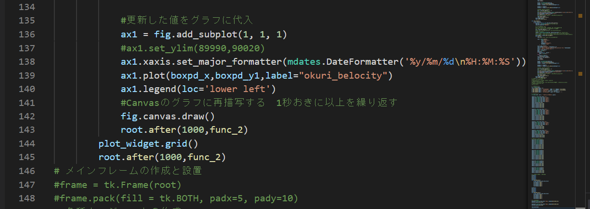

以上が怪しそう。

plot_widget.grid()の代わりに
plot_widget.pack(side=tk.TOP,fill=tk.BOTH,expand=1)
以上を追加したらグラフの大きさは自在に変更できた。

結果として時刻も見やすくなっていた。

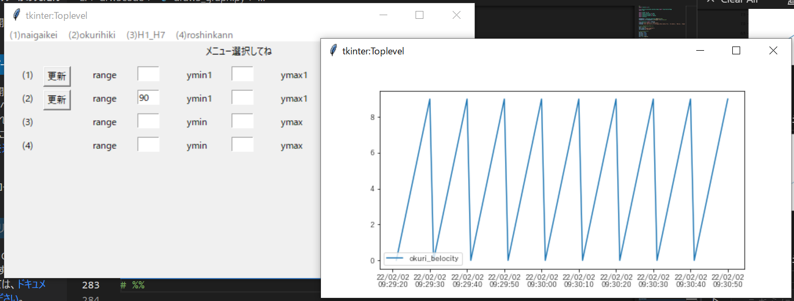

## データ収集をbatで動かす。

draw3_collmain.batを作る。


内容は下記

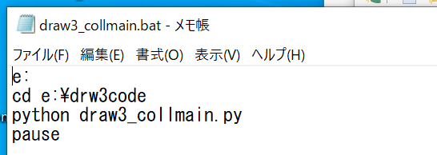

## グラフを複数個作る。


## IP変更
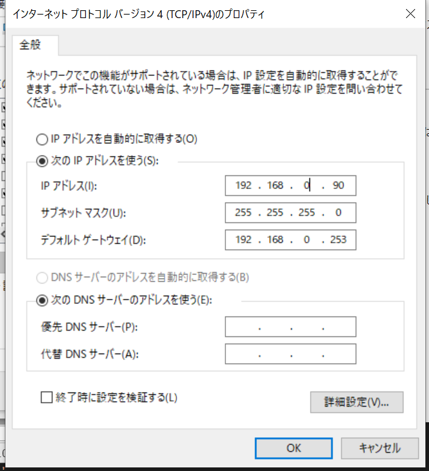


## トラブル

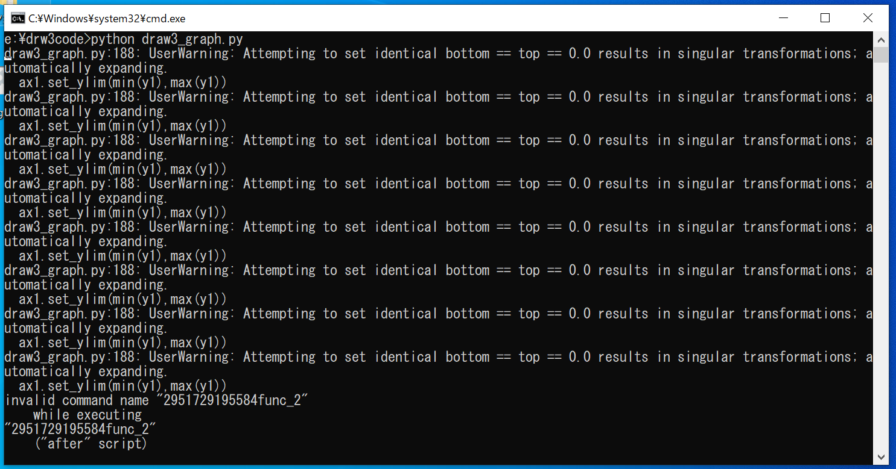

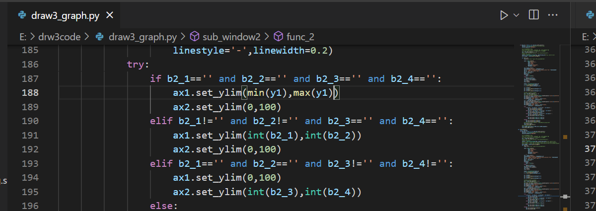

y1の値がmax、min二つとも0が入っているとエラーが出ていた

ただグラフを閉じてもエラーが出続けている？

試しにtestをプリントさせてみた

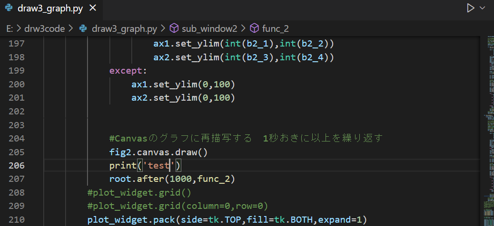

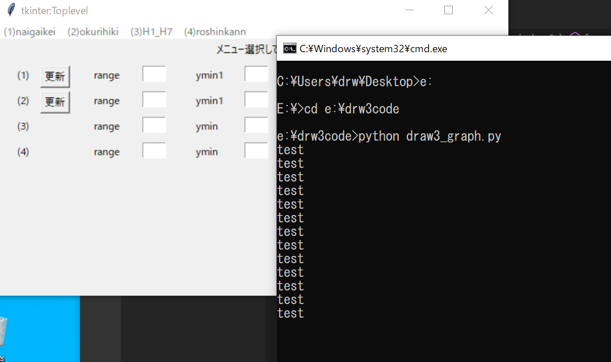

グラフを落としてもtestが出力されつづけた。

root.afterの後の関数を止めないといけない。

while executing

これがエラー内容だと思う。

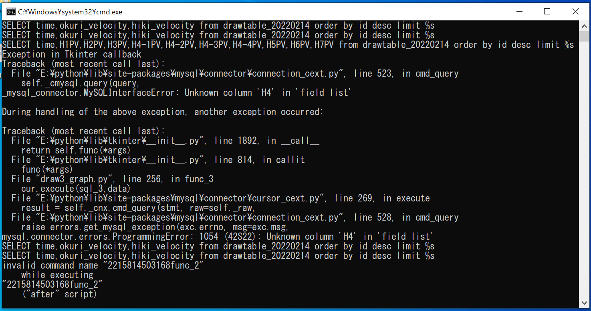

何かをトリガにaftercancelしたい。


別のトラブル

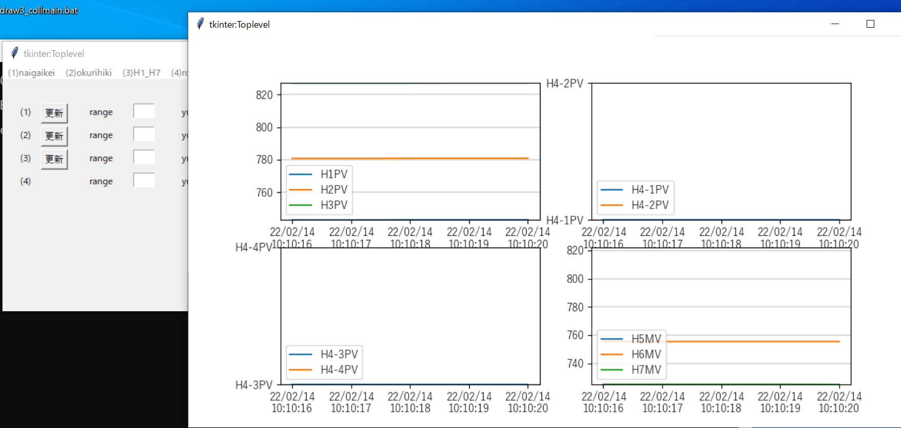

sql文に問題あり


ハイフンが特殊文字なのでエスケープした
