# drw作業5

## 別PCにdbeaverを利用してデータ移動

dbeaverのtaskを利用

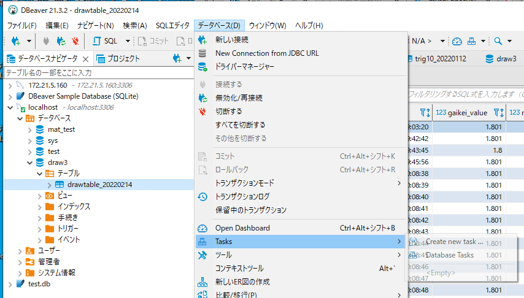

dataexportを選択してname,descriptionを記述

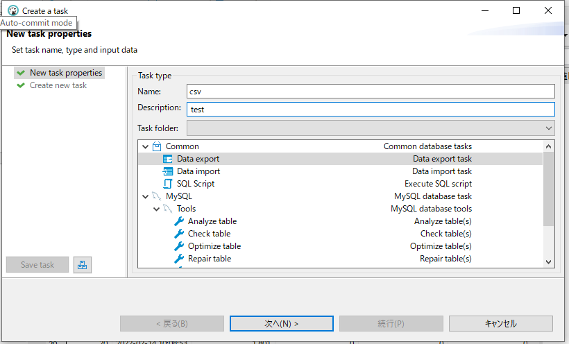

CSVにするテーブルを選択。あとは標準設定でcsvが出力される

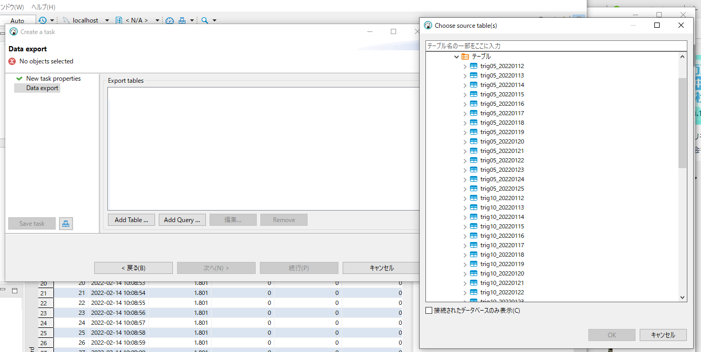

次にインポート

まずはdbを作りsql文でテーブルを作る。

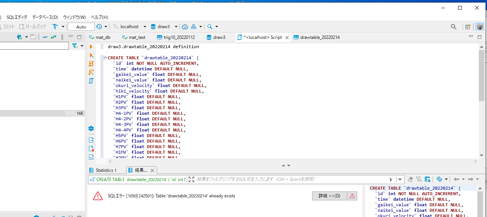

作ったテーブルを選択しデータのエクスポートを選ぶ

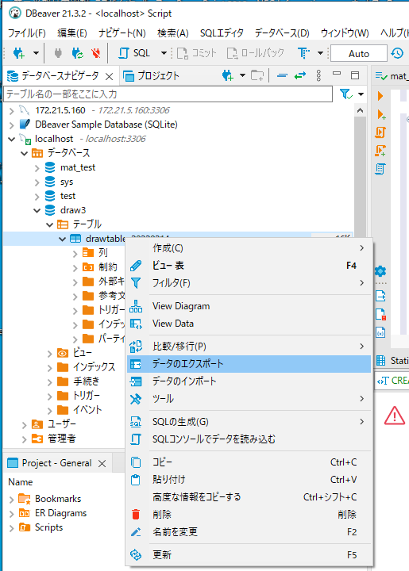

先ほど出力したデータを選ぶ

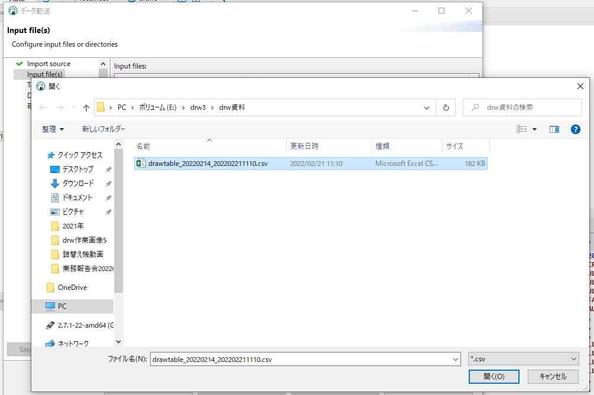

無事にデータが入った

## tkinterでtoplevelのプログラムが停止していない。

draw3_graph.pyを起動

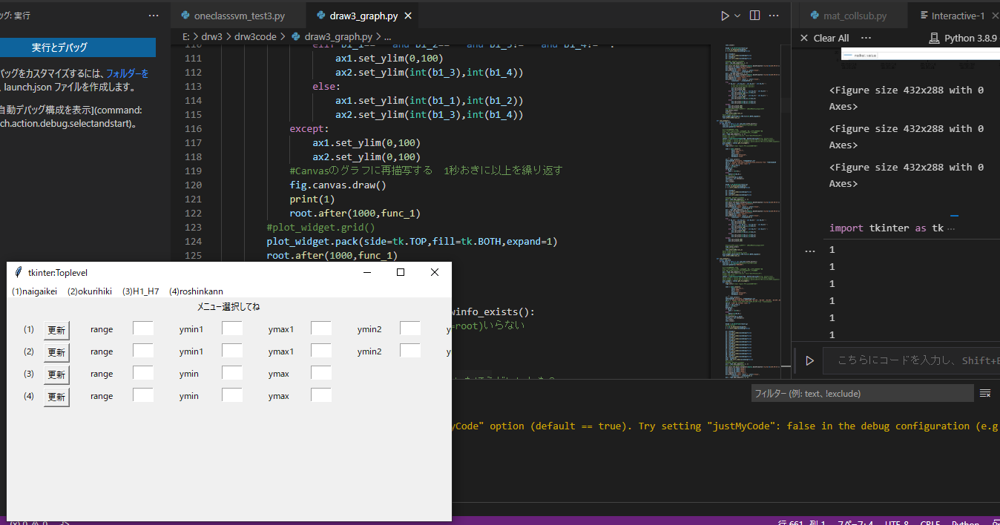

func_1にprint文を記載。

（１）naigaikeiを起動させた後サブ画面を閉じてみたがprint文が起動したままだった。

また下記のようにsub_winのインスタンスを確認してみたところ新たにウィンドウを作り直すたびに、新たなインスタンスが作られていることが判明した。

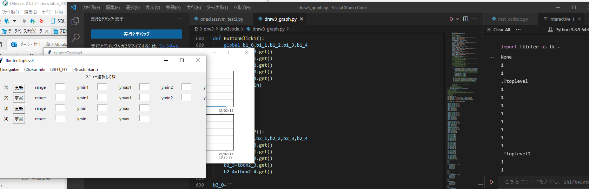

対策１

sub_win.destroyで消してみた

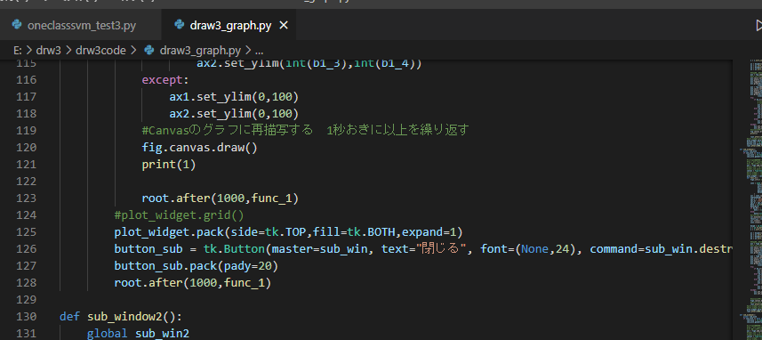

結果

バツ印で消すのと挙動が変わらなかった

対策２

`after` メソッドは戻り値として `id` を返却しますので、キャンセルしたい `after` メソッドの戻り値を `after_cancel` 実行時に引数として指定すれば良い

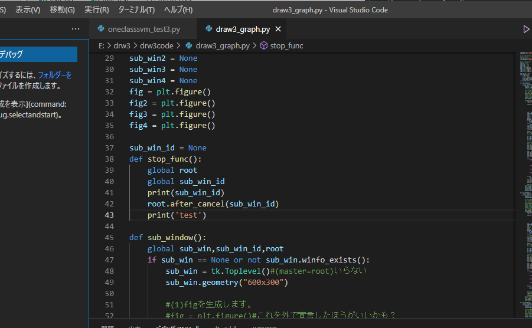

after部分に

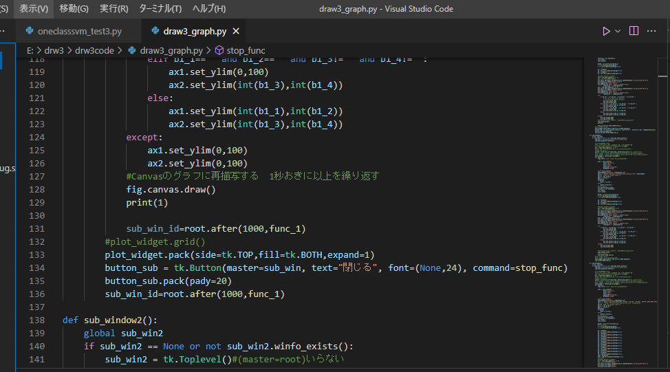

ただこれでもうまくいかなかった。

対策3

after_cancelで別の書き方にしてみる。

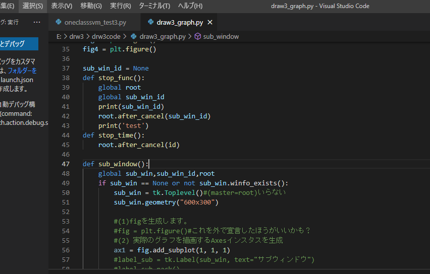

after部分

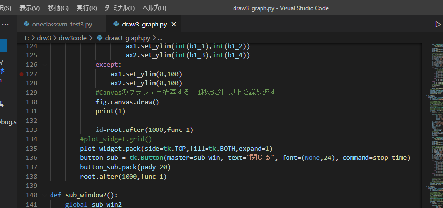

これでも駄目だった。

対策4

対策１でOKだった。func_1を止めないといけないのでfunc_1にglobal sub_win_idを入れないといけなかった。

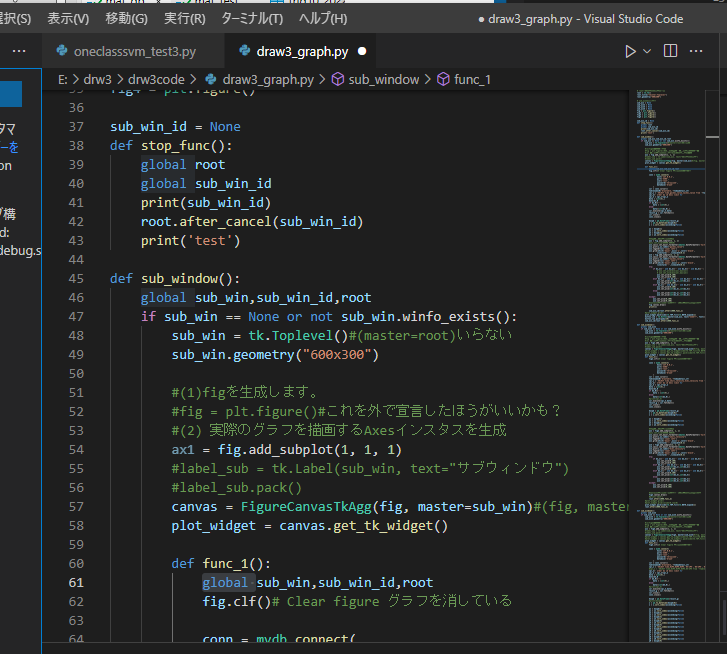

afterも止めて画面も消してみた。コマンド部分に複数関数を登録した。

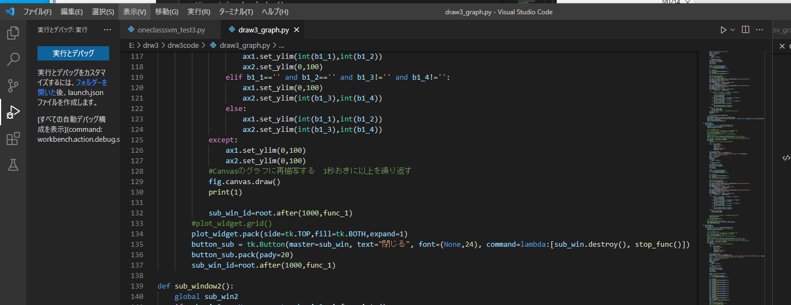

ただよく考えたらstop_funcの中にsub_win.destroyを入れると一つの関数で複数処理してくれる

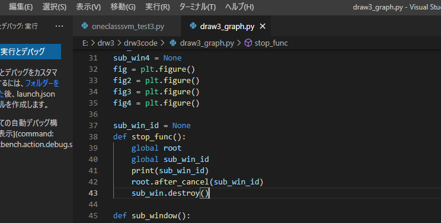

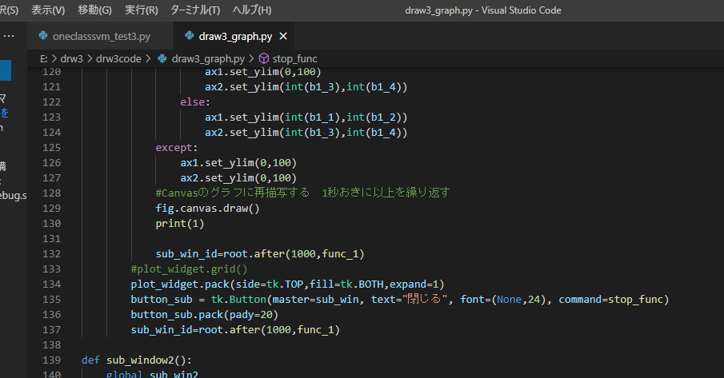

ボタンでafterを止め、ウィンドウを消すのではなく×で処理する。

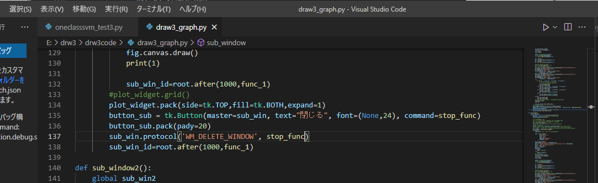

成功した。使い勝手よくなるようにプログラムを修正していく。

例えばcommand=lambda:msg_show("ボタンが押されました。")のように引数を入れたりする。

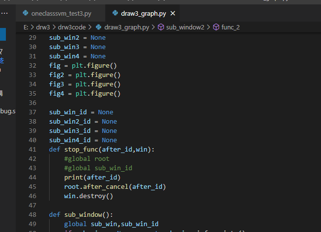

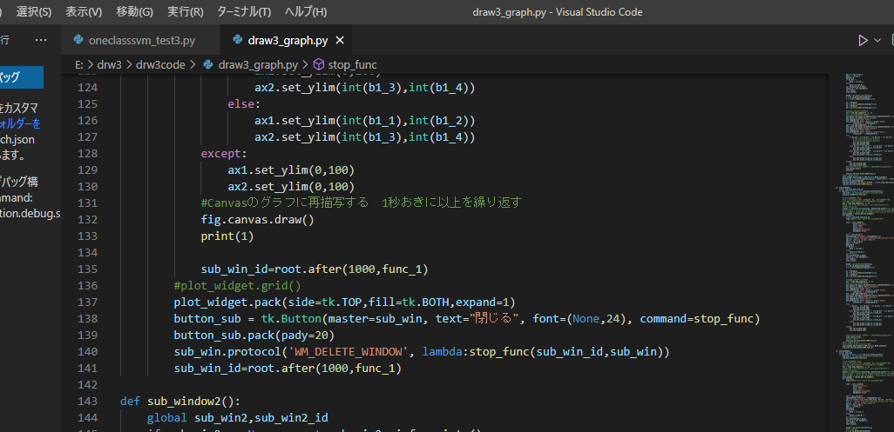

各ウィンドウに対してafterの停止処理を入れることができた。

