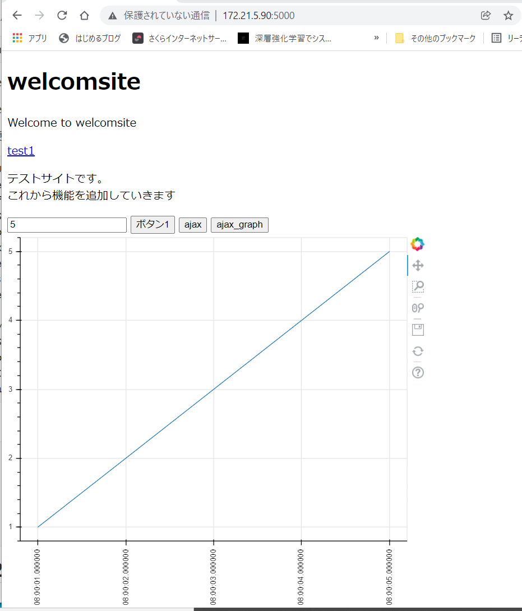
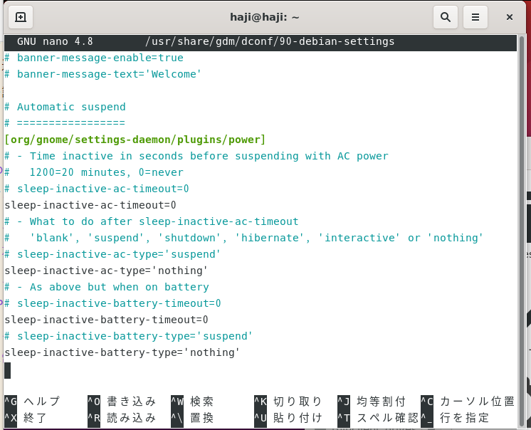

---

---

## ubuntuのflask設定方法10

### uWSGI、nginxの環境を整える

uWSGIの動作確認をする

```
pip3 install uWSGI
```

Successfully installed uWSGI-2.0.20

sudoつけないとダメだった。

```
sudo pip3 install uwsgi
```

Successfully installed uwsgi-2.0.20

test.py

```python
def application(env, start_response):
    start_response('200 OK', [('Content-Type','text/html')])
    return [b"Hello World uWSGI"]
```

下記コマンドで実行

```
uwsgi --http :8000 --wsgi-file test.py    
```

### uWSGIを通してFlaskのサイトをブラウザに表示する以下のコマンドで実行

```
uwsgi --http :8000 --wsgi-file flasktest.py --callable app
```


### Nginxの動作確認をする

```
sudo apt install nginx
sudo apt uninstall nginx
sudo systemctl status nginx
sudo systemctl start nginx
sudo systemctl enable nginx
sudo systemctl stop nginx
```

[http://127.0.0.1:80](http://127.0.0.1/) にアクセス

成功した。

### nginxの設定ファイル作成

設定ファイルは/etc/nginx/nginx.confに入っている

ここにinclude /etc/nginx/nginx.d/*.conf;という記載がある。

なので今回は/etc/nginx/nginx.d/uwsgi.confというファイルを作る

sudo nano /etc/nginx/conf.d/uwsgi.conf

```
server {
    listen       5000;
    location / {
        include uwsgi_params;
        uwsgi_pass unix:///tmp/uwsgi.sock;
    }
}
```

serverコンテキスト内を記載した

listenにipを書くと表示されなくなったのでこの書き方

念のため構文のチェックを行う

```
nginx -t
sudo systemctl daemon-reload
sudo systemctl status nginx
sudo systemctl restart nginx
sudo systemctl enable nginx
```

ローカルホストIPを変更した下記に記載する。

sudo nano /etc/dhcpcd.conf

### NginxとuWSGIを接続して、動作確認

daemonize入れると動かなかった

logfile-chmod = 644これがないとlogファイルにread権限がつかなかった

die-on-term = trueこれがないとなぜかスレッドしか動かなかった

master = true

これをとると複数アクセスが不可になった

processes = 1

これをとると複数アクセスが不可になった

lazy-apps = trueよくわからないが各workerにアプリに配るみたい

元のmyapp.ini

```
[uwsgi]
current_release = /home/pi/flask-test3
chdir = %(current_release)
wsgi-file=%(current_release)/app.py
callable=app
#callable=logger

processes = 4
threads = 2
thunder-lock = true
max-requests = 3000
max-requests-delta = 300
master = True
workers = 1
enable-threads = true
lazy-apps = true

socket = /tmp/uwsgi.sock
chmod-socket = 666
vacuum = true
die-on-term = true
logto = /home/pi/flask-test3/logs/uwsgi.log
logfile-chown
log-master = true
log-reopen = true
touch-logreopen = /home/pi/flask-test3/logs/logreopen
```

最後の行はたぶんいらないので削除

sudo nano /home/haji/flask-test1/myapp.ini

```
[uwsgi]
current_release = /home/haji/flask-test1
chdir = %(current_release)
wsgi-file=%(current_release)/flasktest.py
callable=app

processes = 4
threads = 2
thunder-lock = true
max-requests = 3000
max-requests-delta = 300
master = True
workers = 1
enable-threads = true
lazy-apps = true

socket = /tmp/uwsgi.sock
chmod-socket = 666
vacuum = true
die-on-term = true
logto = /home/haji/flask-test1/logs/uwsgi.log
logfile-chown
log-master = true
log-reopen = true
```

とりあえず下記のコマンドで動くか確認

```
/usr/local/bin/uwsgi --http :8000 --wsgi-file flasktest.py --callable app
/usr/local/bin/uwsgi --ini  /home/haji/flask-test1/myapp.ini
```

成功した



ちなみにログを見てみる


print関数の部分も出力されている。これは朗報。アクセスログ以外にエラーログも残せる


logローテーション設定

logrotateの設定を行う

そもそもlogrotateは入っているの？

```
sudo systemctl status logrotate
```

入っていたので設定ファイルを作る

/etc/logrotate.dここに記載する

```
sudo nano /etc/logrotate.d/uwsgi1-log
```

uwsgi1-log 前のバージョン

```
/home/haji/flask-test1/logs/uwsgi.log {
    create 666 root root
    hourly
    missingok
    rotate 10
    notifempty
    compress
    dateext
    dateformat -%Y%m%d%H
    sharedscripts
    postrotate
            touch /home/pi/flask-test3/logs/logreopen
    endscript
}
```

uwsgiにtouch-logreopen = /home/pi/flask-test3/logs/logreopenが書いていないので

```
	sharedscripts
    postrotate
            touch /home/pi/flask-test3/logs/logreopen
    endscript
```

ここをとってもいいのでは？ローテート後にsyslogを再起動するためのことを記述するが今回はシェルスクリプトにしてcrontab -eで実行させるので別にいらない。

sudo nano /etc/logrotate.d/uwsgi1-log

```
/home/haji/flask-test1/logs/uwsgi.log {
    create 666 root root
    hourly
    missingok
    rotate 10
    notifempty
    compress
    dateext
    dateformat -%Y%m%d%H
}
```

missingok          # ログファイルがなくてもエラーを出さない

rotate 10          # 10世代分古いログを残す

daily              # 毎日ローテートする

notifempty　# ログファイルが空ならローテーションしない

compress           # 圧縮する

dateext　　　# バックアップファイルの末尾が数値の羅列でなく日付になる

dateformat -%Y%m%d%H　 # dateフォーマットを任意のものに変更する

下記で実行する

ローテートする条件を満たしていなくても強制的に実行する場合は`-f`を付ける

```
sudo /usr/sbin/logrotate -f /etc/logrotate.d/uwsgi
```


問題点

再起動の度に自動サスペンドが復活してしまう。

ubunt_flask設定8参照

```
sudo systemctl restart systemd-logind.service 
```

再度このコマンドを実行してみた

restartでなくenableの方がいいの？

まずはsystemdにユニットファイルを更新したことを通知する。

ユニットファイルからのプログラムの自動起動を有効にする。

```
sudo systemctl daemon-reload
sudo systemctl status systemd-logind.service 
sudo systemctl enable systemd-logind.service 
```

ダメだった。別の部分を変更させてみる。

https://qiita.com/ikesama200/items/f595293de82ddc9fa3f1


```
sudo nano /usr/share/gdm/dconf/90-debian-settings
sudo nano /etc/gdm3/greeter.dconf-defaults
```

上記の一番下に下記を追加

```
sleep-inactive-ac-timeout = 0
sleep-inactive-battery-timeout = 0
```

ちなみに上を変更すると下も勝手に変更されるみたい。


上記の時間を変更しても変化なし

コメント外してみても変化なし

下記でそれ以外も蓋閉じたときの動作を確認したが問題なし

```
sudo nano /etc/systemd/logind.conf
```

下記も追加

```
sleep-inactive-ac-type='suspend'
sleep-inactive-battery-type='nothing'
```





suspendの項目4個をnoに下

```
sudo nano /etc/systemd/sleep.conf
```

これでもダメだった

以前のやり方を

```
#スリープ機能を無効
sudo systemctl mask sleep.target suspend.target hibernate.target hybrid-sleep.target
#スリープ機能を有効
sudo systemctl unmask sleep.target suspend.target hibernate.target hybrid-sleep.target
```

エラー内容的にはhibernate.targetとhybrid-sleep.targetを消さなければ大丈夫そう


```
sudo systemctl mask sleep.target suspend.target
```


下記で確認したが大丈夫そうだった

```
cat /var/log/auth.log | tail -50
cat /var/log/kern.log | tail -50
```

もとに戻しておく。容量も大丈夫そう


成功した。


