## ubuntuのflask設定方法11

### uWSGI、nginxの環境を整える

問題発生sudoで動かすと画面表示されなかった

```
sudo /usr/local/bin/uwsgi --ini  /home/haji/flask-test1/myapp.ini
```


下記で試してもダメだった。

```
sudo /usr/local/bin/uwsgi --http :8000 --wsgi-file flasktest.py --callable app
```

ただ下ならOKだった。

```
sudo /usr/local/bin/uwsgi --http :8000 --wsgi-file test.py  
```

両者の違いとしてはflaskが入っているか、入っていないか。

なのでsudoでflaskを入れる

```
sudo pip3 install Flask==1.1.2
```

一度ターミナルを変えて実行する。

ダメだった

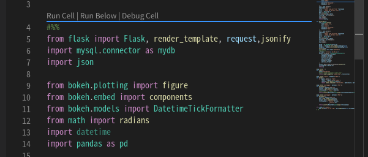

過去に入れたライブラリも見直しておく

```
sudo pip3 install bokeh==0.13.0
sudo pip3 install mysql-connector-python
sudo pip3 install pandas
```

```
sudo /usr/local/bin/uwsgi --ini  /home/haji/flask-test1/myapp.ini
```

成功した。

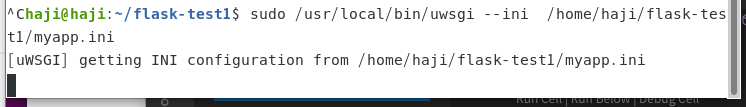

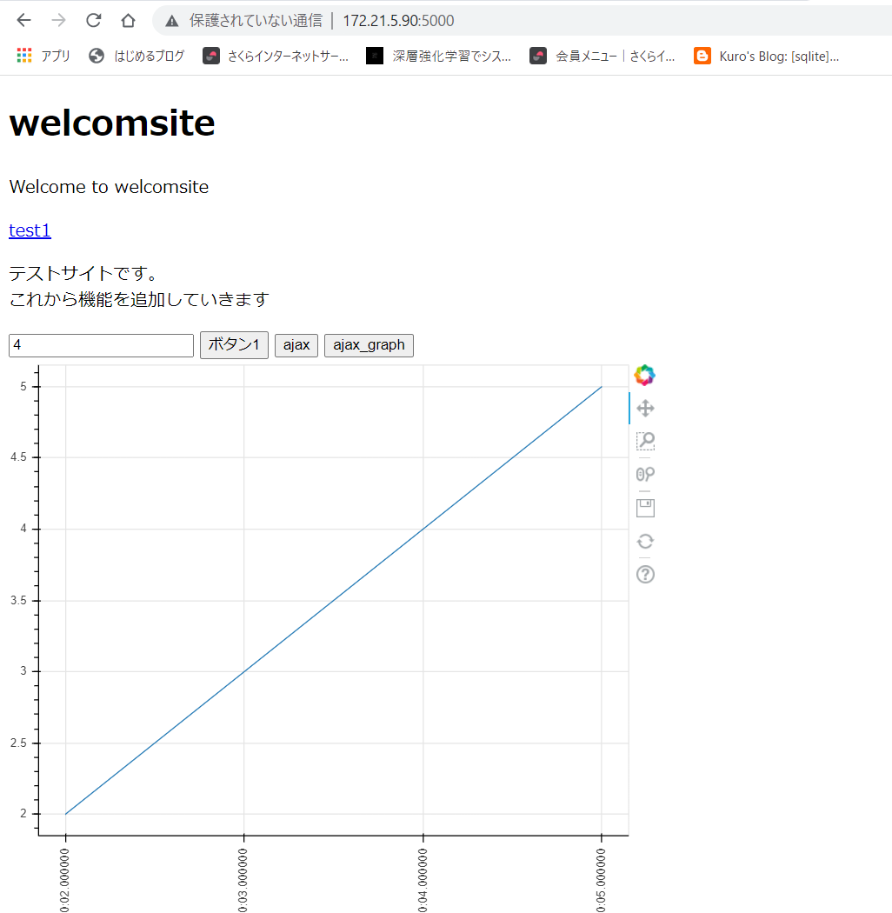


IPアドレスを変更する

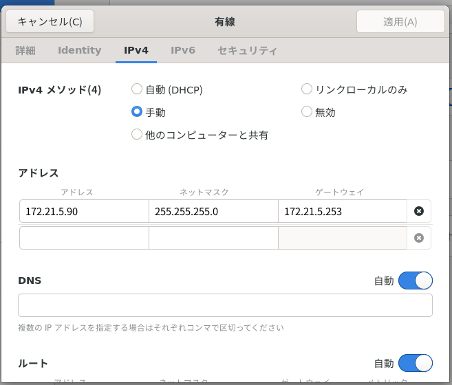

リモートでは変えれなかった？

直接変更した。

### pythonでwhile文のプログラムをsystemdで動かす

そもそもpythonプログラムを切れるか確認する

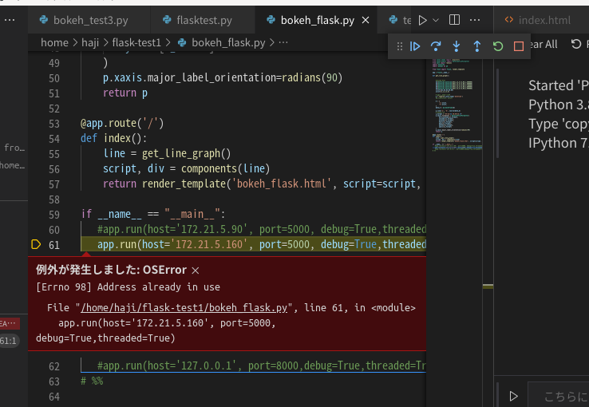

すでにポート使われている？

```
sudo lsof -i :5000
```

sudoつかないとダメだった？

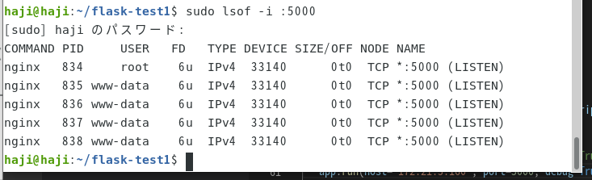

nginxが使用していたポート変えて実行

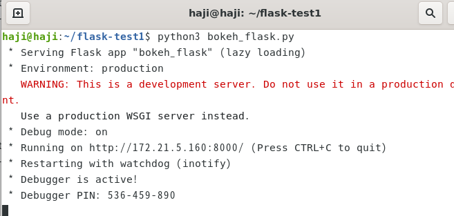

```
ps aux | grep python
```

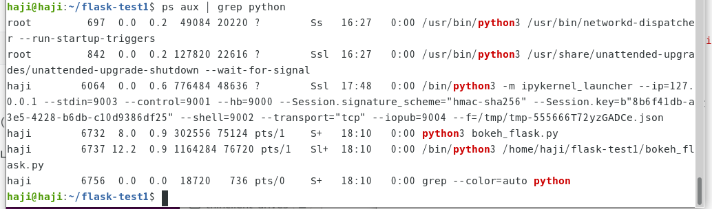

```
kill 6732
```

とりあえずkillでプログラムは切断できる。

csvにひたすら書き込むプログラムを作る

ディレクトリも作成

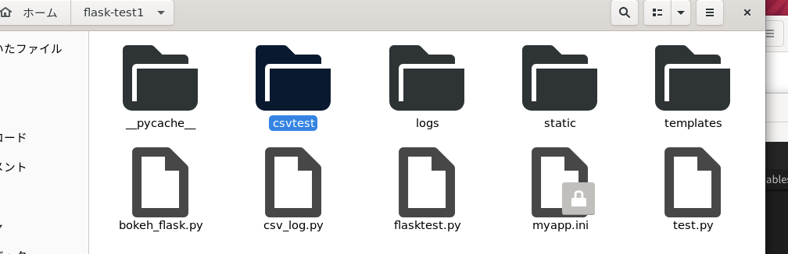

csv_log.py

```python
import datetime
import csv
import time

# 日時の取得
now = datetime.datetime.now()
# ディレクトリの指定はここ
filename = './csvtest/log.csv'

# ファイル，1行目(カラム)の作成
with open(filename, 'w') as f:
    writer = csv.writer(f)
    writer.writerow(['time','x','y','z'])

x,y,z = 0,0,0
while True:
    # なんらかの処理を書く
    x += 1
    y += 2
    z += 3
    now_str = datetime.datetime.now().strftime('%H:%M:%S')

    # filenameを作成したファイル名に合わせる
    # writer.writerowでlistをcsvに書き込む
    with open(filename, 'a', newline="") as f:
        writer = csv.writer(f)
        writer.writerow([now_str, x, y, z])

    time.sleep(1)
```

シェルスクリプトを作成

sudo nano /home/haji/flask-test1/csv_log.sh

```
cd /home/haji/flask-test1/
python3 /home/haji/flask-test1/csv_log.py
```

テスト実行

```
/bin/bash /home/haji/flask-test1/csv_log.sh
```


テスト停止

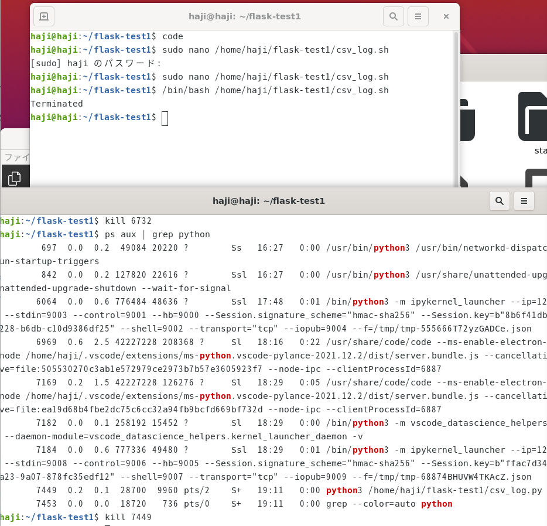

サービス登録してみる

ちなみにここにsleep.target、suspend.targetも含まれている

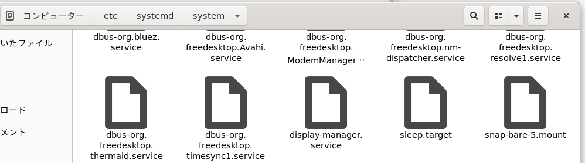

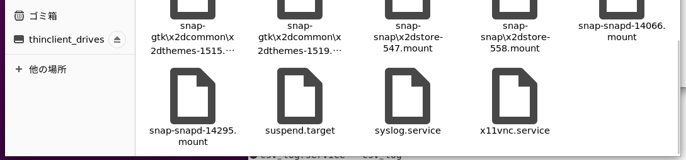

sudo nano /etc/systemd/system/csv_log.service

```
[Unit]
Description = csv_log
After = multi-user.target
[Service]
WorkingDirectory=/home/haji/flask-test1
ExecStart = /bin/bash /home/haji/flask-test1/csv_log.sh
User=root
Restart=always
Type=simple
[Install]
WantedBy=multi-user.target
```

このコマンドで止まるか確認

```
sudo systemctl status csv_log
sudo systemctl daemon-reload
sudo systemctl start csv_log
sudo systemctl stop csv_log
```

消せたみたい。

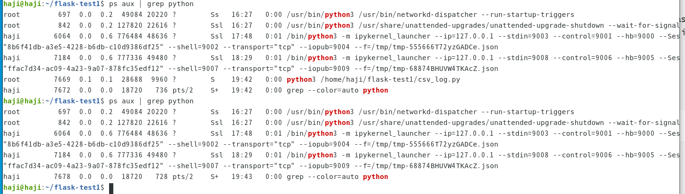

```
ps aux | grep python
kill 
```

ちなみにkillで消してもすぐに復活する。

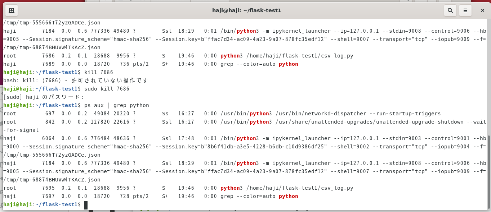

### 所定の期間だけ動かすことを考える。

https://qiita.com/girlfellfromsky/items/90f22240f326d83e2ca2

以上を参考

仮に15時～16時までしか動かない

流れとしては

（１）現在時間を確認して16時～翌日15時までの時間ならサービスを停止するシェルスクリプトを作成。サービスに登録する。

（２）クーロンで15時にスタートさせる

（３）クーロンで１６時にストップする。

（４）クーロンでリブートしたとき（１）のサービスを起動させる

という流れを作る。

csv_log.pyで考える。シェルスクリプトの作成。

シェルスクリプトの実行環境を整える。

Bash Debugを入れた

構成の追加ボタン


Bash Debug入れる前

```
{
    "launch": {
        "configurations": [
        
        ]
    }
}
```

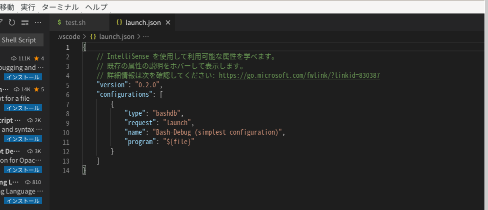

入れた後

```
{
    // IntelliSense を使用して利用可能な属性を学べます。
    // 既存の属性の説明をホバーして表示します。
    // 詳細情報は次を確認してください: https://go.microsoft.com/fwlink/?linkid=830387
    "version": "0.2.0",
    "configurations": [
        {
            "type": "bashdb",
            "request": "launch",
            "name": "Bash-Debug (simplest configuration)",
            "program": "${file}"
        }
    ]
}
```

変更後

```
  "configurations": [
    {
      "type": "bashdb",
      "request": "launch",
      "name": "Bash-Debug (select script from list of sh files)",
      "cwd": "${workspaceFolder}",
      "program": "${command:SelectScriptName}",
      "args": []
    },
```

"launch":をとったら設定反映されるがpythonのデバックがしにくくなった

一応下記でデバックはできるようになった。

```
{
    
        "configurations": [

            {
                "type": "bashdb",
                "request": "launch",
                "name": "Bash-Debug (select script from list of sh files)",
                "cwd": "${workspaceFolder}",
                "program": "${command:SelectScriptName}",
                "args": []
              },
              {
                "name": "Python",
                "type": "python",
                "request": "launch",
                "stopOnEntry": true,
                "program": "${file}",
                "debugOptions": [
                    "WaitOnAbnormalExit",
                    "WaitOnNormalExit",
                    "RedirectOutput"
                ]
            },
        ]
        
    
}
```

Bash IDEを入れた。インテリセンスが有効になった


```bash
NOW=`date '+%H'`
#echo NOW
if [ $NOW -ge 23 -o $NOW -lt 8 ]; then #現在時刻が23時~翌8時の間なら
    #systemctl stop {Mr.daemon} #デーモンを停止
    echo 'test'
    exit 0 #正常終了
else
    echo $NOW
fi
```


