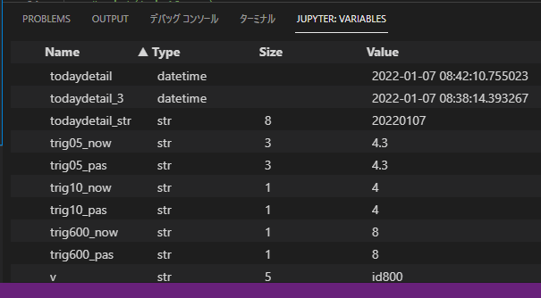
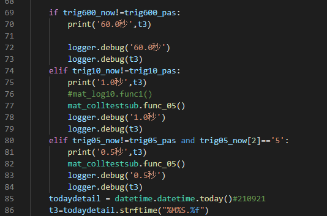
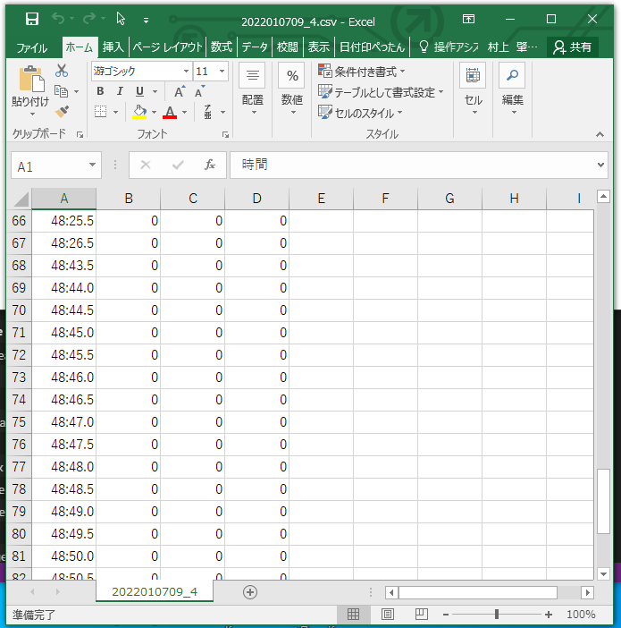
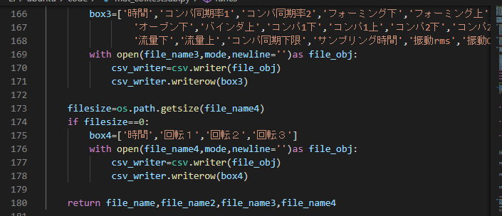
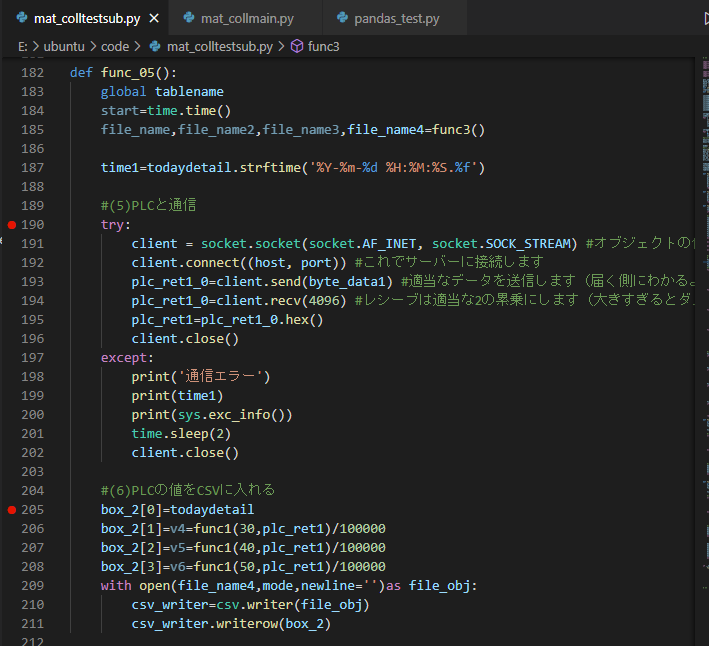
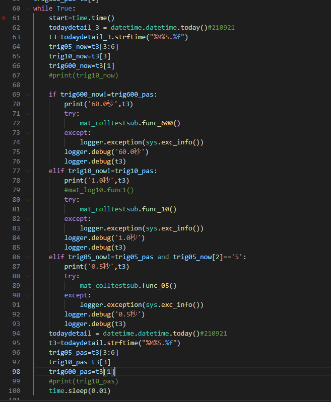
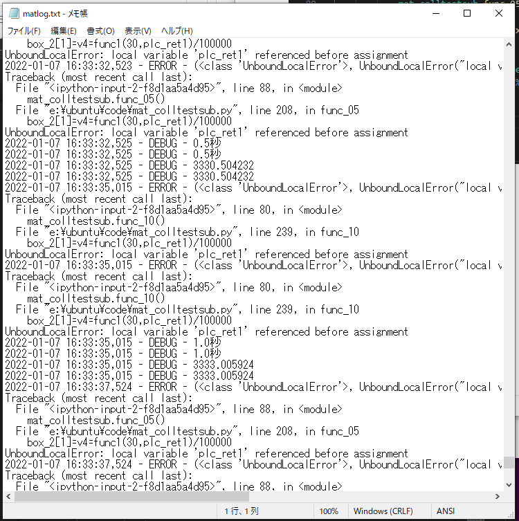

## ubuntuのflask設定方法12

### PLCに対してPCから２重アクセスできるか確認

まずはpingでアクセスできるか確認

```
ping 172.24.11.95
```


pythonでデータ収集してみる

mat_colltest.py

```python
import time
import datetime
import csv
import socket

plc_send1=str("500000FFFF03000C00100001040000282300A82C01")#D9000から1個データ収集　ダブル
byte_data1=bytes.fromhex(plc_send1)

host = "172.24.11.95" #お使いのサーバーのホスト名を入れます
port = 5000 #適当なPORTを指定してあげます

def s32(value):return -(value & 0b10000000000000000000000000000000) | \
(value & 0b01111111111111111111111111111111)#0,1の数重要31個
def s16(value):return -(value & 0b1000000000000000) | (value & 0b0111111111111111)

client = socket.socket(socket.AF_INET, socket.SOCK_STREAM) #オブジェクトの作成をします
client.connect((host, port)) #これでサーバーに接続します
plc_ret1_0=client.send(byte_data1) #適当なデータを送信します（届く側にわかるように）
plc_ret1_0=client.recv(4096) #レシーブは適当な2の累乗にします（大きすぎるとダメ）
plc_ret1=plc_ret1_0.hex()
client.close()

def func1(x,y):       
    h=22+x*4
    plc16_val1=y[h+2]+y[h+3]+y[h]+y[h+1]
    plc16_val2=y[h+6]+y[h+7]+y[h+4]+y[h+5]
    plc32_val=plc16_val2+plc16_val1
    b=int(plc32_val,16) #16進数文字列を数値に変換
    plc10_num1=s32(b) #10進数符号付きに変換
    return plc10_num1

def func2(x,y):       
    h=22+x*4
    plc16_val1=y[h+2]+y[h+3]+y[h]+y[h+1]
    b=int(plc16_val1,16) #16進数文字列を数値に変換
    plc10_num1=s16(b) #10進数符号付きに変換
    return plc10_num1

v1=func1(0,plc_ret1)
print(v1)
```

とりあえずデータを取得することができた。100が取得できた。


### PLCに対してPCから高速アクセスできるか確認

```
set HTTPS_PROXY=http://proxy.neg.co.jp:3128
pip3 install mysql-connector-python
```

mat_colltestsub

```python
# %%

import time
import datetime
import csv
import socket

import os
import mysql.connector as mydb#211119
import sys

plc_send1=str("500000FFFF03000C00100001040000307500A82C01")#D30000から300個データを取得　ダブルワード 20190726追加
byte_data1=bytes.fromhex(plc_send1)
host = "172.24.11.95" #お使いのサーバーのホスト名を入れます
port = 5000 #適当なPORTを指定してあげます
def s32(value):return -(value & 0b10000000000000000000000000000000) | \
(value & 0b01111111111111111111111111111111)#0,1の数重要31個
def s16(value):return -(value & 0b1000000000000000) | (value & 0b0111111111111111)

joined_path_1='./work/1' #一時作業用のworkフォルダ1
joined_path_2='./work/2' #一時作業用のworkフォルダ60
joined_path_3='./work/3' #一時作業用のworkフォルダ設定
joined_path_4='./work/4' #一時作業用のworkフォルダ0.5
joined_path2_1='./save/1' #保存先フォルダ1
joined_path2_2='./save/2' #保存先フォルダ60
joined_path2_3='./save/3' #保存先フォルダ設定
joined_path2_4='./save/4' #保存先フォルダ0.5

strage=[]
index=[]
for i in range(1,801):
    v='id'+str(i)
    w=i
    strage.append(v)
    index.append(w)

strage2=[]
for i in range(1,802):
    W='?'
    strage2.append(W)
#print(box4) 
mojiretsu=','.join(strage)
mojiretsu2=','.join(strage2)

mode='a'
#err_count=0
box=[0,0,0,0,0,0,0]
box_2=[0,0,0,0]
v1,v2,v3,v4,v5,v6,v7,v8,v9=0,0,0,0,0,0,0,0,0
box_1=[0,0,0,0,0,0,0,0,0,0,0,0,0,0,0,0,0,0,0,0,0]#20190710追加20190726追加
w1,w2,w3,w4,w5,w6,w7,w8,w9,w10,w11,w12,w13,w14,w15,w16,w17,w18,w19,w20=0,0,0,0,0,0,0,0,0,0,0,0,0,0,0,0,0,0,0,0#20190710追加20190726追加
err_count=0

todaydetail = datetime.datetime.today()
t1=todaydetail.strftime("%Y%m%d%H")
todaydetail_str=todaydetail.strftime('%Y%m%d')#211119
tablename='trig05_'+todaydetail_str

def func1(x,y):       
    h=22+x*4
    plc16_val1=y[h+2]+y[h+3]+y[h]+y[h+1]
    plc16_val2=y[h+6]+y[h+7]+y[h+4]+y[h+5]
    plc32_val=plc16_val2+plc16_val1
    b=int(plc32_val,16) #16進数文字列を数値に変換
    plc10_num1=s32(b) #10進数符号付きに変換
    return plc10_num1

def func2(x,y):       
    h=22+x*4
    plc16_val1=y[h+2]+y[h+3]+y[h]+y[h+1]
    b=int(plc16_val1,16) #16進数文字列を数値に変換
    plc10_num1=s16(b) #10進数符号付きに変換
    return plc10_num1

def func_05():
    global tablename
    start=time.time()
    todaydetail = datetime.datetime.today()
    todaydetail_str=todaydetail.strftime('%Y%m%d')
    if tablename!='trig05_'+todaydetail_str:
        pass
    #(1)空のcsvファイル生成
    todaydetail = datetime.datetime.today()
    t1=todaydetail.strftime("%Y%m%d%H")
    fname1=t1+'_1'+'.csv'
    fname2=t1+'_2'+'.csv'
    fname3=t1+'_3'+'.csv'#20190710追加
    fname4=t1+'_4'+'.csv'
    file_name=joined_path_1+'/'+fname1
    file_name2=joined_path_2+'/'+fname2
    file_name3=joined_path_3+'/'+fname3#20190710追加
    file_name4=joined_path_4+'/'+fname4
    with open(file_name,mode,newline='')as file_obj:
            csv_writer=csv.writer(file_obj)
    with open(file_name2,mode,newline='')as file_obj:
            csv_writer=csv.writer(file_obj)
    with open(file_name3,mode,newline='')as file_obj:#20190710追加
            csv_writer=csv.writer(file_obj)
    with open(file_name4,mode,newline='')as file_obj:
            csv_writer=csv.writer(file_obj)
    
    #(2)フォルダの中身を確認
    #    ファイル名!＝現在時刻のファイルがあるときリネイムする
    files1 = os.listdir(joined_path_1)
    files2 = os.listdir(joined_path_2)
    files3 = os.listdir(joined_path_3)#20190710追加
    files4 = os.listdir(joined_path_4)
    #files_all=[files1,files2,files3,files4]
    for file in files1:
            dtime=file[0:4]+'/'+file[4:6]+'/'+file[6:8]+' '+file[8:10]#12018/4/27 15のような表記
            com_dtime=datetime.datetime.strptime(dtime, '%Y/%m/%d %H')#文字列を日付に変更
            todaydetail = datetime.datetime.today()
            t2=todaydetail.strftime("%Y/%m/%d %H")
            com_t2=datetime.datetime.strptime(t2, '%Y/%m/%d %H')
        #    com_t3=com_t2 - datetime.timedelta(minutes=1)#日付の加算・減算を行うには、datetime.timedeltaを使用する。
            if com_dtime!=com_t2:
                os.renames(joined_path_1+'/'+file,joined_path2_1+'/'+file[:8]+'/'+file)

    for file2 in files2:
            dtime=file2[0:4]+'/'+file2[4:6]+'/'+file2[6:8]+' '+file2[8:10]#12018/4/27 15のような表記
            com_dtime=datetime.datetime.strptime(dtime, '%Y/%m/%d %H')#文字列を日付に変更
            todaydetail = datetime.datetime.today()
            t2=todaydetail.strftime("%Y/%m/%d %H")
            com_t2=datetime.datetime.strptime(t2, '%Y/%m/%d %H')
        #    com_t3=com_t2 - datetime.timedelta(minutes=1)#日付の加算・減算を行うには、datetime.timedeltaを使用する。
            if com_dtime!=com_t2:
                os.renames(joined_path_2+'/'+file2,joined_path2_2+'/'+file2[:8]+'/'+file2)
 
    for file3 in files3:#20190710追加
            dtime=file3[0:4]+'/'+file3[4:6]+'/'+file3[6:8]+' '+file3[8:10]#12018/4/27 15のような表記
            com_dtime=datetime.datetime.strptime(dtime, '%Y/%m/%d %H')#文字列を日付に変更
            todaydetail = datetime.datetime.today()
            t2=todaydetail.strftime("%Y/%m/%d %H")
            com_t2=datetime.datetime.strptime(t2, '%Y/%m/%d %H')
        #    com_t3=com_t2 - datetime.timedelta(minutes=1)#日付の加算・減算を行うには、datetime.timedeltaを使用する。
            if com_dtime!=com_t2:
                os.renames(joined_path_3+'/'+file3,joined_path2_3+'/'+file3[:8]+'/'+file3)
  
    for file4 in files4:#20190710追加
            dtime=file4[0:4]+'/'+file4[4:6]+'/'+file4[6:8]+' '+file4[8:10]#12018/4/27 15のような表記
            com_dtime=datetime.datetime.strptime(dtime, '%Y/%m/%d %H')#文字列を日付に変更
            todaydetail = datetime.datetime.today()
            t2=todaydetail.strftime("%Y/%m/%d %H")
            com_t2=datetime.datetime.strptime(t2, '%Y/%m/%d %H')
        #    com_t3=com_t2 - datetime.timedelta(minutes=1)#日付の加算・減算を行うには、datetime.timedeltaを使用する。
            if com_dtime!=com_t2:
                os.renames(joined_path_4+'/'+file4,joined_path2_4+'/'+file4[:8]+'/'+file4)


    #(3)   ファイルサイズが０の場合タイトルをつける
    filesize=os.path.getsize(file_name)        
    if filesize==0:
        box1=['時間','蛇行量１','蛇行量２','蛇行量３','流量１','流量２','流量３']                      
        with open(file_name,mode,newline='')as file_obj:
            csv_writer=csv.writer(file_obj)
            csv_writer.writerow(box1)

    filesize2=os.path.getsize(file_name2)        
    if filesize2==0:
        box2=['時間']              
        box2.extend(strage)
        with open(file_name2,mode,newline='')as file_obj:
            csv_writer=csv.writer(file_obj)
            csv_writer.writerow(box2)
    
    filesize3=os.path.getsize(file_name3)#20190710追加    
    if filesize3==0:
        box3=['時間','コンパ同期率1','コンパ同期率2','フォーミング下','フォーミング上','バインダ下','バインダ上',
                'オーブン下','バインダ上','コンパ1下','コンパ1上','コンパ2下','コンパ2上','サーフェース下','サーフェース上',
                '流量下','流量上','コンパ同期下限','サンプリング時間','振動rms','振動OA']  #20190726追記            
        with open(file_name3,mode,newline='')as file_obj:
            csv_writer=csv.writer(file_obj)
            csv_writer.writerow(box3)
    
    filesize=os.path.getsize(file_name4)        
    if filesize==0:
        box4=['時間','回転１','回転２','回転３']                      
        with open(file_name4,mode,newline='')as file_obj:
            csv_writer=csv.writer(file_obj)
            csv_writer.writerow(box4) 

    time1=todaydetail.strftime('%Y-%m-%d %H:%M:%S.%f')

    #(5)PLCと通信
    try:
        client = socket.socket(socket.AF_INET, socket.SOCK_STREAM) #オブジェクトの作成をします
        client.connect((host, port)) #これでサーバーに接続します
        plc_ret1_0=client.send(byte_data1) #適当なデータを送信します（届く側にわかるように）
        plc_ret1_0=client.recv(4096) #レシーブは適当な2の累乗にします（大きすぎるとダメ）
        plc_ret1=plc_ret1_0.hex()
        client.close()
    except:
        print('通信エラー')
        print(time1)
        print(sys.exc_info())
        time.sleep(2)
        client.close()

    #(6)PLCの値をCSVに入れる
    box_2[0]=todaydetail   
    box_2[1]=v4=func1(30,plc_ret1)/100000
    box_2[2]=v5=func1(40,plc_ret1)/100000
    box_2[3]=v6=func1(50,plc_ret1)/100000
    with open(file_name4,mode,newline='')as file_obj:
        csv_writer=csv.writer(file_obj)
        csv_writer.writerow(box_2)

if __name__ == '__main__':
    func_05()
```

成功した。

メインプログラムから動かしてみる

mat_collmain.py

```python
# %%
#----------------
import csv
import datetime
import os
import datetime
import time
#import mat_log05
#import mat_log10
import mat_colltestsub

import logging
from logging.handlers import TimedRotatingFileHandler
import sys


flag=True
mode='a'
b_break=None #終了判定用変数

strage=[]
index=[]
for i in range(1,801):
    v='id'+str(i)
    w=i
    strage.append(v)
    index.append(w)


#--------------------------
#rootロガーを取得
logger = logging.getLogger()#インスタンス化
# ログレベルを DEBUG に変更 デフォルトは値は warning info, debug はコンソールに出力されない
logger.setLevel(logging.DEBUG)#fh.setLevel(logging.DEBUG)に加えて必要
#出力のフォーマットを定義
formatter = logging.Formatter('%(asctime)s - %(levelname)s - %(message)s')
#ファイルへ出力するハンドラーを定義
#when='D','H','M'
fh=logging.handlers.TimedRotatingFileHandler(filename='log/matlog.txt',
                                             when='H',
                                             backupCount=7)
# ログレベルを DEBUG に変更 デフォルトは値は warning info, debug はコンソールに出力されない
fh.setLevel(logging.DEBUG)
fh.setFormatter(formatter)
#rootロガーにハンドラーを登録する
logger.addHandler(fh)
logger.debug('ロギング 開始')
#--------------------------

todaydetail = datetime.datetime.today()#210921
#dt = datetime.datetime(2018, 2, 1, 12, 5, 30, 2000)
t3=todaydetail.strftime("%M%S.%f")
#t2=dt.strftime("%M%S.%f")
trig05_now=t3[3:6]
trig05_pas=t3[3:6]
trig10_now=t3[3]
trig10_pas=t3[3]
trig600_now=t3[1]
trig600_pas=t3[1]
while True:
    start=time.time()
    todaydetail_3 = datetime.datetime.today()#210921
    t3=todaydetail_3.strftime("%M%S.%f")
    trig05_now=t3[3:6]
    trig10_now=t3[3]
    trig600_now=t3[1]
    #print(trig10_now)
    
    if trig600_now!=trig600_pas:
        print('60.0秒',t3)
        
        logger.debug('60.0秒')
        logger.debug(t3)
    elif trig10_now!=trig10_pas:
        print('1.0秒',t3)
        #mat_log10.func1()
        logger.debug('1.0秒')
        logger.debug(t3)
    elif trig05_now!=trig05_pas and trig05_now[2]=='5':
        print('0.5秒',t3)
        mat_colltestsub.func_05()
        logger.debug('0.5秒')
        logger.debug(t3)
    todaydetail = datetime.datetime.today()#210921
    t3=todaydetail.strftime("%M%S.%f")
    trig05_pas=t3[3:6]
    trig10_pas=t3[3]
    trig600_pas=t3[1]
    
    #print(trig10_pas)
    time.sleep(0.01)

# %%

```



一部ソフト変更



0.5秒ごとにも1秒ごとにもmat_colltestsub.func05()を入れるようにした。



0.5秒と1秒台にとれていることが確認できた。

使い勝手を良くするためにソフトを変更




CSV作る作業は共通なので関数化した。またリターンにはCSVの名前を当てた

今後データベースの際には戻りにオブジェクトを渡すことを考える

file_name~4までをもらうようにした



だめだった。todaydetailが更新されていなかった。

戻り値に追加しておく


mat_collmain.pyも一部変更



急にLANを抜いてみたが一応エラーは出力されそう



細かい話だがlogフォルダをlogsフォルダに変更した。


