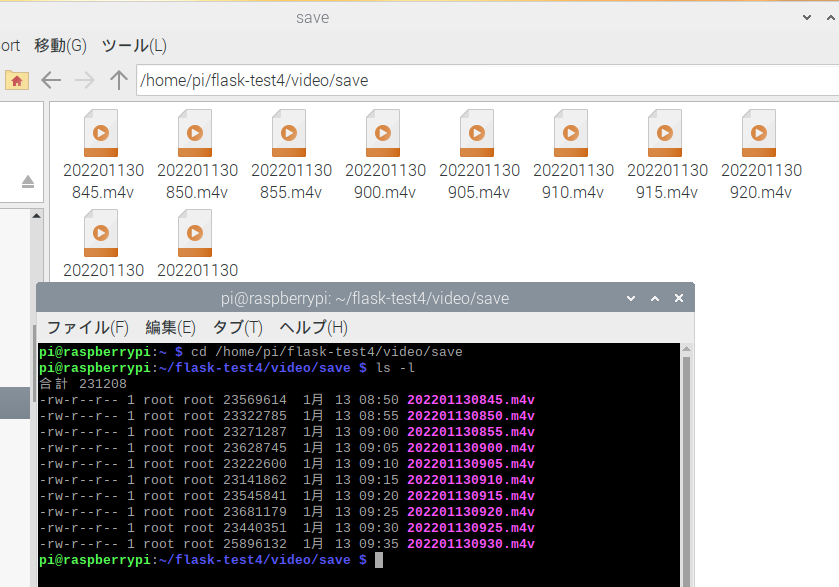
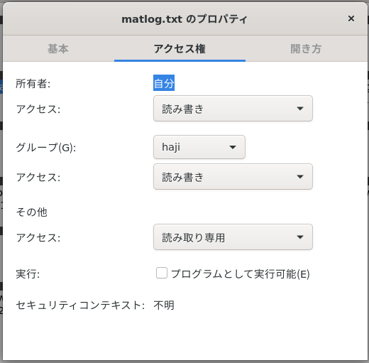

## ubuntuのflask設定方法14

### dbのテーブルを自動的に消す、作る

ライブラリの入れ直し。ネットにつながっている状態で（必要か？）

```
sudo pip3 install natsort

```

ｄbのテーブルを自動的に作るプログラム

dbtable_crate_4.py

```python

#%%
import mysql.connector as mydb
import datetime
import sys
import time

start=time.time()

strage=[]
for i in range(1,801):
    v='id'+str(i)+' int'
    w=i
    strage.append(v)
mojiretsu=','.join(strage)

todaydetail = datetime.datetime.today()
todaydetail_str=todaydetail.strftime('%Y%m%d')
todaydetail_str='20220107'


def func_dbcreate():
    try:
        # コネクションの作成
        conn = mydb.connect(
            host='127.0.0.1',
            port='3306',
            user='test',
            password='tkroyc123',
            database='mat_db'
        )
        cur = conn.cursor()
        sql ="CREATE TABLE %s (\
        `id` int NOT NULL AUTO_INCREMENT,\
        `time` datetime(1) NOT NULL,\
        `rotate1` float DEFAULT NULL,\
        `rotate2` float DEFAULT NULL,\
        `rotate3` float DEFAULT NULL,\
        PRIMARY KEY (`id`))"
        tablename05='trig05_'+todaydetail_str
        cur.execute(sql % tablename05)
        conn.commit()
        cur.close()
    except:
        print(sys.exc_info())
    finally:
        conn.close()

    try:
        # コネクションの作成
        conn = mydb.connect(
            host='127.0.0.1',
            port='3306',
            user='test',
            password='tkroyc123',
            database='mat_db'
        )
        cur = conn.cursor()
        sql ="CREATE TABLE %s (\
        `id` int NOT NULL AUTO_INCREMENT,\
        `time` datetime(1) NOT NULL,\
        `meand1` float DEFAULT NULL,\
        `meand2` float DEFAULT NULL,\
        `meand3` float DEFAULT NULL,\
        `flow1` float DEFAULT NULL,\
        PRIMARY KEY (`id`))"
        tablename10='trig10_'+todaydetail_str
        cur.execute(sql % tablename10)
        conn.commit()
        cur.close()
    except:
        print(sys.exc_info())
    finally:
        conn.close()

    try:
        # コネクションの作成
        conn = mydb.connect(
            host='127.0.0.1',
            port='3306',
            user='test',
            password='tkroyc123',
            database='mat_db'
        )
        cur = conn.cursor()
        sql ="CREATE TABLE %s ( `id` int NOT NULL AUTO_INCREMENT,`time` datetime(1) DEFAULT NULL,"
        sql2=mojiretsu
        sql3=",PRIMARY KEY (`id`))" 
        sql_all=sql+sql2+sql3
        dbname='trig600vib_'+todaydetail_str
        cur.execute(sql_all % dbname)
        conn.commit()
        cur.close()
    except:
        print(sys.exc_info())
    finally:
        conn.close()

    try:
        # コネクションの作成
        conn = mydb.connect(
            host='127.0.0.1',
            port='3306',
            user='test',
            password='tkroyc123',
            database='mat_db'
        )
        cur = conn.cursor()
        sql ="CREATE TABLE %s (\
        `id` int NOT NULL AUTO_INCREMENT,\
        `time` datetime(1) NOT NULL,\
        `sync1` float,\
        `sync2` float,\
        `meand1low` float,\
        `meand1hi` float,\
        `meand2low` float,\
        `meand2hi` float,\
        `meand3low` float,\
        `meand3hi` float,\
        `rotat1low` float,\
        `rotat1hi` float,\
        `rotat2low` float,\
        `rotat2hi` float,\
        `rotat3low` float,\
        `rotat3hi` float,\
        `flow1low` float,\
        `flow1hi` float,\
        `synclow` float,\
        `sampletime` float,\
        `rms` float,\
        `OA` float,\
        PRIMARY KEY (`id`))"
        tablename600='trig600set_'+todaydetail_str
        cur.execute(sql % tablename600)
        conn.commit()
        cur.close()
    except:
        print(sys.exc_info())
    finally:
        conn.close()
    

func_dbcreate()
p_time=time.time()-start
print(p_time)


# %%

```

ｄbのテーブルを自動的に消すプログラム

dbtable_del_2.py

```python

#%%
import mysql.connector as mydb
import datetime
import pandas as pd
import time
import sys

start=time.time()
todaydetail = datetime.datetime.today()
todaydetail_str=todaydetail.strftime('%Y%m%d')

def func_dbdel():
    try:
    # コネクションの作成
        conn = mydb.connect(
            host='127.0.0.1',
            port='3306',
            user='test',
            password='tkroyc123',
            database='mat_db'
        )

        cur = conn.cursor()

        #sql ="show tables"
        #sql ="show tables like 'trig05%'"
        sql ="show tables like 'trig05%'"
        cur.execute(sql)
        rows = cur.fetchall()
        df = pd.DataFrame(rows)

        sql_2 ="show tables like 'trig10%'"
        cur.execute(sql_2)
        rows_2 = cur.fetchall()
        df_2 = pd.DataFrame(rows_2)

        sql_3 ="show tables like 'trig600vib%'"
        cur.execute(sql_3)
        rows_3 = cur.fetchall()
        df_3 = pd.DataFrame(rows_3)


        sql_4 ="show tables like 'trig600set%'"
        cur.execute(sql_4)
        rows_4 = cur.fetchall()
        df_4 = pd.DataFrame(rows_4)
        print(type(len(df)))
        if len(df)>= 5:
            print(len(df))
            for i in range(0,len(df)-5):
                print (df.iloc[i,0])
                sql ='drop table if exists %s'
                cur.execute(sql % df.iloc[i,0])
                cur.execute(sql % df_2.iloc[i,0])
                cur.execute(sql % df_3.iloc[i,0])
                cur.execute(sql % df_4.iloc[i,0])
                conn.commit()

        cur.close()
        conn.close()
    except:
        print(sys.exc_info())
    finally:
        conn.close()

func_dbdel()
p_time=time.time()-start
print(p_time)

# %%

```

両方とも0.2秒くらいかかった

mat_collsub.pyに組み込んだ


### systemdで動かす

シェルスクリプトを作成

sudo nano /home/haji/flask-test1/plc_log.sh

```
cd /home/haji/flask-test1/
python3 /home/haji/flask-test1/mat_collmain.py
```

テスト実行

```
/bin/bash /home/haji/flask-test1/plc_log.sh
```


サービス登録してみる

sudo nano /etc/systemd/system/plc_log.service

```
[Unit]
Description = plc_log
After = multi-user.target network.target
[Service]
WorkingDirectory=/home/haji/flask-test1
ExecStart = /bin/bash /home/haji/flask-test1/plc_log.sh
User=root
Restart=always
Type=simple
[Install]
WantedBy=multi-user.target
```

このコマンドで止まるか確認

```
sudo systemctl status plc_log
sudo systemctl daemon-reload
sudo systemctl start plc_log
sudo systemctl stop plc_log
```

systemdで動かすとrootで作られる





恐らく問題にならないのでこのまま進める

### 所定の期間だけ動かすことを考える。

sudo nano /home/haji/flask-test1/plc_log_service.sh

```bash
#!/bin/sh

NOW=`date '+%H'`
#echo NOW
if [ $NOW -ge 21 -o $NOW -lt 8 ]; then #現在時刻が21時~翌8時の間なら
    systemctl stop plc_log
    echo 'test'
    exit 0 #正常終了
else
    systemctl start plc_log
    echo $NOW
fi
exit 0 #正常終了
```

```bash
#!/bin/sh
NOW=`date '+%H'`
#echo NOW
if [ $NOW -ge 9 -o $NOW -lt 12 ]; then #現在時刻が21時~翌8時の間なら
    systemctl stop plc_log#デーモンを停止
    echo 'test'
    exit 0 #正常終了
else
    systemctl start plc_log
    echo $NOW
fi
exit 0 #正常終了
```

logファイルがローテーションされていない？


もしかしてrootで作られていないから？



ただ単にタイミングの問題かな？

一時間以上動かしてみる

```
sudo chmod -R 777 work
sudo chmod -R 777 save
sudo chmod -R 777 logs
```

この最初のログローテートを行う時刻は`when`引数で指定した値が`'S'`,`'M'`,`'H'`,`'D'`の場合は次の時刻のうちの早い方になる。

- スクリプトを起動した時刻の`when`引数で指定した単位時間後
- (すでにログファイルがある場合)ログファイルの最終更新日時から`when`引数で指定した単位時間後

1時間たったらローテーションされた。

### クーロンの内容を検討する

まずはuwsgiのローテーションを考える


sudo nano /home/haji/flask-test1/uwsgi_log.sh

```
#!/bin/bash
sudo /usr/sbin/logrotate -f /etc/logrotate.d/uwsgi1-log
```

一応テスト

/bin/bash uwsgi_log.sh

sudo crontab -e？　crontab -e？

多分nanoで開くのが簡単

```
crontab -e
00 * * * * sudo bash /home/haji/flask-test1/uwsgi_log.sh
0 8 * * * systemctl start plc_log
0 21 * * * systemctl stop plc_log
@reboot sudo bash /home/haji/flask-test1/plc_log_service.sh
```


もしかしてsudoでcronも動かさないとだめ？

多分気にしなくてもOK

### ディレクトリを削除


以上の一番古いディレクトリを消去。os.removeはディレクトリを削除できません

**rmdir関数は空のディレクトリのみ削除**することができます。ディレクトリにファイルやサブディレクトリが存在する場合はエラーが発生しますので注意

ディレクトリに含まれるファイルやサブディレクトリをまるごと削除するには、shutilモジュールのrmtree関数を使用

fold_del.py

```python
import shutil
import os
import pandas as pd
from natsort import natsorted

fname1='./save/1'
fname2='./save/2'
fname3='./save/3'
fname4='./save/4'

fnamelist1=natsorted(os.listdir(fname1))
fnamelist2=natsorted(os.listdir(fname2))
fnamelist3=natsorted(os.listdir(fname3))
fnamelist4=natsorted(os.listdir(fname4))

if len(fnamelist1)>=100:
    #print(fnamelist1[0])
    for i in range(0,len(fnamelist1)-100):
        shutil.rmtree(fname1+'/'+fnamelist1[i])
    for i in range(0,len(fnamelist2)-100):
        shutil.rmtree(fname2+'/'+fnamelist2[i])
    for i in range(0,len(fnamelist3)-100):
        shutil.rmtree(fname3+'/'+fnamelist3[i])
    for i in range(0,len(fnamelist4)-100):
        shutil.rmtree(fname4+'/'+fnamelist4[i])
    
else:
    print(len(fnamelist1))
```

sudo nano /home/haji/flask-test1/fold_del.sh

```
cd /home/haji/flask-test1/
python3 /home/haji/flask-test1/fold_del.py
```

/bin/bash /home/haji/flask-test1/fold_del.sh

```
crontab -e
00 * * * * sudo bash /home/haji/flask-test1/uwsgi_log.sh
0 8 * * * systemctl start plc_log
0 21 * * * systemctl stop plc_log
@reboot sudo bash /home/haji/flask-test1/plc_log_service.sh
0 22 * * * sudo bash /home/haji/flask-test1/fold_del.sh
```


