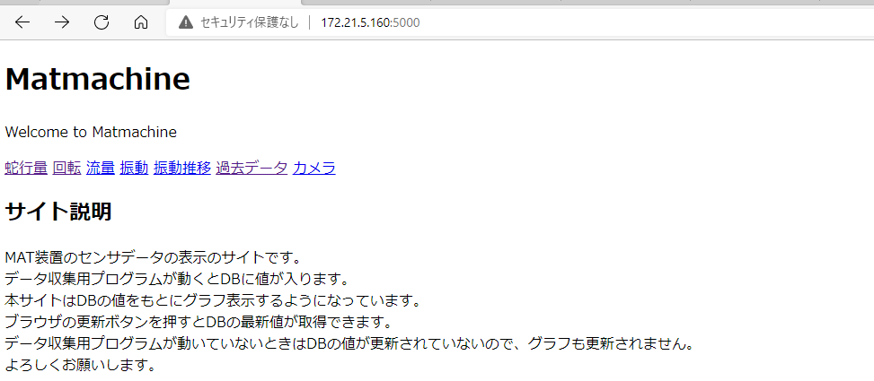
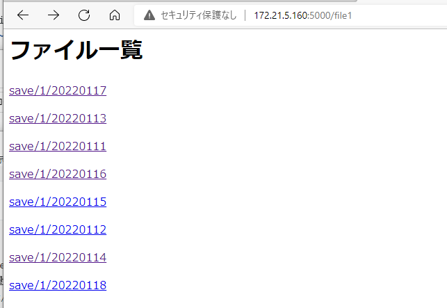
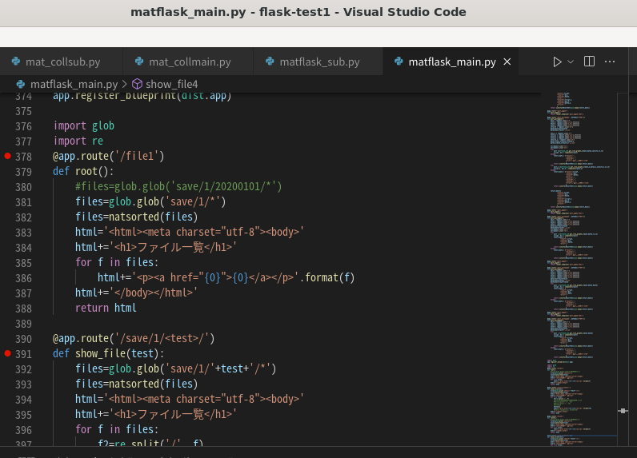

## ubuntuのflask設定方法15

### NginxとuWSGIを接続して、動作確認の続き

とりあえず前回の確認

```
/usr/local/bin/uwsgi --ini  /home/haji/flask-test1/myapp.ini
```


とりあえず動いたので機能を追加していく

matflask_main.pyを記載

```python
from flask import Flask, render_template, request,jsonify
import mysql.connector as mydb
import json

from bokeh.plotting import figure
from bokeh.embed import components
from bokeh.models import DatetimeTickFormatter
from math import radians
import datetime
import pandas as pd
from math import radians

app = Flask(__name__)#flaskのインスタンス化

#現在データグラフ#    
#---------------------------------
@app.route("/")
def index():
    title="Matmachine"
    return render_template('index.html', title=title)


@app.route('/page1')
def page1():
    return render_template('page1.html')

if __name__=="__main__":
    #app.run(host='172.21.5.90', port=5000,debug=True,threaded=True)
    app.run(host='172.21.5.160', port=5000,debug=True,threaded=True)
```

index.html、page1.htmlを配置する


設定ファイル変更 起動プログラムをmatflask_main.pyにする

sudo nano /home/haji/flask-test1/myapp.ini

```
[uwsgi]
current_release = /home/haji/flask-test1
chdir = %(current_release)
wsgi-file=%(current_release)/matflask_main.py
callable=app

processes = 4
threads = 2
thunder-lock = true
max-requests = 3000
max-requests-delta = 300
master = True
workers = 1
enable-threads = true
lazy-apps = true

socket = /tmp/uwsgi.sock
chmod-socket = 666
vacuum = true
die-on-term = true
logto = /home/haji/flask-test1/logs/uwsgi.log
logfile-chown
log-master = true
log-reopen = true
```

テスト実行

```
/usr/local/bin/uwsgi --ini  /home/haji/flask-test1/myapp.ini
```




### クーロンが動かない？

sudo systemctl status cron


rootのcrontabにsudoは付けずに動かしたらいいのでは？

もしくはユーザー名指定して実行したら？

cronはcrontabが変更されたかどうかを毎分チェックしており、変更されていればcrontabファイルを再ロードします。

そのためにcrontabで変更してもcron再起動は不要です。

\# 実行ユーザーを指定して実行

sudo crontab -u root -e

hajiで実行しようとしていたものをすべてrootの方に移す

```
crontab -e
sudo crontab -u root -e
00 * * * * bash /home/haji/flask-test1/uwsgi_log.sh
0 8 * * * systemctl start plc_log
0 21 * * * systemctl stop plc_log
@reboot bash /home/haji/flask-test1/plc_log_service.sh
0 22 * * * bash /home/haji/flask-test1/fold_del.sh
```


成功した


### 時刻の設定

sudo nano /etc/systemd/timesyncd.conf 

```
[Time]
NTP=172.21.28.101
NTP=172.21.28.101を追記
```


### NginxとuWSGIを接続して、動作確認の続き

2020年に作ったものがhtmlもpythonも使用できた

matflask_main.pyには表示関係や全体の動作を

matflask_sub.pyには各関数を入れた

基本的にはそのままでいけたが、csvファイルの一覧を見せるところだけ修正が必要だった。

dist.py

```
from flask import Blueprint
app = Blueprint("dist", __name__,
    static_url_path='/save', static_folder='./save'
)
```

matflask_main.py

```
import dist
app.register_blueprint(dist.app)

import glob
@app.route('/file1')
def root():
    #files=glob.glob('save/1/20200101/*')
    files=glob.glob('save/1/*')
    html='<html><meta charset="utf-8"><body>'
    html+='<h1>ファイル一覧</h1>'
    for f in files:
        html+='<p><a href="{0}">{0}</a></p>'.format(f)
    html+='</body></html>'
    return html

import re
@app.route('/save/1/<test>/')
def show_file(test):
    files=glob.glob('save/1/'+test+'/*')
    html='<html><meta charset="utf-8"><body>'
    html+='<h1>ファイル一覧</h1>'
    for f in files:
        f2=re.split('/', f)
        #f3=f2[2]#20200101\2020010109_1.csv
        #f4=re.split(r'\\', f3)
        #f4=re.split('/', f3)
        #f5=f4[1]
        f5=f2[3]
        html+='<p><a href="{0}">{0}</a></p>'.format(f5)
        #html+='<p>{0}</p>'.format(f5)
    html+='</body></html>'
    return html
```

index.html

```
<body>
    <h1>{{ title }}</h1>
    <p>Welcome to {{ title }}</p>
    <a href="/page1">蛇行量</a>
    <a href="/page2">回転</a>
    <a href="/page3">流量</a>
    <a href="/page4">振動</a>
    <a href="/page5">振動推移</a>
    <a href="/past_index">過去データ</a> 
    <a href="http://172.24.11.97">カメラ</a><br>
    <a href="/file1">file1蛇行量</a>
    
    <h2 id='test'>サイト説明</h2>
```



順番がめちゃくちゃなのでプログラム修正　natsortedを使用した



csv削除の方はnatsortedしようしたがdbは使用していないが大丈夫？


ちゃんと並んでそう。一応明日9日目のdbが消えているか確認する。

### NginxとuWSGIを接続してsystemdで動かす

シェルスクリプトの代わりにiniファイルを作る

sudo nano /home/haji/flask-test1/myapp.ini

以上は前回のまま

sytemed登録（サービス登録）してみる

sudo nano /etc/systemd/system/matflask_main.service

```
[Unit]
Description = matflask_main
After = syslog.target
[Service]
WorkingDirectory=/home/haji/flask-test1
ExecStart = /usr/local/bin/uwsgi --ini /home/haji/flask-test1/myapp.ini
User=root
Restart=always
Type=simple
#StandardError=syslog
[Install]
WantedBy=multi-user.target
```

ラズパイシステムから一部変更した。

KillSignal=SIGQUIT　とった

Type=notify　変更した

NotifyAccess=all　とった

```
sudo systemctl status matflask_main
sudo systemctl daemon-reload
sudo systemctl start matflask_main
sudo systemctl stop matflask_main
sudo systemctl enable matflask_main
```

再起動しても表示できたのでOKそう

### systemdに登録しているもの

sudo nano /etc/systemd/system/

matflask_main.service　plc_log.service

### crontab -eに登録しているもの

```
sudo crontab -u root -e
00 * * * * bash /home/haji/flask-test1/uwsgi_log.sh
0 8 * * * systemctl start plc_log
0 21 * * * systemctl stop plc_log
@reboot bash /home/haji/flask-test1/plc_log_service.sh
0 22 * * * bash /home/haji/flask-test1/fold_del.sh
```

### nginxの設定ファイル作成

設定ファイルは/etc/nginx/nginx.confに入っている

ここにinclude /etc/nginx/nginx.d/*.conf;という記載がある。

なので今回は/etc/nginx/nginx.d/uwsgi.confというファイルを作る

sudo nano /etc/nginx/conf.d/uwsgi.conf

```
server {
    listen       5000;
    location / {
        include uwsgi_params;
        uwsgi_pass unix:///tmp/uwsgi.sock;
    }
}
```


