## ubuntuのflask設定方法16

## sambaインストール

以下のコマンドでsambaをインストール

~~~ 
sudo apt-get install samba
~~~

下の画面でDHCPサーバからWINS設定の有無を聞いてきますが「いいえ」でOK

続行するか聞いてきたら「Y」でEnter

#### 共有フォルダ作成

~~~ 
 mkdir /home/haji/share
~~~

#### 設定ファイルの編集

```
sudo nano /etc/samba/smb.conf
```

下記を最後に記載

```
[share]
comment = share
force user = haji
guest ok = Yes
path = /home/haji/share
read only = No 
```

```
testparm
sudo systemctl start smbd
sudo systemctl enable smbd
sudo systemctl stop smbd
systemctl status smbd
sudo systemctl daemon-reload
sudo systemctl restart smbd
```

構文チェックしてOKだったのでrestartしてみる

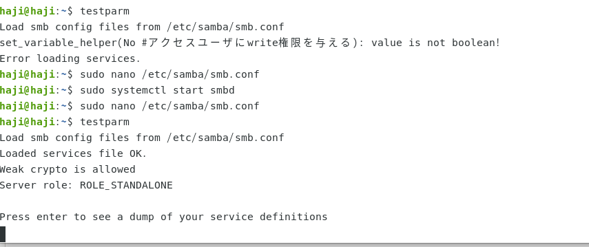

下記でファイルアクセスできるか確認

```
file://172.21.5.160/share/
```

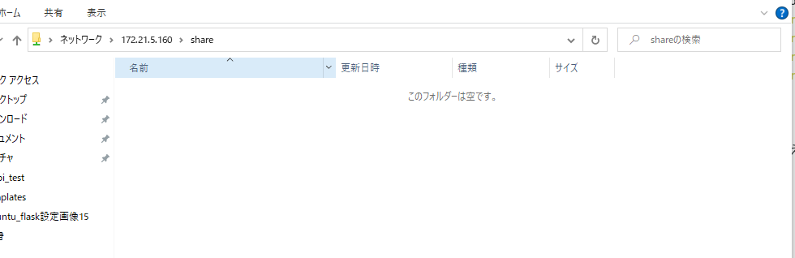

OKだった。

トラブル

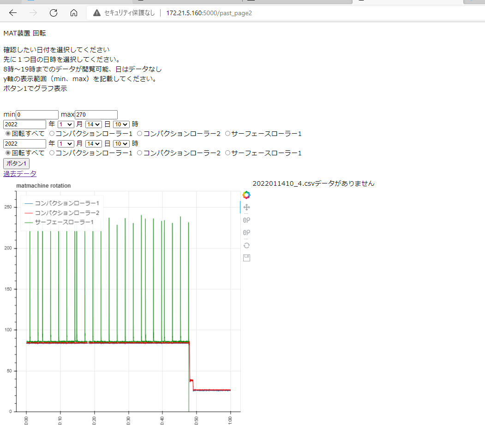

なぜか2個目のグラフが表示されなかった

デバックで確認することにした

```
{
    
        "configurations": [

            {
                "type": "bashdb",
                "request": "launch",
                "name": "Bash-Debug (select script from list of sh files)",
                "cwd": "${workspaceFolder}",
                "program": "${command:SelectScriptName}",
                "args": []
              },
              {
                "name": "Python",
                "type": "python",
                "request": "launch",
                "stopOnEntry": true,
                "program": "${file}",
                "debugOptions": [
                    "WaitOnAbnormalExit",
                    "WaitOnNormalExit",
                    "RedirectOutput"
                ]
            },
        ]
        
    
}
```

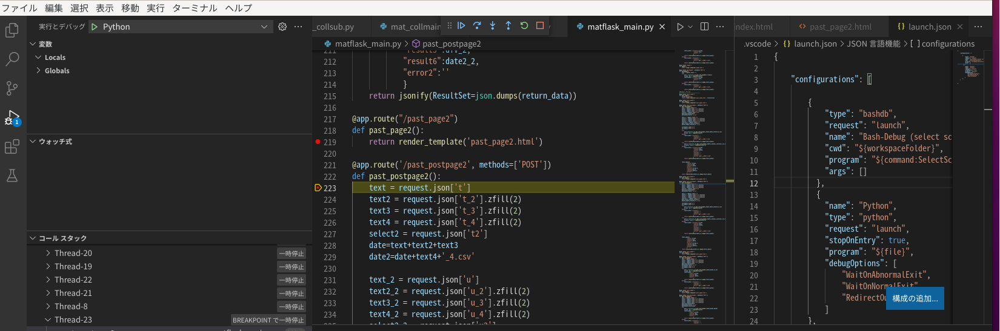

CSVファイルの名前が間違えていた。正しくは_4.csv

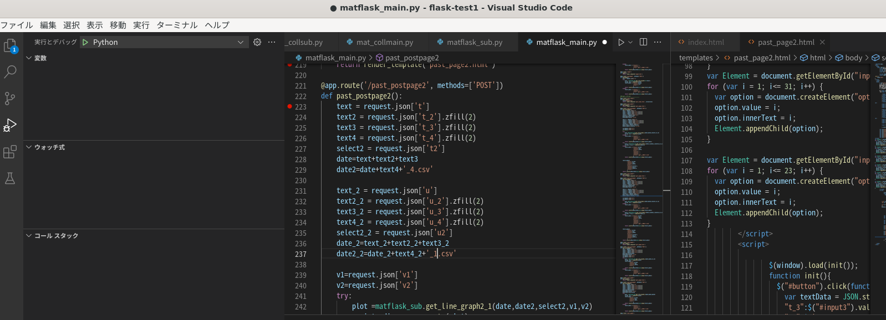

成功した。

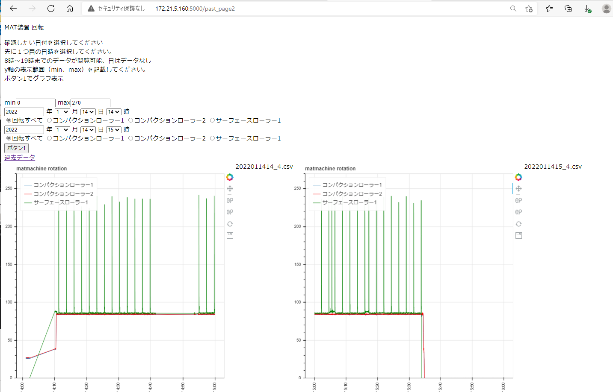

一応再度容量確認をしておく

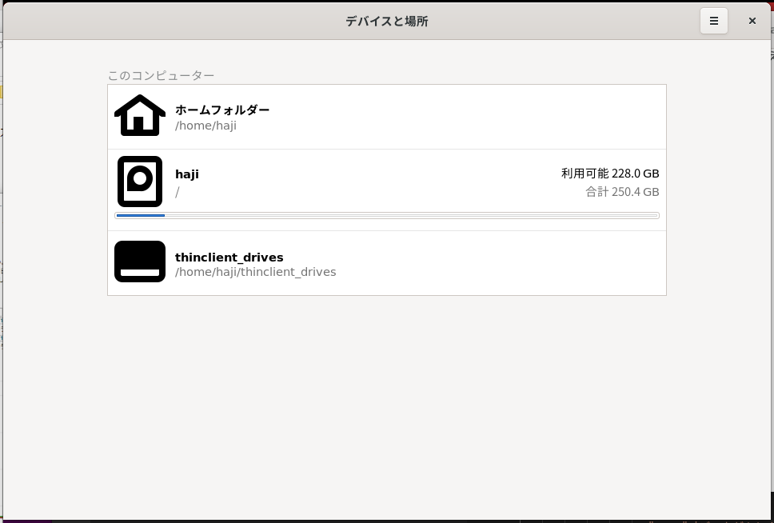

前回の229Gから1Gしか変化していないので多分大丈夫そう。

トラブル発生

リアルタイムグラフが止まっている。2022.1.18 21時で止まっている。

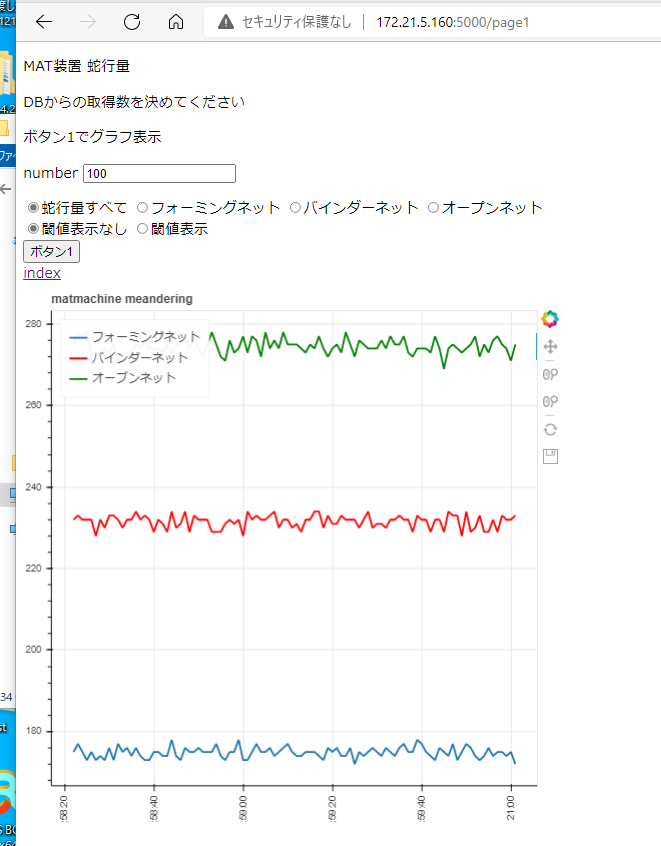

ただCSVは作られている。


logの確認

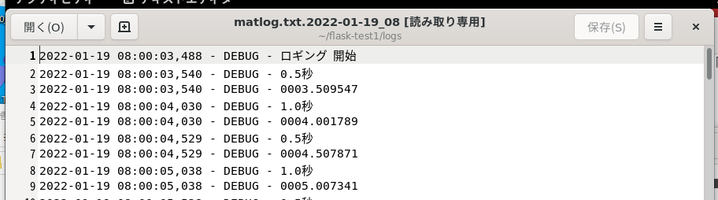

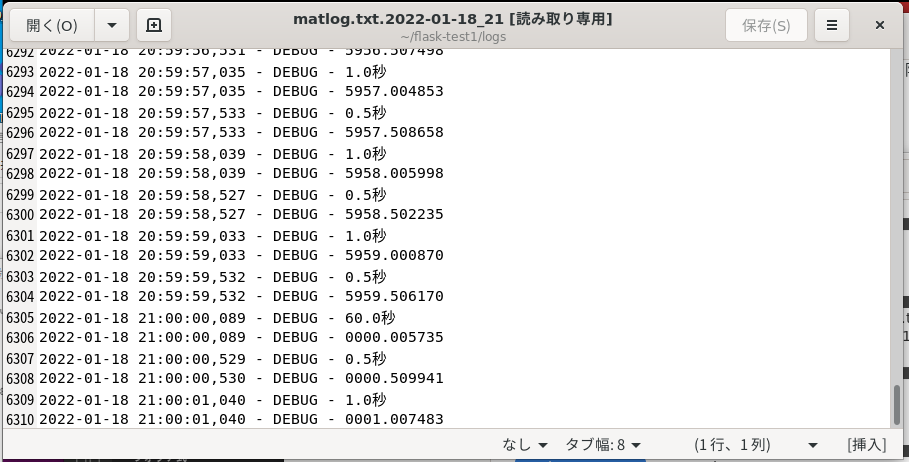

どちらにもエラー内容が記載されていない。

とりあえずサービスの確認

```
sudo systemctl status plc_log
```

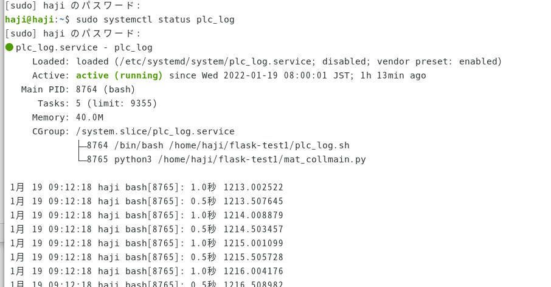

動いてはいた。とりあえず止めてデバックして確認する。

ｄｂらへんが怪しい。

```
sudo systemctl stop plc_log
```

mat_collsub.pyのfunc_dbdelとfunc_dbcreateが怪しい

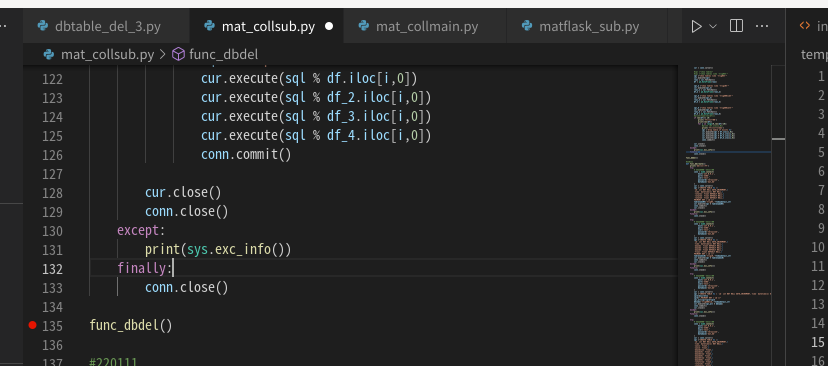

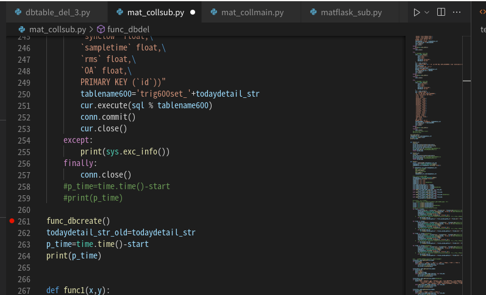

ここら辺が怪しいので確認する。

まずテーブル削除が働いていなさそうだった。func_dbdel

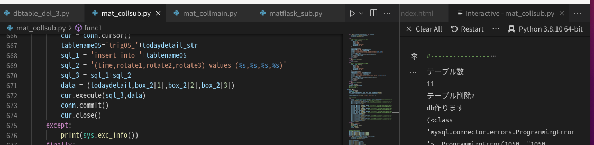

ただfunc_dbcreateでテーブルも作れていた。

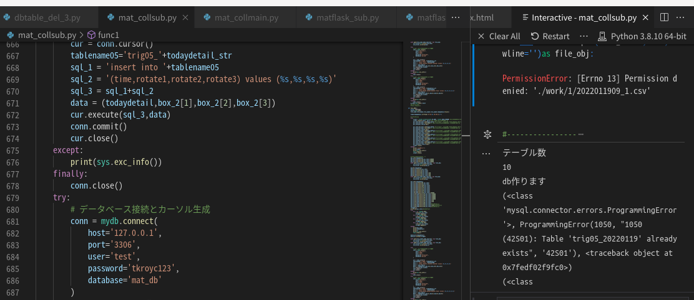

エラーが出ていないとすると

20220118のテーブルにデータを書いていた？

ｄｂの値の確認

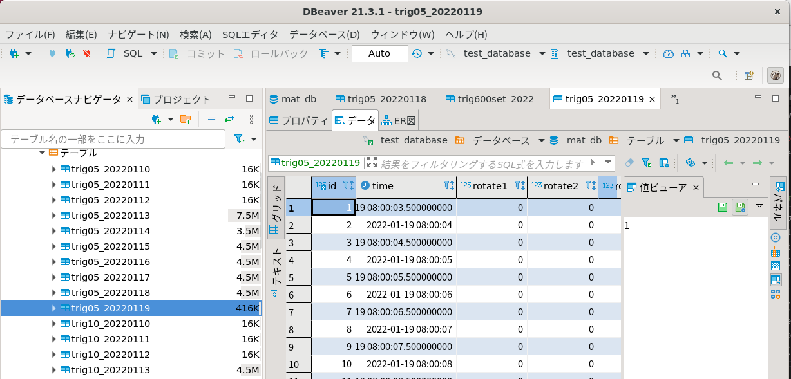

ちゃんとdbにデータを書いていた。

よく考えたら下記のプログラムは動かない。なぜならif todaydetail_str_old!=todaydetail_str:の部分を動かすにはこのプルグラムが一日中動いている必要がある。しかしこのシステムは9時から21時までしか動かない。よってこの部分は動かない。

テーブル削除はクーロンで動かして別のタイミングで行う。

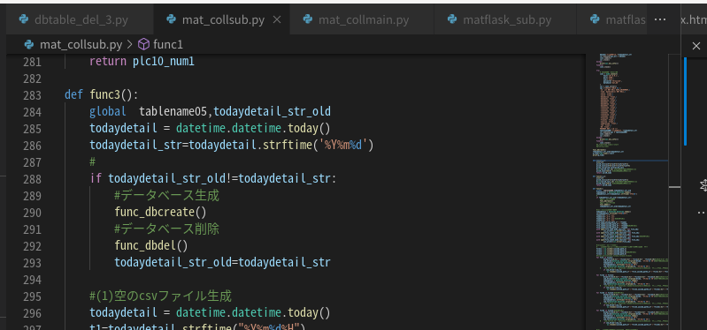

つまりこのことから考えられることは

（１）ｄｂを作るのにcreatetableは必要ない？

（２）表示のプログラムが参照するｄｂが間違ている？

まずは（２）について調べてみる。

原因は明確だった。

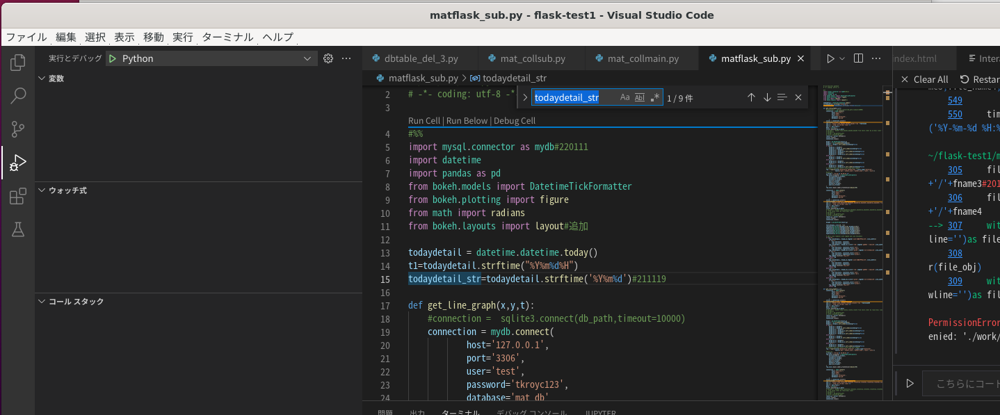

todaydetail_strが外に出ている。

このままではソフト起動時にしか日付が更新されないので各funcに入れないといかない

９か所あるので変更する。

（１）についても検証する。

dbの確認

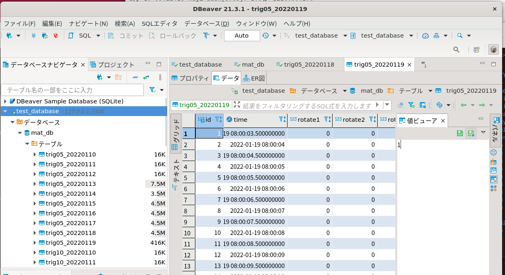

ただ疑問がある。createtableでテーブルを作らないとテーブル情報が無いので作れないはず？

なぜテーブルが自動的に作られたのか？

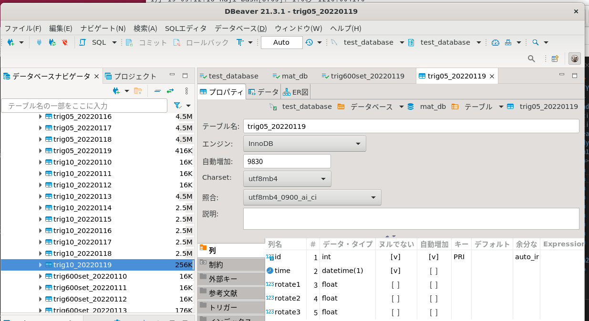

dbtable_crate_5.py

```python
import mysql.connector as mydb
import datetime
import sys
import time

start=time.time()

box_2=[0,0,0,0]

todaydetail = datetime.datetime.today()
todaydetail_str=todaydetail.strftime('%Y%m%d')
todaydetail_str='20220107'
box_2[0]=todaydetail   
box_2[1]=1
box_2[2]=2
box_2[3]=3

def func_dbcreate():
    try:
        # データベース接続とカーソル生成
        conn = mydb.connect(
            host='127.0.0.1',
            port='3306',
            user='test',
            password='tkroyc123',
            database='mat_db'
        )        
        cur = conn.cursor()
        tablename05='trig05_'+todaydetail_str
        sql_1 = 'insert into '+tablename05
        sql_2 = '(time,rotate1,rotate2,rotate3) values (%s,%s,%s,%s)'
        sql_3 = sql_1+sql_2       
        data = (todaydetail,box_2[1],box_2[2],box_2[3])
        cur.execute(sql_3,data)
        conn.commit()
        cur.close()
    except:
        print(sys.exc_info())
    finally:
        conn.close()
    

func_dbcreate()
p_time=time.time()-start
print(p_time)
```

予想通りテーブルを作ることはできなかった。

mat_collmain.pyが毎日8時に実行される。

その時にmat_collsub.pyのfunc_dbdelは動作せずにとfunc_dbcreateだけは動いたという事？

func_dbdel、func_dbcreateともに動いているみたい。

本当にｄｂが消せていないか確認する。

func_dbdelでテーブル数をリターンさせる

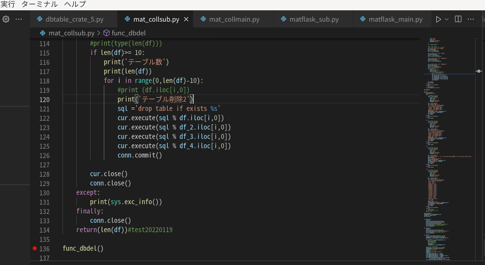

mat_collmain.pyで再度mat_collsub.func_dbdel()を実行させてテーブル数をロギングしてみる。

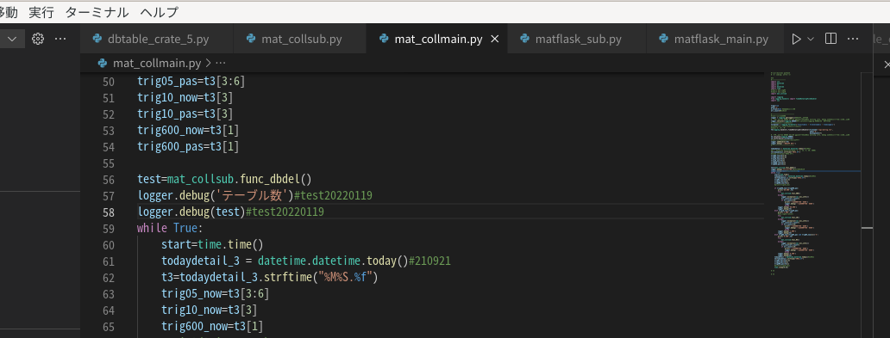

本当に動いているかテーブルを作っておく

dbtable_crate_4.pyこれで20220107のテーブルを作っておく

また下記でmatflask_mainサービスは実行させておく

```
sudo systemctl stop matflask_main
sudo systemctl daemon-reload
sudo systemctl start matflask_main
```

下記で実行させるとテーブルが10個になったことが確認された。

```
sudo systemctl start plc_log
sudo systemctl stop plc_log
```

よくよく考えたら今日の時点でテーブル11個は当たり前のこと。

なぜならテーブルを消去（テーブル数10個）した後にテーブルを作るのでその時点ではテーブルは11個になる。

なのでこれで問題解決することができた。


