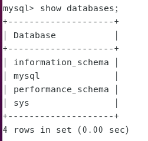
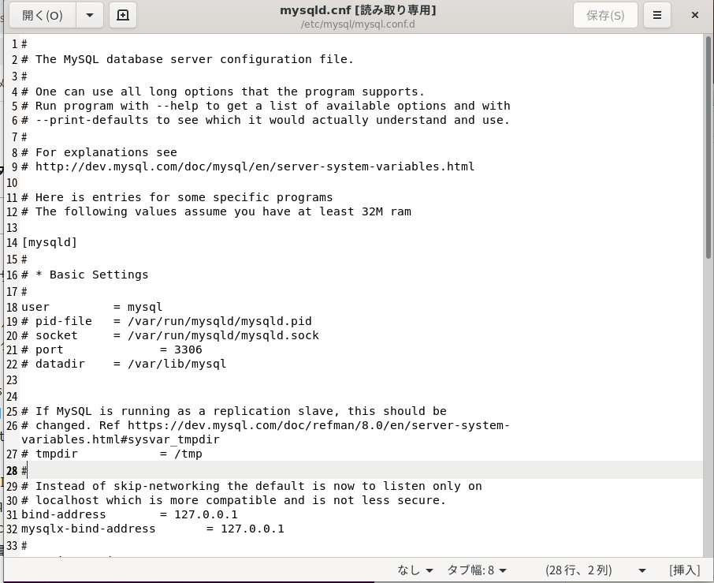
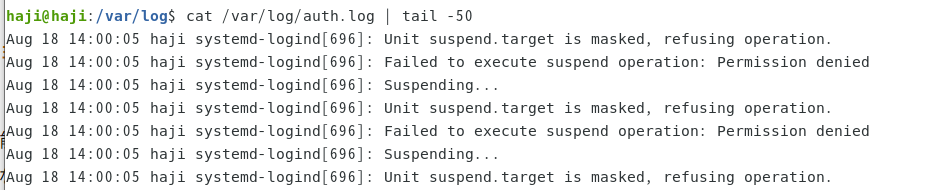

## ubuntuのflask設定方法2

### mysqlのダウンロード

```
sudo apt install mysql-server mysql-client
```

インストールしたらバージョン確認

```
mysql --version
```

mysql  Ver 8.0.26-0ubuntu0.20.04.2 for Linux on x86_64 ((Ubuntu))

サービスの起動確認

```
sudo service mysql status
```

rootユーザーの設定

```
sudo mysql_secure_installation
```

Press y|Y for Yes, any other key for No: 

y

Please enter 0 = LOW, 1 = MEDIUM and 2 = STRONG:

0

New password: 

Re-enter new password: 

Estimated strength of the password: 50 
Do you wish to continue with the password provided?(Press y|Y for Yes, any other key for No) :

y

Remove anonymous users? (Press y|Y for Yes, any other key for No) : 

y

Disallow root login remotely? (Press y|Y for Yes, any other key for No) : 

n

 ... skipping.
By default, MySQL comes with a database named 'test' that
anyone can access. This is also intended only for testing,
and should be removed before moving into a production
environment.

Remove test database and access to it? (Press y|Y for Yes, any other key for No) :

y

Reload privilege tables now? (Press y|Y for Yes, any other key for No) :

y

とりあえずパスワードの設定だけ行った

MySQLにログイン

```
sudo mysql -u root
```

データベース一覧表示

```
show databases;
```



テストデータベース作成

```
create database test_database; 
```

テストデータベースにテストテーブル作成

```
create table test_database.test_table (id int, total_pix int, primary key (id)); 
```

使用するDBに移動

```
use test_database
```


テストテーブルにデータ投入

```
insert into test_database.test_table(id, total_pix) values(58, 2054); #DBに移動してない時
insert into test_table(id, total_pix) values(58, 2054); 
```

テストテーブル表示

```
select * from test_database.test_table;
```


テストデータベース削除

```
drop database test_database;
```

ログアウト

```
exit
```

データの保存場所確認



ルートユーザーで中身を確認

```
sudo su - 
cd /var/lib/mysql/
```


### 問題点。容量が大きくなっていた

容量の確認

```
df -h
```


ルート直下のディレクトリの容量が異様にでかい？

```
# rootになります（フォルダ/ファイルの読み取り権限が必要なので）
sudo su -
# ルート直下のディレクトリの容量を取得します
$ du -sh /*
```


`/var`が容量を使っている

```
cd /var
du -sm ./* | sort -rn | head -5
```


プロパティでも確認してみた


/var/logのトップ５を確認してみる

```
cd /var/log
du -sm ./* | sort -rn | head -5
```


調べてみた

/var/log/auth.log　システムへのログイン履歴情報を格納

/var/log/kern.log　カーネルより出力されるメッセージ情報を格納

```
#でかすぎて開けなさそう
cat /var/log/auth.log | tail -50
cat /var/log/kern.log | tail -50
```

ログローテーションがどのようになっているのか？


etc/logrotate.dも確認


etc/logrotate.confに下記を追加したら容量の制限をかけれる

```
# see "man logrotate" for details
# rotate log files weekly
weekly

# size matters, I hope it work
maxsize 10M <ー　加えた

# use the adm group by default, since this is the owning group
# of /var/log/syslog.
su root adm
```

設定反映

```
/usr/sbin/logrotate /etc/logrotate.conf
```

設定反映＃強制的に

```
/usr/sbin/logrotate -f /etc/logrotate.conf
```

とりあえずファイルを空にする。

```
sudo su -
: > /var/log/auth.log.1
: > /var/log/auth.log
: > /var/log/kern.log.1
: > /var/log/kern.log
```

とりあえず容量は減った


ただどんどん増えてきた




対策

```
sudo nano /etc/systemd/system.conf


#LogLevel=info #削除
Loglevel=notice #追加
反映
systemctl daemon-reexec
systemctl reboot
```

ダメだった。どうやら下記のせい。

```
#スリープ機能を無効
sudo systemctl mask sleep.target suspend.target hibernate.target hybrid-sleep.target
#スリープ機能を有効
sudo systemctl unmask sleep.target suspend.target hibernate.target hybrid-sleep.target
```

confのリロード

```
systemctl status systemd-logind
sudo systemctl restart systemd-logind.service
```


ダメだった。下記の方法を試す

すぐにスリープ状態にしない方法

```
sudo nano /etc/systemd/logind.conf
#HandleLidSwitch=suspend  
HandleLidSwitch=ignore  
```

confのリロードは

```
sudo systemctl restart systemd-logind.service 
```

もう一個追加した211216

```
HandleLidSwitchExternalPower=ignore  
```


解決した。確認

```
cat /var/log/auth.log | tail -50
cat /var/log/kern.log | tail -50
```


## 放置してもスリープ状態にしない方法

[【Ubuntu】蓋を閉じてもノートPCをスリープにしない方法 | 機械学習ナビ (nisshingeppo.com)](https://nisshingeppo.com/ai/ubuntu-nonsleep/)

この機能の設定は**/usr/share/gdm/dconf/90-local-settings**で変更できるので編集していきましょう。

こちらも管理者権限が必要です。

```bash
sudo nano /usr/share/gdm/dconf/90-local-settings
```

```

[org / gnome / settings-daemon / plugins / power]
sleep-inactive-ac-timeout = 0
sleep-inactive-battery-timeout = 0
```

上記の場所にはなかった？下記ならあった

/etc/gdm3/greeter.dconf-defaults


