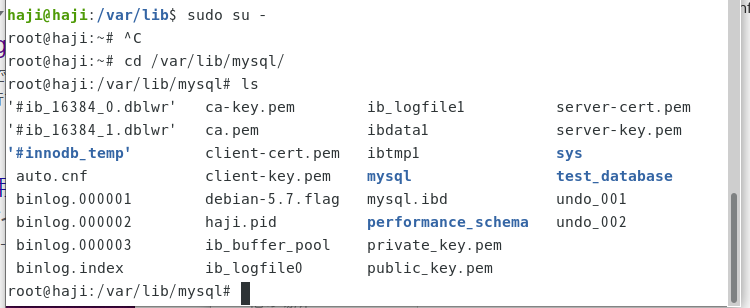
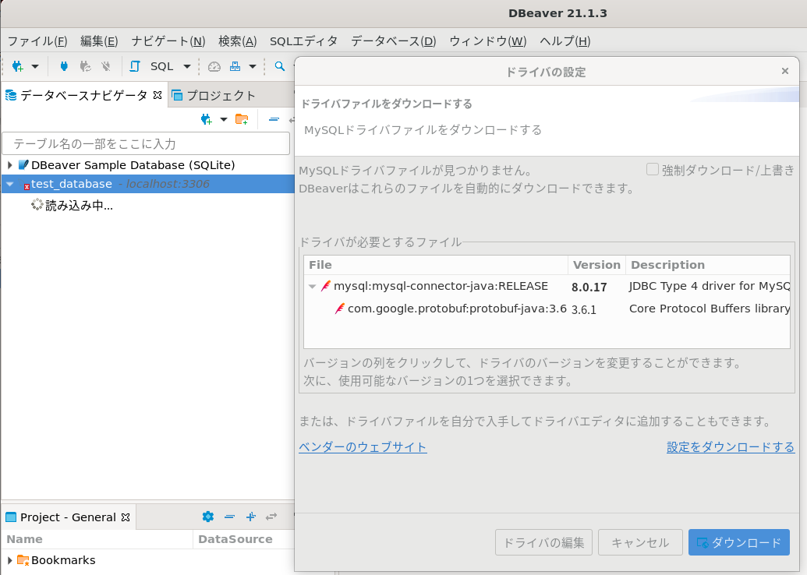
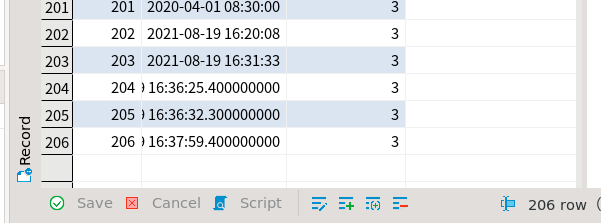
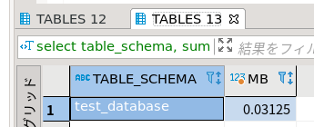

## ubuntuのflask設定方法3

### mysqlの設定等

MySQLにログイン

```
sudo mysql -u root
```

データベース一覧表示

```
show databases;
```


テストデータベース作成

```
create database test_database; 
```

テストデータベースにテストテーブル作成

```
create table test_database.test_table (id int, total_pix int, primary key (id)); 
```

使用するDBに移動

```
use test_database
```


テストテーブルにデータ投入

```
insert into test_database.test_table(id, total_pix) values(58, 2054); #DBに移動してない時
insert into test_table(id, total_pix) values(58, 2054); 
```

テストテーブル表示

```
select * from test_database.test_table;
```


テストデータベース削除

```
drop database test_database;
```

ログアウト

```
exit
```

データの保存場所確認


ルートユーザーで中身を確認

```
sudo su - 
cd /var/lib/mysql/
```



ルートユーザーで中身の容量を確認

```
du -h /var/lib/mysql/
```


### dbeaverの設定

#### インストール

```
sudo snap install dbeaver-ce
```

ラズパイの場合

```
sudo apt update
sudo apt install snapd
sudo reboot
sudo snap install core
sudo snap install dbeaver-ce
```


#### mysql接続

データベースをクリック


新しい接続をクリック


必要事項を記載


ドライバが必要


ドライバをダウンロード



接続しようとしたらうまくいかなかった


そういえばユーザー作っていなかった。MySQLのユーザ一覧を確認

```
sudo mysql -u root -p
SELECT  host, user FROM mysql.user;
```


```
sudo nano /etc/mysql/mysql.conf.d/mysqld.cnf
```


設定反映　

```
sudo systemctl restart mysql
```

接続できなかったのでrootにパスワードをつけてみた

```
sudo mysql -u root
use mysql;
update mysql.user set password=password('tkroyc123') where user = 'root';#この書き方は古い
set password for 'root'@'localhost' = 'tkroyc123';#mysql8からはこっち
flush privileges;#設定反映
```

これでもうまくいかなかったので別ユーザーを作ることにした。

```
grant all privileges on *.* to test@"%" identified by 'tkroyc123' with grant option;
select user,host from mysql.user;
SHOW GRANTS;
exit
sudo systemctl restart mysql
```


```
CREATE USER 'test'@'%' IDENTIFIED BY 'tkroyc123';
```

怒られた　上だけでもOKだった

```
set global validate_password.policy = "LOW";
set global validate_password.special_char_count = 0;
```

testユーザーを作った

```
CREATE USER 'test'@'%' IDENTIFIED BY 'tkroyc123';
GRANT ALL PRIVILEGES ON *.* TO 'test'@'%' WITH GRANT OPTION;
FLUSH PRIVILEGES;
```


接続しようとしたらうまくいかなかった


JDBCドライバのプロパティ「allowPublicKeyRetrieval」をtrue、「useSSL」をfalseにする


#### テーブル操作

カラムを追加する


insert_timeを作ってみた


saveボタンを押す


最終的に下記のようにした


### pythonでmysqlを操作する

まずはpythonで触れるようにライブラリインストール

```
pip3 install mysql-connector-python
```

mysql_test　値を入れてみる

mysql_test.py

```
import mysql.connector as mydb

# コネクションの作成
conn = mydb.connect(
    host='127.0.0.1',
    port='3306',
    user='test',
    password='tkroyc123',
    database='test_database'
)

conn.ping(reconnect=True)
print(conn.is_connected())

cur = conn.cursor()

sql ='insert into test_table (insert_time, total_pix) values ("2020-04-01 08:30:00",100)'
cur.execute(sql)
conn.commit()

cur.close()
conn.close()
```

値が入ったことを確認できた


ちょっと変えてみた

```
import mysql.connector as mydb
import time
import datetime

todaydetail = datetime.datetime.today()
start = time.time()
todaydetail_str=str(todaydetail)
# コネクションの作成
conn = mydb.connect(
    host='127.0.0.1',
    port='3306',
    user='test',
    password='tkroyc123',
    database='test_database'
)

conn.ping(reconnect=True)
print(conn.is_connected())

cur = conn.cursor()

sql ='insert into test_table_1 (insert_time, total_pix) values (%s, %s)'
cur.execute(sql, (todaydetail, 3, ))
conn.commit()

cur.close()
conn.close()
```

test_table_1を作って小数点も１個表示できるようにした




#### 大量データをテーブルに追加

test_databaseと各テーブルの状況を確認


mysql_test_for.py

```
import mysql.connector as mydb


# コネクションの作成
conn = mydb.connect(
    host='127.0.0.1',
    port='3306',
    user='test',
    password='tkroyc123',
    database='test_database'
)

conn.ping(reconnect=True)
print(conn.is_connected())

cur = conn.cursor()

for i in range(10000):
    sql ='insert into test_table_1 (insert_time, total_pix) values ("2020-04-01 08:30:00",100)'
    cur.execute(sql)
    conn.commit()

cur.close()
conn.close()
```

データベース容量の確認

```
use test_database;
select table_schema, sum(data_length+index_length) /1024 /1024 as MB from information_schema.tables where table_schema = database();

select table_schema, sum(data_length+index_length) /1024 /1024 as MB from information_schema.tables  group by table_schema order by sum(data_length+index_length) desc;

```



テーブル

```
SELECT table_name, round(((data_length + index_length) / 1024), 2) AS MB FROM information_schema.TABLES WHERE table_schema = database();

select  
table_name, engine, table_rows as tbl_rows, avg_row_length as rlen,  
floor((data_length+index_length)/1024/1024) as allMB,  #総容量
floor((data_length)/1024/1024) as dMB,  #データ容量
floor((index_length)/1024/1024) as iMB   #インデックス容量
from information_schema.tables  
where table_schema=database()  
order by (data_length+index_length) desc; 
```


下記の書き方もある。

```
use test_database;
select 
table_name, engine, table_rows as tbl_rows, avg_row_length as rlen, 
floor((data_length+index_length)/1024) as allMB, #総容量
floor((data_length)/1024) as dMB, #データ容量
floor((index_length)/1024) as iMB #インデックス容量
from information_schema.tables 
where table_schema=database() 
order by (data_length+index_length) desc;
```

別のデータの見方　前回よりデータが大きくなっている


```
sudo su - 
cd /var/lib/mysql/test_database
du -h /var/lib/mysql/test_database
ls -l
```


これでもデータを確認することができた。

またテーブルを消すことでデータベースの容量が小さくなっていることも分かった。

