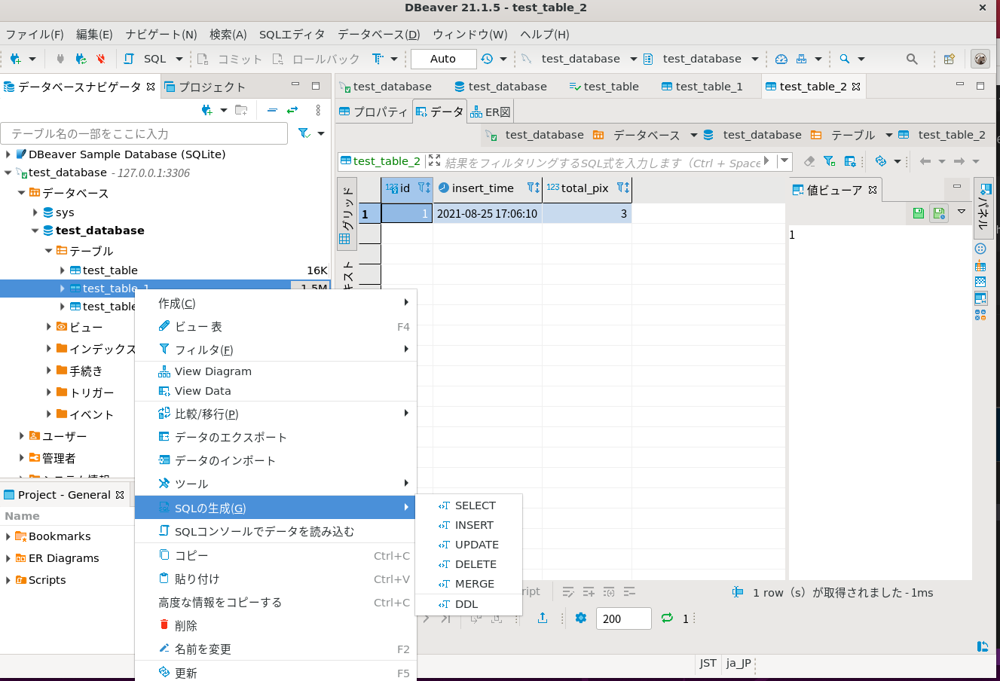
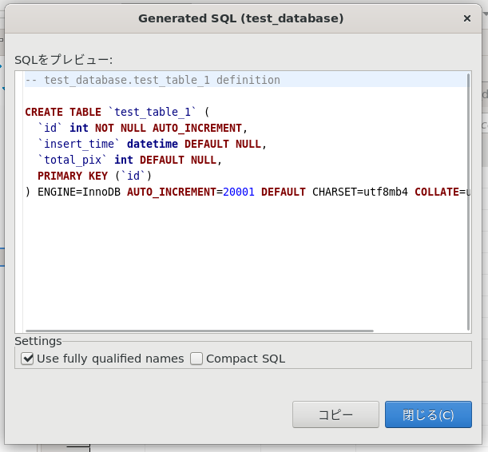
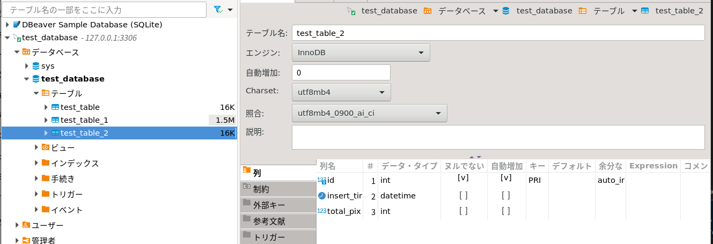

## ubuntuのflask設定方法4

### pythonでテーブル作成

テーブル生成の為のSQL文を確認する。



DDLの中身



dbtable_crate.py

```
import mysql.connector as mydb

# コネクションの作成
conn = mydb.connect(
    host='127.0.0.1',
    port='3306',
    user='test',
    password='tkroyc123',
    database='test_database'
)

conn.ping(reconnect=True)
print(conn.is_connected())

cur = conn.cursor()

sql ='CREATE TABLE `test_table_2` ( `id` int NOT NULL AUTO_INCREMENT, \
`insert_time` datetime DEFAULT NULL,`total_pix` int DEFAULT NULL,PRIMARY KEY (`id`)) '

cur.execute(sql)
conn.commit()

cur.close()
conn.close()
```



テーブルが1個追加された

データ入れられるか確認

mysql_test2.py

```
import mysql.connector as mydb
import datetime

todaydetail = datetime.datetime.today()

# コネクションの作成
conn = mydb.connect(
    host='127.0.0.1',
    port='3306',
    user='test',
    password='tkroyc123',
    database='test_database'
)

conn.ping(reconnect=True)
print(conn.is_connected())

cur = conn.cursor()

sql ='insert into test_table_2 (insert_time, total_pix) values (%s, %s)'

cur.execute(sql, (todaydetail, 3, ))
conn.commit()

cur.close()
conn.close()
```

テーブル名を日付で作成

dbtable_crate_2.py

```python
import mysql.connector as mydb
import datetime

todaydetail = datetime.datetime.today()
todaydetail_str=todaydetail.strftime('%Y%m%d')

# コネクションの作成
conn = mydb.connect(
    host='127.0.0.1',
    port='3306',
    user='test',
    password='tkroyc123',
    database='test_database'
)

conn.ping(reconnect=True)
print(conn.is_connected())

cur = conn.cursor()

sql ="CREATE TABLE %s ( `id` int NOT NULL AUTO_INCREMENT, \
`insert_time` datetime DEFAULT NULL,`total_pix` int DEFAULT NULL,PRIMARY KEY (`id`)) "

dbname='test_tabe_'+todaydetail_str
dbname='test_tabe_20210901'
cur.execute(sql % dbname)
#cur.execute(sql,('test3'))
#cur.execute(sql,('test3'))
conn.commit()

cur.close()
conn.close()
```


### pythonでテーブル削除

まずは一覧確認から

dbtable_show.py

```
import mysql.connector as mydb
import datetime
import pandas as pd

todaydetail = datetime.datetime.today()
todaydetail_str=todaydetail.strftime('%Y%m%d')

# コネクションの作成
conn = mydb.connect(
    host='127.0.0.1',
    port='3306',
    user='test',
    password='tkroyc123',
    database='test_database'
)

conn.ping(reconnect=True)
print(conn.is_connected())

cur = conn.cursor()

sql ="show tables"

cur.execute(sql)
rows = cur.fetchall()
df = pd.DataFrame(rows)
print(df.iloc[0,0])
conn.commit()

cur.close()
conn.close()
```

自然順で並び変えるライブラリを入れる

```
pip3 install natsort
```


dbtable_del.py

```python
import mysql.connector as mydb
import datetime
import pandas as pd

todaydetail = datetime.datetime.today()
todaydetail_str=todaydetail.strftime('%Y%m%d')

# コネクションの作成
conn = mydb.connect(
    host='127.0.0.1',
    port='3306',
    user='test',
    password='tkroyc123',
    database='test_database'
)

conn.ping(reconnect=True)
print(conn.is_connected())

cur = conn.cursor()

sql ="show tables"
cur.execute(sql)
rows = cur.fetchall()
df = pd.DataFrame(rows)
print(df.iloc[0,0])

sql ="drop table if exists %s"
cur.execute(sql % df.iloc[0,0])

sql ="show tables"
cur.execute(sql)
rows = cur.fetchall()
df2 = pd.DataFrame(rows)
print(df2.iloc[0,0])
conn.commit()

cur.close()
conn.close()
```


Pylanceのインストールしてもデバックおかしかった※そもそもpythonに含まれているみたい

ユーザー固有の設定/拡張機能は`$HOME/.config/Code`および`$HOME/.vscode/`にあるため、これらのフォルダーを手動で削除します

ユーザー設定や拡張機能を削除する

Linux：~/.config/Code/Userフォルダ

拡張機能のインストールフォルダ

Linux：~/.vscode/extensions

```
sudo apt remove code
cd ~/.config/Code
cd ~/.vscode/extensions
sudo rm -r ~/.config/Code
sudo rm -r ~/.vscode/extensions

cd /home/haji/ダウンロード
sudo apt install ./code_1.59.1-1629375198_amd64.deb
```


mat0.5_

id,time,rota1,rota2,rota3

mat1.0_


