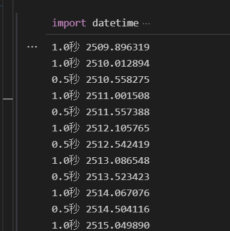

## ubuntuのflask設定方法5

### 0.5,1.0,60.0毎に所定関数を動かす

datetime_test.py

```python
import datetime
import time

todaydetail = datetime.datetime.today()#210921
#dt = datetime.datetime(2018, 2, 1, 12, 5, 30, 2000)
t2=todaydetail.strftime("%M%S.%f")
#t2=dt.strftime("%M%S.%f")
trig05=t2[5]
trig10_now=t2[3]
trig10_pas=t2[3]
trig600_now=t2[1]
trig600_pas=t2[1]
while True:
    todaydetail = datetime.datetime.today()#210921
    t2=todaydetail.strftime("%M%S.%f")
    trig05=t2[5]
    trig10_now=t2[3]
    trig600_now=t2[1]
    #print(trig10_now)
    
    if trig600_now!=trig600_pas:
        print('60.0秒',t2)
    elif trig10_now!=trig10_pas:
        print('1.0秒',t2)
    elif trig05=='5':
        print('0.5秒',t2)
    todaydetail = datetime.datetime.today()#210921
    t2=todaydetail.strftime("%M%S.%f")
    trig10_pas=t2[3]
    trig600_pas=t2[1]
    #print(trig10_pas)
    time.sleep(0.1)
```



極力タイマーによらないように変更。またログを残すように変更

datetime_test3.py

```python
import datetime
import time

import logging
from logging.handlers import TimedRotatingFileHandler
import sys

#--------------------------
#rootロガーを取得
logger = logging.getLogger()#インスタンス化
# ログレベルを DEBUG に変更 デフォルトは値は warning info, debug はコンソールに出力されない
logger.setLevel(logging.DEBUG)#fh.setLevel(logging.DEBUG)に加えて必要
#出力のフォーマットを定義
formatter = logging.Formatter('%(asctime)s - %(levelname)s - %(message)s')
#ファイルへ出力するハンドラーを定義
#when='D','H','M'
fh=logging.handlers.TimedRotatingFileHandler(filename='log/matlog.txt',
                                             when='H',
                                             backupCount=7)
# ログレベルを DEBUG に変更 デフォルトは値は warning info, debug はコンソールに出力されない
fh.setLevel(logging.DEBUG)
fh.setFormatter(formatter)
#rootロガーにハンドラーを登録する
logger.addHandler(fh)
logger.debug('ロギング 開始')
#--------------------------

todaydetail = datetime.datetime.today()#210921
#dt = datetime.datetime(2018, 2, 1, 12, 5, 30, 2000)
t2=todaydetail.strftime("%M%S.%f")
#t2=dt.strftime("%M%S.%f")
trig05_now=t2[3:6]
trig05_pas=t2[3:6]
trig10_now=t2[3]
trig10_pas=t2[3]
trig600_now=t2[1]
trig600_pas=t2[1]
while True:
    start=time.time()
    todaydetail = datetime.datetime.today()#210921
    t2=todaydetail.strftime("%M%S.%f")
    trig05_now=t2[3:6]
    trig10_now=t2[3]
    trig600_now=t2[1]
    #print(trig10_now)
    
    if trig600_now!=trig600_pas:
        print('60.0秒',t2)
        logger.debug('60.0秒')
        logger.debug(t2)
    elif trig10_now!=trig10_pas:
        print('1.0秒',t2)
        logger.debug('1.0秒')
        logger.debug(t2)
    elif trig05_now!=trig05_pas and trig05_now[2]=='5':
        print('0.5秒',t2)
        logger.debug('0.5秒')
        logger.debug(t2)
    todaydetail = datetime.datetime.today()#210921
    t2=todaydetail.strftime("%M%S.%f")
    trig05_pas=t2[3:6]
    trig10_pas=t2[3]
    trig600_pas=t2[1]
    
    #print(trig10_pas)
    time.sleep(0.01)
```


### プログラムの簡素化等

datetime_test3.py

```python
import csv
import datetime

flag=True
mode='a'
b_break=None #終了判定用変数

#(1)空のcsvファイル生成
joined_path_1 ='./'+'work'+'/'+'1' #一時作業用のworkフォルダ1
joined_path_2 ='./'+'work'+'/'+'2'
joined_path_3 ='./'+'work'+'/'+'3'
joined_path_4 ='./'+'work'+'/'+'4'
joined_path2_1 = './'+'save'+'/'+'1' #保存先フォルダ1
joined_path2_2 = './'+'save'+'/'+'2'
joined_path2_3 = './'+'save'+'/'+'3'
joined_path2_4 = './'+'save'+'/'+'4'  

todaydetail = datetime.datetime.today()
t1=todaydetail.strftime("%Y%m%d%H")
fname1=t1+'_1'+'.csv'
fname2=t1+'_2'+'.csv'
fname3=t1+'_3'+'.csv'
fname4=t1+'_4'+'.csv'
file_name1=joined_path_1+'/'+fname1
file_name2=joined_path_2+'/'+fname2
file_name3=joined_path_3+'/'+fname3
file_name4=joined_path_4+'/'+fname4

for i in range(1,5):
    code='with open(file_name'+str(i)+',mode,newline=\'\')as file_obj:csv_writer=csv.writer(file_obj)'
    exec(code)
```

一応このような書き方もできるがもう少し変更する

mat_log_test.py

```python
def func1():
    global t3,trig10
    #(1)空のcsvファイル生成
    todaydetail = datetime.datetime.today()
    t1=todaydetail.strftime("%Y%m%d%H")
    #一時作業用のworkフォルダ
    workfile_box=[]
    for i in range(1,5):
        workfile='./'+'work'+'/'+str(i)+'/'+t1+'_'+str(i)+'.csv'
        workfile_box.append(workfile)

    #保存先フォルダ
    savefile_box=[]
    for i in range(1,5):
        savefile='./'+'save'+'/'+str(i)+'/'+t1+'_'+str(i)+'.csv'
        savefile_box.append(savefile)

    #(1)空のcsvファイル生成
    for i in range(4):
        with open(workfile_box[i],mode,newline='')as file_obj:
                csv_writer=csv.writer(file_obj)

    #(2)フォルダの中身を確認
    #    ファイル名!＝現在時刻のファイルがあるときリネイムする
    for i in range(4):
        files=os.listdir(workfile_box[i][0:8])
        for file in files:
            dtime=file[0:4]+'/'+file[4:6]+'/'+file[6:8]+' '+file[8:10]#12018/4/27 15のような表記
            com_dtime=datetime.datetime.strptime(dtime, '%Y/%m/%d %H')#文字列を日付に変更
            todaydetail = datetime.datetime.today()
            t2=todaydetail.strftime("%Y/%m/%d %H")
            com_t2=datetime.datetime.strptime(t2, '%Y/%m/%d %H')
        #    com_t3=com_t2 - datetime.timedelta(minutes=1)#日付の加算・減算を行うには、datetime.timedeltaを使用する。
            if com_dtime!=com_t2:
                os.renames(workfile_box[i][0:8]+'/'+file,savefile_box[i][0:8]+'/'+file[:8]+'/'+file)

    #(3)   ファイルサイズが０の場合タイトルをつける
    filesize=os.path.getsize(workfile_box[0])        
    if filesize==0:
        box1=['時間','回転１','回転２','回転３']                      
        with open(workfile_box[0],mode,newline='')as file_obj:
            csv_writer=csv.writer(file_obj)
            csv_writer.writerow(box1) 

    filesize=os.path.getsize(workfile_box[1])        
    if filesize==0:
        box2=['時間','蛇行量１','蛇行量２','蛇行量３','流量１']                      
        with open(workfile_box[1],mode,newline='')as file_obj:
            csv_writer=csv.writer(file_obj)
            csv_writer.writerow(box2) 

    filesize=os.path.getsize(workfile_box[2])
    if filesize==0:
        box3=['時間']              
        box3.extend(strage)
        with open(workfile_box[2],mode,newline='')as file_obj:
            csv_writer=csv.writer(file_obj)
            csv_writer.writerow(box3) 

    filesize=os.path.getsize(workfile_box[3])
    if filesize==0:
        box4=['時間','コンパ同期率1','コンパ同期率2','フォーミング下','フォーミング上','バインダ下','バインダ上',
                'オーブン下','バインダ上','コンパ1下','コンパ1上','コンパ2下','コンパ2上','サーフェース下','サーフェース上',
                '流量下','流量上','コンパ同期下限','サンプリング時間','振動rms','振動OA']  #20190726追記            
        with open(workfile_box[3],mode,newline='')as file_obj:
                    csv_writer=csv.writer(file_obj)
                    csv_writer.writerow(box4)

    strage1=[]
    strage2=[]
    strage3=[]
    strage4=[]
    time1=todaydetail.strftime('%Y-%m-%d %H:%M:%S.%f')
    print('test',t3)
    print('test',trig10)
    strage2.append(time1)
    for i in range(4):
        strage2.append(trig10)
    print(strage2)


#----------------
import csv
import datetime
import os
import datetime
import time

import logging
from logging.handlers import TimedRotatingFileHandler
import sys


flag=True
mode='a'
b_break=None #終了判定用変数

strage=[]
index=[]
for i in range(1,801):
    v='id'+str(i)
    w=i
    strage.append(v)
    index.append(w)


#--------------------------
#rootロガーを取得
logger = logging.getLogger()#インスタンス化
# ログレベルを DEBUG に変更 デフォルトは値は warning info, debug はコンソールに出力されない
logger.setLevel(logging.DEBUG)#fh.setLevel(logging.DEBUG)に加えて必要
#出力のフォーマットを定義
formatter = logging.Formatter('%(asctime)s - %(levelname)s - %(message)s')
#ファイルへ出力するハンドラーを定義
#when='D','H','M'
fh=logging.handlers.TimedRotatingFileHandler(filename='log/matlog.txt',
                                             when='H',
                                             backupCount=7)
# ログレベルを DEBUG に変更 デフォルトは値は warning info, debug はコンソールに出力されない
fh.setLevel(logging.DEBUG)
fh.setFormatter(formatter)
#rootロガーにハンドラーを登録する
logger.addHandler(fh)
logger.debug('ロギング 開始')
#--------------------------

todaydetail = datetime.datetime.today()#210921
#dt = datetime.datetime(2018, 2, 1, 12, 5, 30, 2000)
t3=todaydetail.strftime("%M%S.%f")
#t2=dt.strftime("%M%S.%f")
trig05_now=t3[3:6]
trig05_pas=t3[3:6]
trig10_now=t3[3]
trig10_pas=t3[3]
trig600_now=t3[1]
trig600_pas=t3[1]
while True:
    start=time.time()
    todaydetail_3 = datetime.datetime.today()#210921
    t3=todaydetail_3.strftime("%M%S.%f")
    trig05_now=t3[3:6]
    trig10_now=t3[3]
    trig600_now=t3[1]
    #print(trig10_now)
    
    if trig600_now!=trig600_pas:
        print('60.0秒',t3)
        
        logger.debug('60.0秒')
        logger.debug(t3)
    elif trig10_now!=trig10_pas:
        print('1.0秒',t3)
        trig10=1
        func1()
        logger.debug('1.0秒')
        logger.debug(t3)
    elif trig05_now!=trig05_pas and trig05_now[2]=='5':
        print('0.5秒',t3)
        
        logger.debug('0.5秒')
        logger.debug(t3)
    todaydetail = datetime.datetime.today()#210921
    t3=todaydetail.strftime("%M%S.%f")
    trig05_pas=t3[3:6]
    trig10_pas=t3[3]
    trig600_pas=t3[1]
    
    #print(trig10_pas)
    time.sleep(0.01)

```

