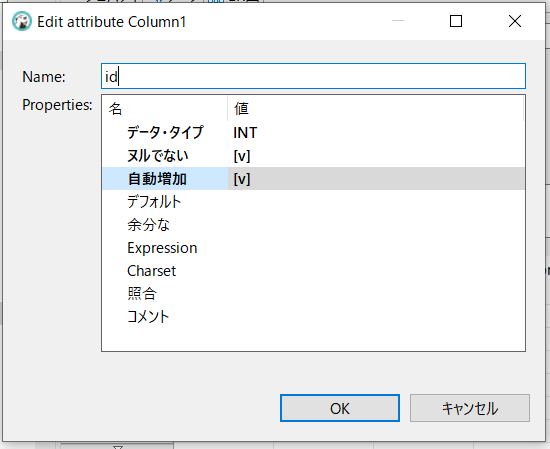

## ubuntuのflask設定方法7

### db作成しpythonから操作する

まずはdb作る


テーブル作る


これではまだ登録できない。カラムを作る。制約まですると保存できる。




最終的には下記のようなカラムを作った


起動後の最大同時接続数

```
SHOW STATUS LIKE 'Max_used_connections';
```


現在の接続数

```
SHOW STATUS LIKE 'Threads_connected';
```

timeout確認しておく

```
SHOW GLOBAL VARIABLES LIKE '%timeout%';
```


SQL文を確認してpythonで操作

dbtable_crate.py

```python
import mysql.connector as mydb
import datetime

todaydetail = datetime.datetime.today()
todaydetail_str=todaydetail.strftime('%Y%m%d')

# コネクションの作成
conn = mydb.connect(
    host='127.0.0.1',
    port='3306',
    user='root',
    password='testneg',
    database='mat_db'
)

#conn.ping(reconnect=True)
#print(conn.is_connected())
cur = conn.cursor()
sql ="CREATE TABLE %s (\
  `id` int NOT NULL AUTO_INCREMENT,\
  `time` datetime NOT NULL,\
  `rotate1` int DEFAULT NULL,\
  `rotate2` int DEFAULT NULL,\
  `rotate3` int DEFAULT NULL,\
  PRIMARY KEY (`id`))"

tablename='trig05_'+todaydetail_str
tablename='trig05_20210905'
cur.execute(sql % tablename)
conn.commit()
cur.close()
conn.close()
```

dbtable_del.py

```python
import mysql.connector as mydb
import datetime
import pandas as pd

# コネクションの作成
conn = mydb.connect(
    host='127.0.0.1',
    port='3306',
    user='root',
    password='testneg',
    database='mat_db'
)

cur = conn.cursor()

sql ="show tables like 'trig05_%'"
cur.execute(sql)
rows = cur.fetchall()

df = pd.DataFrame(rows)
print(df.iloc[0,0])
print(len(df))
if len(df)>5:
    print(print(df.iloc[0,0]))
    sql ="drop table if exists %s"
    cur.execute(sql % df.iloc[0,0])
    conn.commit()
	#cur.close()
	#conn.close()
conn.commit()
cur.close()
conn.close()   
```

dbtable_insert.py

```python
# %%
import mysql.connector as mydb
import datetime

todaydetail = datetime.datetime.today()
todaydetail_str=todaydetail.strftime('%Y%m%d')

# コネクションの作成
conn = mydb.connect(
    host='127.0.0.1',
    port='3306',
    user='root',
    password='testneg',
    database='mat_db'
)
cur = conn.cursor()
sql = 'insert into trig05_20211122 (time,rotate1,rotate2,rotate3) values ("2020-04-01 08:30:00",1,1,%s)'
tablename='trig05_'+todaydetail_str

data = (tablename, todaydetail, 1,1,1)
cur.execute(sql,(1,))
#cur.execute(sql)
conn.commit()
cur.close()
conn.close()

```

cur.execute(sql,(1,))

※1個だけデータ入れるときは最後にカンマを入れるのがお約束

dbtable_insert.py

```python
# %%
import mysql.connector as mydb
import datetime

todaydetail = datetime.datetime.today()
todaydetail_str=todaydetail.strftime('%Y%m%d')

# コネクションの作成
conn = mydb.connect(
    host='127.0.0.1',
    port='3306',
    user='root',
    password='testneg',
    database='mat_db'
)
cur = conn.cursor()
sql = 'insert into %s (time,rotate1,rotate2,rotate3) values ("2020-04-01 08:30:00",1,1,%s)'
tablename='trig05_'+todaydetail_str

data = (tablename,1)
#data = (1,)
cur.execute(sql % data)
#cur.execute(sql,(1,))
#cur.execute(sql)
conn.commit()
cur.close()
conn.close()
```


```
sql = 'insert into trig05_20211207 (time,rotate1,rotate2,rotate3) values (%s,%s,%s,%s)'
#trig05_20211207
#"2020-04-01 08:30:00.29"
tablename='trig05_'+todaydetail_str

data = (todaydetail,1,1,1)
#data = (1,1)
#data = (1,)
 
#cur.execute(sql % data)
cur.execute(sql,data)
```

数値だけならこの書き方でOK

```
sql = 'insert into %s (time,rotate1,rotate2,rotate3) values (%s,%s,%s,%s)'
#trig05_20211207
#"2020-04-01 08:30:00.29"
tablename='trig05_'+todaydetail_str

data = (tablename,todaydetail,1,1,1)
#data = (1,1)
#data = (1,)
 
#cur.execute(sql % data)
cur.execute(sql,data)
```

この書き方だとエラーが出る

理由は

'trig05_20211207' (time,rotate1,rotate2,rotate3) values ('2021-12-07 17:18:07.94' at line 1

といった間違ったSQL文を作っているから

```python
import mysql.connector as mydb
import datetime

todaydetail = datetime.datetime.today()
todaydetail_str=todaydetail.strftime('%Y%m%d')
#todaydetail_str2=todaydetail.strftime('%Y-%m-%d')

# コネクションの作成
conn = mydb.connect(
    host='127.0.0.1',
    port='3306',
    user='root',
    password='testneg',
    database='mat_db'
)
cur = conn.cursor()

tablename='trig05_'+todaydetail_str
sql_1 = 'insert into '+tablename
sql_2 = '(time,rotate1,rotate2,rotate3) values (%s,%s,%s,%s)'
sql_3 = sql_1+sql_2

#trig05_20211207
#"2020-04-01 08:30:00.29"


data = (todaydetail,1,1,1)
#data = (1,1)
#data = (1,)
 
#cur.execute(sql % data)
cur.execute(sql_3,data)
#cur.execute(sql,(todaydetail, 3, ))
#cur.execute(sql)
conn.commit()
cur.close()
conn.close()
```


以上のDB操作を組み込む 

mat_log05.py

```python
import datetime
import csv
import os

import mysql.connector as mydb#211119
import sys

mode='a'
strage=[]
index=[]
for i in range(1,801):
    v='id'+str(i)
    w=i
    strage.append(v)
    index.append(w)


todaydetail = datetime.datetime.today()
t1=todaydetail.strftime("%Y%m%d%H")
todaydetail_str=todaydetail.strftime('%Y%m%d')#211119

try:
    # コネクションの作成#211119
    conn = mydb.connect(
        host='127.0.0.1',
        port='3306',
        user='root',
        password='testneg',
        database='mat_db'
    )
    cur = conn.cursor()
    sql ="CREATE TABLE %s (\
      `id` int NOT NULL AUTO_INCREMENT,\
      `time` datetime NOT NULL,\
      `rotate1` int DEFAULT NULL,\
      `rotate2` int DEFAULT NULL,\
      `rotate3` int DEFAULT NULL,\
      PRIMARY KEY (`id`))"

    tablename='trig05_'+todaydetail_str
    tablename='trig05_20210905'
    cur.execute(sql % tablename)
    conn.commit()
    cur.close()
except:
    print(sys.exc_info())
finally:
    conn.close()

#一時作業用のworkフォルダ
workfile_box=[]
for i in range(1,5):
    workfile='./'+'work'+'/'+str(i)+'/'+t1+'_'+str(i)+'.csv'
    workfile_box.append(workfile)

#保存先フォルダ
savefile_box=[]
for i in range(1,5):
    savefile='./'+'save'+'/'+str(i)+'/'+t1+'_'+str(i)+'.csv'
    savefile_box.append(savefile)

def func1():
    #(1)空のcsvファイル生成
    for i in range(4):
        with open(workfile_box[i],mode,newline='')as file_obj:
                csv_writer=csv.writer(file_obj)

    #(2)フォルダの中身を確認
    #    ファイル名!＝現在時刻のファイルがあるときリネイムする
    for i in range(4):
        files=os.listdir(workfile_box[i][0:8])
        for file in files:
            dtime=file[0:4]+'/'+file[4:6]+'/'+file[6:8]+' '+file[8:10]#12018/4/27 15のような表記
            com_dtime=datetime.datetime.strptime(dtime, '%Y/%m/%d %H')#文字列を日付に変更
            todaydetail = datetime.datetime.today()
            t2=todaydetail.strftime("%Y/%m/%d %H")
            com_t2=datetime.datetime.strptime(t2, '%Y/%m/%d %H')
        #    com_t3=com_t2 - datetime.timedelta(minutes=1)#日付の加算・減算を行うには、datetime.timedeltaを使用する。
            if com_dtime!=com_t2:
                os.renames(workfile_box[i][0:8]+'/'+file,savefile_box[i][0:8]+'/'+file[:8]+'/'+file)

    #(3)   ファイルサイズが０の場合タイトルをつける
    filesize=os.path.getsize(workfile_box[0])        
    if filesize==0:
        box1=['時間','回転１','回転２','回転３']                      
        with open(workfile_box[0],mode,newline='')as file_obj:
            csv_writer=csv.writer(file_obj)
            csv_writer.writerow(box1) 

    filesize=os.path.getsize(workfile_box[1])        
    if filesize==0:
        box2=['時間','蛇行量１','蛇行量２','蛇行量３','流量１']                      
        with open(workfile_box[1],mode,newline='')as file_obj:
            csv_writer=csv.writer(file_obj)
            csv_writer.writerow(box2) 

    filesize=os.path.getsize(workfile_box[2])
    if filesize==0:
        box3=['時間']              
        box3.extend(strage)
        with open(workfile_box[2],mode,newline='')as file_obj:
            csv_writer=csv.writer(file_obj)
            csv_writer.writerow(box3) 

    filesize=os.path.getsize(workfile_box[3])
    if filesize==0:
        box4=['時間','コンパ同期率1','コンパ同期率2','フォーミング下','フォーミング上','バインダ下','バインダ上',
                'オーブン下','バインダ上','コンパ1下','コンパ1上','コンパ2下','コンパ2上','サーフェース下','サーフェース上',
                '流量下','流量上','コンパ同期下限','サンプリング時間','振動rms','振動OA']  #20190726追記            
        with open(workfile_box[3],mode,newline='')as file_obj:
                    csv_writer=csv.writer(file_obj)
                    csv_writer.writerow(box4)

    strage1=[]
    strage2=[]
    strage3=[]
    strage4=[]
    time1=todaydetail.strftime('%Y-%m-%d %H:%M:%S.%f')
    #print('test',t3)
    #print('test',trig10)

    strage1.append(todaydetail)
    for i in range(3):
        strage1.append(1)

    with open(workfile_box[0],mode,newline='')as file_obj:
        csv_writer=csv.writer(file_obj)
        csv_writer.writerow(strage1)
    #print('05保存')

    try:
        # データベース接続とカーソル生成#211119
        conn = mydb.connect(
        host='127.0.0.1',
        port='3306',
        user='root',
        password='testneg',
        database='mat_db'
        )
        
        cur = conn.cursor()
        tablename='trig05_'+todaydetail_str
        sql_1 = 'insert into '+tablename
        sql_2 = '(time,rotate1,rotate2,rotate3) values (%s,%s,%s,%s)'
        sql_3 = sql_1+sql_2
        
        data = (todaydetail,1,1,1)
        #data = (1,)
        cur.execute(sql_3,data)
        #cur.execute(sql,(1,))
        #cur.execute(sql)
        conn.commit()
        cur.close()
    except:
        print(sys.exc_info())
    finally:
        conn.close()

if __name__ == '__main__':
    func1()
```


