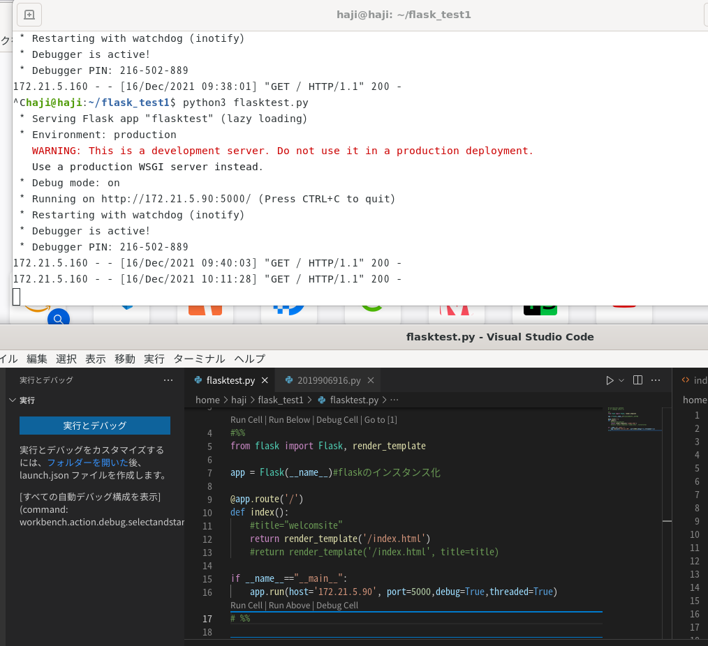
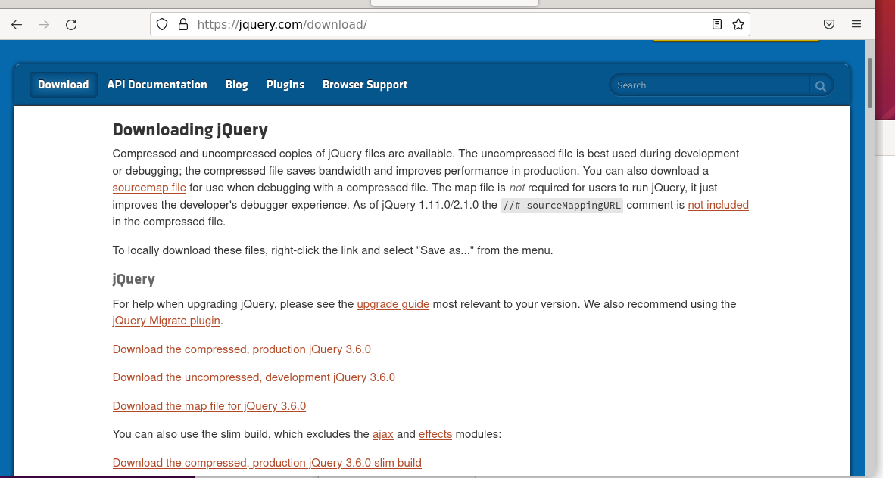
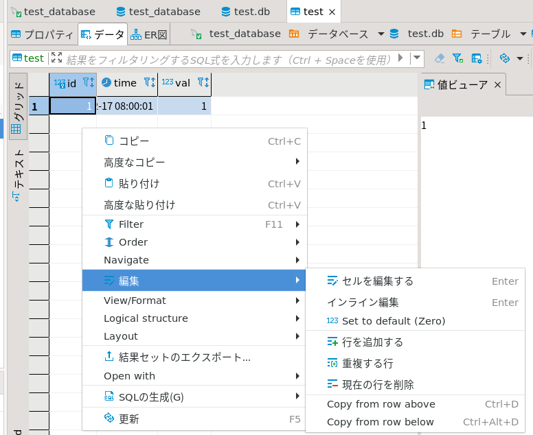

## ubuntuのflask設定方法8

### dbからデータを取り出す

dbtable_select.py

```python
# %%
import mysql.connector as mydb
import datetime

todaydetail = datetime.datetime.today()
todaydetail_str=todaydetail.strftime('%Y%m%d')

# コネクションの作成
conn = mydb.connect(
    host='127.0.0.1',
    port='3306',
    user='root',
    password='testneg',
    database='mat_db'
)
cur = conn.cursor()

tablename='trig05_'+todaydetail_str
sql_1 = 'select time,rotate1,rotate2,rotate3 from '+tablename
sql_2 = ' order by id desc limit %s'
sql_3 = sql_1+sql_2

data = (5,)
cur.execute(sql_3,data)
result_g = cur.fetchall()
cur.close()
conn.close()

print(result_g[0][0])
```

cur.execute(sql,(1,))

※1個だけデータ入れるときは最後にカンマを入れるのがお約束

少数第一位が表示されていなかったので変更

また、func()の一番初めでDBを作るかどうかを毎回確認するように変更

mat_log05.py

```python
# %%
import datetime
import csv
import os

import mysql.connector as mydb#211119
import sys

mode='a'
strage=[]
index=[]
for i in range(1,801):
    v='id'+str(i)
    w=i
    strage.append(v)
    index.append(w)


todaydetail = datetime.datetime.today()
t1=todaydetail.strftime("%Y%m%d%H")
todaydetail_str=todaydetail.strftime('%Y%m%d')#211119

try:
    # コネクションの作成#211119
    conn = mydb.connect(
        host='127.0.0.1',
        port='3306',
        user='root',
        password='testneg',
        database='mat_db'
    )
    cur = conn.cursor()
    sql ="CREATE TABLE %s (\
      `id` int NOT NULL AUTO_INCREMENT,\
      `time` datetime(1) NOT NULL,\
      `rotate1` int DEFAULT NULL,\
      `rotate2` int DEFAULT NULL,\
      `rotate3` int DEFAULT NULL,\
      PRIMARY KEY (`id`))"

    tablename='trig05_'+todaydetail_str
    #tablename='trig05_20210905'
    cur.execute(sql % tablename)
    conn.commit()
    cur.close()
except:
    print(sys.exc_info())
finally:
    conn.close()

#一時作業用のworkフォルダ
workfile_box=[]
for i in range(1,5):
    workfile='./'+'work'+'/'+str(i)+'/'+t1+'_'+str(i)+'.csv'
    workfile_box.append(workfile)

#保存先フォルダ
savefile_box=[]
for i in range(1,5):
    savefile='./'+'save'+'/'+str(i)+'/'+t1+'_'+str(i)+'.csv'
    savefile_box.append(savefile)

def func1():
    #211215
    global tablename
    todaydetail = datetime.datetime.today()
    todaydetail_str=todaydetail.strftime('%Y%m%d')
    if tablename!='trig05_'+todaydetail_str:
        #テーブル生成
        try:
            # コネクションの作成#211119
            conn = mydb.connect(
                host='127.0.0.1',
                port='3306',
                user='root',
                password='testneg',
                database='mat_db'
            )
            cur = conn.cursor()
            sql ="CREATE TABLE %s (\
            `id` int NOT NULL AUTO_INCREMENT,\
            `time` datetime(1) NOT NULL,\
            `rotate1` int DEFAULT NULL,\
            `rotate2` int DEFAULT NULL,\
            `rotate3` int DEFAULT NULL,\
            PRIMARY KEY (`id`))"

            tablename='trig05_'+todaydetail_str
            #tablename='trig05_20210905'
            cur.execute(sql % tablename)
            conn.commit()
            cur.close()
        except:
            print(sys.exc_info())
        finally:
            conn.close()

    #(1)空のcsvファイル生成
    for i in range(4):
        with open(workfile_box[i],mode,newline='')as file_obj:
                csv_writer=csv.writer(file_obj)

    #(2)フォルダの中身を確認
    #    ファイル名!＝現在時刻のファイルがあるときリネイムする
    for i in range(4):
        files=os.listdir(workfile_box[i][0:8])
        for file in files:
            dtime=file[0:4]+'/'+file[4:6]+'/'+file[6:8]+' '+file[8:10]#12018/4/27 15のような表記
            com_dtime=datetime.datetime.strptime(dtime, '%Y/%m/%d %H')#文字列を日付に変更
            todaydetail = datetime.datetime.today()
            t2=todaydetail.strftime("%Y/%m/%d %H")
            com_t2=datetime.datetime.strptime(t2, '%Y/%m/%d %H')
        #    com_t3=com_t2 - datetime.timedelta(minutes=1)#日付の加算・減算を行うには、datetime.timedeltaを使用する。
            if com_dtime!=com_t2:
                os.renames(workfile_box[i][0:8]+'/'+file,savefile_box[i][0:8]+'/'+file[:8]+'/'+file)

    #(3)   ファイルサイズが０の場合タイトルをつける
    filesize=os.path.getsize(workfile_box[0])        
    if filesize==0:
        box1=['時間','回転１','回転２','回転３']                      
        with open(workfile_box[0],mode,newline='')as file_obj:
            csv_writer=csv.writer(file_obj)
            csv_writer.writerow(box1) 

    filesize=os.path.getsize(workfile_box[1])        
    if filesize==0:
        box2=['時間','蛇行量１','蛇行量２','蛇行量３','流量１']                      
        with open(workfile_box[1],mode,newline='')as file_obj:
            csv_writer=csv.writer(file_obj)
            csv_writer.writerow(box2) 

    filesize=os.path.getsize(workfile_box[2])
    if filesize==0:
        box3=['時間']              
        box3.extend(strage)
        with open(workfile_box[2],mode,newline='')as file_obj:
            csv_writer=csv.writer(file_obj)
            csv_writer.writerow(box3) 

    filesize=os.path.getsize(workfile_box[3])
    if filesize==0:
        box4=['時間','コンパ同期率1','コンパ同期率2','フォーミング下','フォーミング上','バインダ下','バインダ上',
                'オーブン下','バインダ上','コンパ1下','コンパ1上','コンパ2下','コンパ2上','サーフェース下','サーフェース上',
                '流量下','流量上','コンパ同期下限','サンプリング時間','振動rms','振動OA']  #20190726追記            
        with open(workfile_box[3],mode,newline='')as file_obj:
                    csv_writer=csv.writer(file_obj)
                    csv_writer.writerow(box4)

    strage1=[]
    strage2=[]
    strage3=[]
    strage4=[]
    time1=todaydetail.strftime('%Y-%m-%d %H:%M:%S.%f')
    #print('test',t3)
    #print('test',trig10)

    strage1.append(todaydetail)
    for i in range(3):
        strage1.append(1)

    with open(workfile_box[0],mode,newline='')as file_obj:
        csv_writer=csv.writer(file_obj)
        csv_writer.writerow(strage1)
    #print('05保存')

    try:
        # データベース接続とカーソル生成#211119
        conn = mydb.connect(
        host='127.0.0.1',
        port='3306',
        user='root',
        password='testneg',
        database='mat_db'
        )
        
        cur = conn.cursor()
        tablename='trig05_'+todaydetail_str
        sql_1 = 'insert into '+tablename
        sql_2 = '(time,rotate1,rotate2,rotate3) values (%s,%s,%s,%s)'
        sql_3 = sql_1+sql_2
        
        data = (todaydetail,3,3,3)
        #data = (1,)
        cur.execute(sql_3,data)
        #cur.execute(sql,(1,))
        #cur.execute(sql)
        conn.commit()
        cur.close()
    except:
        print(sys.exc_info())
    finally:
        conn.close()

if __name__ == '__main__':
    func1()


# %%

```

draw_csv_db_6.py

上記プログラムでPLCのソケット通信の切り方を再検討する

とりあえず、ソケットクローズを入れる

### flask導入

static、templatesディレクトリを作る


index.htmlをtemplatesに作成

```
<!DOCTYPE html>
<html>
  <head>
    <meta charset="utf-8">
    <title>test</title>
  </head>
  <body>
    <div id="main">
      <h1>test</h1>
      <p>Welcome to test</p>
      <a href="/page1">test1</a>   
      <p id="test">
          テストサイトです。<br>
          これから機能を追加していきます
      </p>
    </div>
   
</body>
</html>
```

Flaskをインポート

```
pip3 install Flask
```

flasktest.py

```
from flask import Flask, render_template

app = Flask(__name__)#flaskのインスタンス化

@app.route('/')
def index():
    #title="welcomsite"
    return render_template('/index.html')
    #return render_template('/index.html', title=title)

if __name__=="__main__":
    app.run(host='127.0.0.1', port=8000,debug=True,threaded=True)
```

ただ実行したが、うまく動かなかった？


バージョンが悪い？

```
import flask

flask.__version__
```


```
pip3 uninstall Flask
pip3 install Flask==1.1.2
```


```
lsof -i :5000 | grep python
```


```
kill 11004
```


一応動いた。

ip変更して試してみる　ただvscodeではデバックできなった？



デバッグ方法を変更すればデバッグ可能だった。

上図のrun cellでなく左の実行とデバッグを使用した。


### 自動サスペンドについて

また発生してしまった。


下記のソフトをインストール


下記の設定が怪しいので変更


下記のように変更してみた


スリープ状態にしない方法

```
sudo nano /etc/systemd/logind.conf
#HandleLidSwitch=suspend  
HandleLidSwitch=ignore
#HandleLidSwitchExternalPower=suspend  
HandleLidSwitchExternalPower=ignore  
```

confのリロードは

```
sudo systemctl restart systemd-logind.service 
```


### jqueryのインポート

https://jquery.com/download/



Download the compressed, production jQuery 3.6.0をダウンロード

jquery.min.jsという名前でstaticフォルダの中に保存する


#### ボタンクリックとjqueryに関して

テキストボックスの中のデータをjqueryで取得するコードを作ります。
まずは下記のようにindex.htmlを変更

```html
<!DOCTYPE html>
<html>
  <head>
    <meta charset="utf-8">
    <script src="static/jquery.min.js"></script>
  </head>
  <body>
    <div id="main">
      <h1>{{ title }}</h1>
      <p>Welcome to {{ title }}</p>
      <a href="/test1">test1</a>   
      <p id="test">
          テストサイトです。<br>
          これから機能を追加していきます
      </p>
      <input type = "number" id="text" name = "number" />
      <input id="btn" type="button" value="ボタン1"/>
      <input id="btn2" type="button" value="ajax"/>
      <div id="data1"></div>
      <p><input type = "submit" value = "submit" /></p>
    </div>
    <script>
    $('#btn').click(function() {
        console.log('クリックされました！');
        console.log($("#text").val());
        var textData = JSON.stringify({"t":$("#text").val()})
        console.log(textData);
        var result = JSON.parse(textData).t;
        console.log(result);
        $("#data1").html(result);
    })
    </script>
  </body>
</html>
```

確認してみる。flasktest.pyを動かす


サイト確認する。F12を押してコンソール画面も出すようにする。


ボタン1を押して確認。クリックされたと表示されたら


#### postに関して

データベースの準備

testデータベースを作りtestテーブルを作成


time、valというカラムを作成


データは下記を参考

時間は2021-12-17 08:00:01、2021-12-17 08:00:02のように記載




index.htmlの変更

```html
<!DOCTYPE html>
<html>
  <head>
    <meta charset="utf-8">
    <script src="static/jquery.min.js"></script>
  </head>
  <body>
    <div id="main">
      <h1>{{ title }}</h1>
      <p>Welcome to {{ title }}</p>
      <a href="/test1">test1</a>   
      <p id="test">
          テストサイトです。<br>
          これから機能を追加していきます
      </p>
      <form action = "/test2" method = "POST"><!--211217追加-->
      <input type = "number" id="text" name = "number" />
      <input id="btn" type="button" value="ボタン1"/>
      <input id="btn2" type="button" value="ajax"/>
      <div id="data1"></div>
      <p><input type = "submit" value = "submit" /></p><!--211217追加-->
    </form><!--211217追加-->
    </div>
    <script>
    $('#btn').click(function() {
        console.log('クリックされました！');
        console.log($("#text").val());
        var textData = JSON.stringify({"t":$("#text").val()})
        console.log(textData);
        var result = JSON.parse(textData).t;
        console.log(result);
        $("#data1").html(result);
    })
    </script>
  </body>
</html>
```

受け先としてtest2.htmlの作成

```html
<!DOCTYPE html>
<html>
  <head>
    <meta charset="utf-8">
    <title>test</title>
  </head>
  <body>
    <div id="main">
      <h1>test</h1>
      <p>Welcome to test</p>
      <a href="/">index</a>   
      <p id="test">
          postデータを表示します。<br>
      </p>
      {{data}}<br>
      {{data2}}<br>
      <div id="data1"></div>
  </body>
</html>
```

flasktest.py

```python
from flask import Flask, render_template, request
import mysql.connector as mydb

app = Flask(__name__)#flaskのインスタンス化

def get_data(x):
    # コネクションの作成
    conn = mydb.connect(
        host='127.0.0.1',
        port='3306',
        user='test',
        password='tkroyc123',
        database='test'
    )
    cur = conn.cursor()
    tablename='test'
    sql_1 = 'select time,val from '+tablename
    sql_2 = ' order by id desc limit %s'
    sql_3 = sql_1+sql_2
    data = (int(x),)
    cur.execute(sql_3,data)
    result_g = cur.fetchall()
    cur.close()
    conn.close()
    return result_g

@app.route('/')
def index():
    title="welcomsite"
    #return render_template('/index.html')
    return render_template('/index.html', title=title)

@app.route('/test2', methods=['POST'])
def test2():
    if request.method == 'POST':
        result = request.form['number']
        result2 = get_data(str(result))
        return render_template('/test2.html', data=result, data2=result2)

if __name__=="__main__":
    app.run(host='172.21.5.90', port=5000,debug=True,threaded=True)
```

テキストボックスに1を入れる


submitを押す。下記のように表示されたらOK


