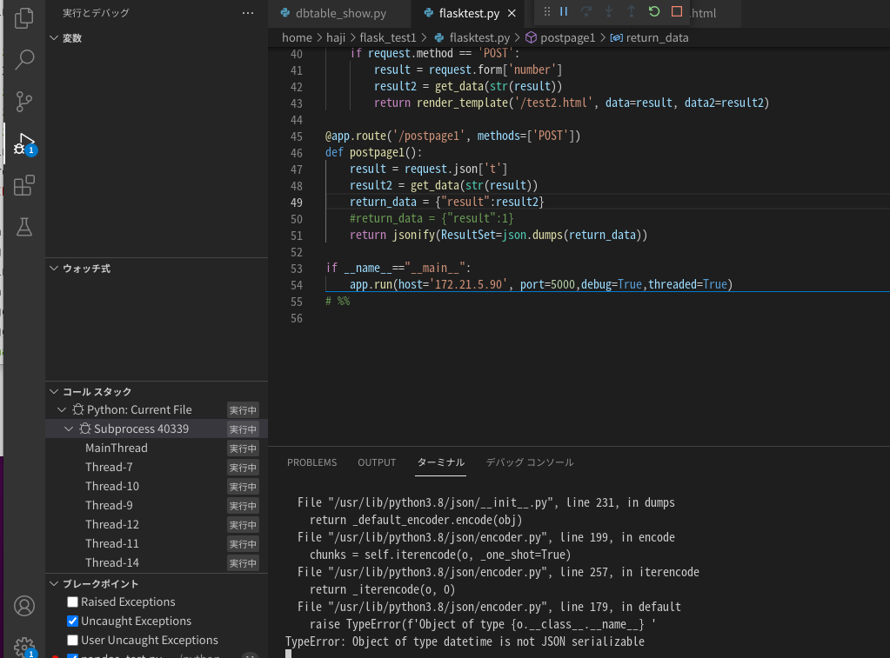

## ubuntuのflask設定方法9

### ajaxを利用したpost

ajaxとは「Asynchronous JavaScript + XML」の略です
ajaxを使用することで画面遷移をせずにHTMLを更新することが可能になり
使い手の操作性の向上等に役に立つようになりました。具体的に何ができるかですが
ページ遷移をさせずサーバーとやり取りができるようになります。
そのことをさっきのpostで実現しようと思います。

index.html

```html
<!DOCTYPE html>
<html>
  <head>
    <meta charset="utf-8">
    <script src="static/jquery.min.js"></script>
  </head>
  <body>
    <div id="main">
      <h1>{{ title }}</h1>
      <p>Welcome to {{ title }}</p>
      <a href="/test1">test1</a>   
      <p id="test">
          テストサイトです。<br>
          これから機能を追加していきます
      </p>
      <form action = "/test2" method = "POST"><!--211217追加-->
      <input type = "number" id="text" name = "number" />
      <input id="btn" type="button" value="ボタン1"/>
      <input id="btn2" type="button" value="ajax"/>
      <div id="data1"></div>
      <p><input type = "submit" value = "submit" /></p><!--211217追加-->
    </form><!--211217追加-->
    </div>
    <script>
    $('#btn').click(function() {
        console.log('クリックされました！');
        console.log($("#text").val());
        var textData = JSON.stringify({"t":$("#text").val()})
        console.log(textData);
        var result = JSON.parse(textData).t;
        console.log(result);
        $("#data1").html(result);
    })
    </script>
    <script>       
      $(document).ready(function(){
        $("#btn2").click(function() {
          var textData = JSON.stringify({"t":$("#text").val()});
          $.ajax({
            type:'POST',
            url:'/postpage1',
            data:textData,
            contentType:'application/json',
            success:function(data) {
              var result = JSON.parse(data.ResultSet).result;
               console.log(result);
              $("#data1").html(result);
            },
            error:function(data) {
              console.log("error");
          }
          });
          return false;
        });
});
  </script>
  </body>
</html>
```

$(document).ready(function(){}ですがhtmlが読まれたタイミングで{}内
の動作を実行してくださいという意味です。

次にボタンを押された時の動作ですが、まずtextDataに{"t":id=textの値}の
jsonオブジェクトを作ります。jsonオブジェクトで送り帰り値もjsonオブジェクト
でもらうようにします。データ送信先は/postpage1になります。

送信が成功したら、ResultSetという名前のjsonオブジェクト
からキーresultの値を取得しresultに代入します。

resultをコンソール画面とhtmlのid=data1部分に表示させます。

flasktest.py

```python
from flask import Flask, render_template, request,jsonify
import mysql.connector as mydb
import json

app = Flask(__name__)#flaskのインスタンス化

def get_data(x):
    # コネクションの作成
    conn = mydb.connect(
        host='127.0.0.1',
        port='3306',
        user='test',
        password='tkroyc123',
        database='test'
    )
    cur = conn.cursor()
    tablename='test'
    sql_1 = 'select time,val from '+tablename
    sql_2 = ' order by id desc limit %s'
    sql_3 = sql_1+sql_2
    data = (int(x),)
    cur.execute(sql_3,data)
    result_g = cur.fetchall()
    cur.close()
    conn.close()
    return result_g

@app.route('/')
def index():
    title="welcomsite"
    #return render_template('/index.html')
    return render_template('/index.html', title=title)

@app.route('/test2', methods=['POST'])
def test2():
    if request.method == 'POST':
        result = request.form['number']
        result2 = get_data(str(result))
        return render_template('/test2.html', data=result, data2=result2)

@app.route('/postpage1', methods=['POST'])
def postpage1():
    result = request.json['t']
    result2 = get_data(str(result))
    return_data = {"result":result2}
    return jsonify(ResultSet=json.dumps(return_data))

if __name__=="__main__":
    app.run(host='172.21.5.90', port=5000,debug=True,threaded=True)
```

ajaxを押す。


エラーが出ていた。



datetimeがjsonとしてserializeできないみたい。

```python
return jsonify(ResultSet=json.dumps(return_data,default=str))
```

上記の変更で出力された


### bokehを使う

```
pip3 install bokeh
```

```
import bokeh
bokeh.__version__
```


bokeh_test.py

```python
from bokeh.io import show
from bokeh.plotting import figure
import numpy as np

x = np.arange(11)
y = np.random.randint(100, size = 11)

bp = figure(plot_width=400, plot_height=400)

bp.line(x, y, line_width=2)

show(bp)
```


bokeh_test2.py

```python
from bokeh.io import show
from bokeh.plotting import figure

import numpy as np
import pandas as pd


d = {
    'a': [1, 2, 3],
    'b': [5, 6, 7],
}
data_b = pd.DataFrame(d)

bp = figure(plot_width=400, plot_height=400)

bp.line('a', 'b', source=data_b,line_width=2)

show(bp)
```

bokeh_test3.py

```python
from bokeh.io import show
from bokeh.plotting import figure
import datetime

import numpy as np
import pandas as pd

d1=datetime.datetime(2021,12,17,8,00,1)
d2=datetime.datetime(2021,12,17,8,00,2)
d3=datetime.datetime(2021,12,17,8,00,3)  

d = {
    'a': [d1, d2, d3],
    'b': [5, 6, 7],
}
data_b = pd.DataFrame(d)

bp = figure(plot_width=400, plot_height=400)

bp.line('a', 'b', source=data_b,line_width=2)

show(bp)
```

bokeh_test4.py

```python
#%%**
from bokeh.io import show
from bokeh.plotting import figure
from bokeh.models import DatetimeTickFormatter
from datetime import datetime as dt
import math
import pandas as pd

xlist=['2018-08-24 8:01:10', '2018-08-24 8:01:20', '2018-08-24 8:01:30']

ylist=[1,2,3]


# xlist,ylistを datetime型に変換
xlist = [dt.strptime(d, '%Y-%m-%d %H:%M:%S') for d in xlist]
#ylist = [dt.strptime(d, '%H:%M:%S') for d in ylist]

# データをプロット
p = figure(x_axis_type='datetime')
#p.line(xlist, ylist)

d = {
    'a':xlist,
    'b':ylist,
}
data_b = pd.DataFrame(d)
p.line('a', 'b', source=data_b)
# # X軸の設定
# x_format = "%Y-%m-%d %H:%M:%S"
# p.xaxis.formatter = DatetimeTickFormatter(
#     seconds=[x_format],
#     minutes=[x_format],
#     hours=[x_format],
#     days=[x_format],
#     months=[x_format],
#     years=[x_format]
# )

show(p)
```

10、20、30秒の変化は表せるが

1、2、3秒の変化は表せない？

なぜか4個以上なら表すことが可能だった？

```python
from bokeh.io import show
from bokeh.plotting import figure
from bokeh.models import DatetimeTickFormatter
import datetime
import math
import pandas as pd
from math import radians

#xlist=['2018-08-24 8:01:11', '2018-08-24 8:01:12', '2018-08-24 8:01:13','2018-08-24 8:01:14']
d1=datetime.datetime(2021,12,17,8,00,1)
d2=datetime.datetime(2021,12,17,8,00,2)
d3=datetime.datetime(2021,12,17,8,00,3) 
d4=datetime.datetime(2021,12,17,8,00,4) 
xlist=[d1,d2,d3,d4]
ylist=[1,2,3,4]


# xlist,ylistを datetime型に変換
#xlist = [datetime.datetime.strptime(d, '%Y-%m-%d %H:%M:%S') for d in xlist]
#ylist = [dt.strptime(d, '%H:%M:%S') for d in ylist]

# データをプロット
p = figure(x_axis_type='datetime')
#p.line(xlist, ylist)

d = {
    'a':xlist,
    'b':ylist,
}
data_b = pd.DataFrame(d)
p.line('a', 'b', source=data_b)
# X軸の設定
x_format = "%Y-%m-%d %H:%M:%S"
p.xaxis.formatter = DatetimeTickFormatter(
    seconds=[x_format],
    minutes=[x_format],
    hours=[x_format],
    days=[x_format],
    months=[x_format],
    years=[x_format]
)
p.xaxis.major_label_orientation=radians(90)
show(p)
```

ミリ秒まで対応できるようにプログラム変更

bokeh_test4.py

```python
from bokeh.io import show
from bokeh.plotting import figure
from bokeh.models import DatetimeTickFormatter
import datetime
import math
import pandas as pd
from math import radians


d1=datetime.datetime(2021,12,17,8,00,1,500000)
d2=datetime.datetime(2021,12,17,8,00,1,600000)
d3=datetime.datetime(2021,12,17,8,00,1,700000) 
d4=datetime.datetime(2021,12,17,8,00,2,800000) 
d5=datetime.datetime(2021,12,17,8,00,2,900000) 
xlist=[d1,d2,d3,d4,d5]
ylist=[1,2,3,4,5]

# データをプロット
p = figure(x_axis_type='datetime')
#p.line(xlist, ylist)

d = {
    'a':xlist,
    'b':ylist,
}
data_b = pd.DataFrame(d)
p.line('a', 'b', source=data_b)
# X軸の設定
x_format = "%Y-%m-%d %H:%M:%S.%f"
p.xaxis.formatter = DatetimeTickFormatter(
    milliseconds=[x_format],
    seconds=[x_format],
    minutes=[x_format],
    hours=[x_format],
    days=[x_format],
    months=[x_format],
    years=[x_format]
)
p.xaxis.major_label_orientation=radians(90)
show(p)
```


### flaskとbokehを使う

bokehをhtml上に表示するための準備


```html
<head>
    <meta charset="utf-8">
    <script src="static/jquery.min.js"></script>
    <link rel="stylesheet" href="../static/css/test.css" >
    <link rel="stylesheet" href="https://cdn.pydata.org/bokeh/release/bokeh-2.4.2.min.css" type="text/css" />
    <script type="text/javascript" src="https://cdn.pydata.org/bokeh/release/bokeh-2.4.2.min.js"></script>

    <title>{{ title }}</title>
  </head>
```

タグの部分にbokeh用のコードを６個追加して下さい。
なお、インターネットにつながっていない状態で実行したい場合は
flask js,ajaxについてで説明した時のようにすべてコピーして
特定の場所に保存して下さい。

staticに置くことが多いので、下記のように記載する

```html
<link rel="stylesheet" href="static/bokeh-0.13.0.min.css" type="text/css" />
```

今回のバージョンではなぜか拒否された


下記にもオフラインで使用する方法が記載されている

http://nopnop2002.webcrow.jp/flask_python/flask_python-23.html

from bokeh.util.string import encode_utf8

ここで怒られた。古いバージョンの書き方みたい

bokehのバージョンを変更してみる

```
pip3 uninstall bokeh
pip3 install bokeh==0.13.0
```

```
import bokeh
bokeh.__version__
```

```
https://cdn.pydata.org/bokeh/release/bokeh-0.13.0.min.css
これをbokeh-0.13.0.min.cssとして保存
https://cdn.pydata.org/bokeh/release/bokeh-0.13.0.min.js
bokeh-0.13.0.min.jsとして保存
```

https://nao-y.hatenablog.com/entry/2018/07/16/110554

こちらを参考

サーバプログラム

bokeh_flask.py

```python
from bokeh.plotting import figure
from bokeh.embed import components
from bokeh.models import DatetimeTickFormatter
from math import radians
import datetime
import pandas as pd

from flask import Flask, render_template

app = Flask(__name__)

def get_line_graph():

    #second Plot
    d1=datetime.datetime(2021,12,17,8,00,1,500000)
    d2=datetime.datetime(2021,12,17,8,00,1,600000)
    d3=datetime.datetime(2021,12,17,8,00,1,700000) 
    d4=datetime.datetime(2021,12,17,8,00,2,800000) 
    d5=datetime.datetime(2021,12,17,8,00,2,900000) 
    xlist=[d1,d2,d3,d4,d5]
    ylist=[1,2,3,4,5]

    # データをプロット
    p = figure(x_axis_type='datetime')
    #p.line(xlist, ylist)

    d = {
        'a':xlist,
        'b':ylist,
    }
    data_b = pd.DataFrame(d)
    p.line('a', 'b', source=data_b)
    # X軸の設定
    x_format = "%Y-%m-%d %H:%M:%S.%f"
    p.xaxis.formatter = DatetimeTickFormatter(
        milliseconds=[x_format],
        seconds=[x_format],
        minutes=[x_format],
        hours=[x_format],
        days=[x_format],
        months=[x_format],
        years=[x_format]
    )
    p.xaxis.major_label_orientation=radians(90)
    return p

@app.route('/')
def index():
    line = get_line_graph()
    script, div = components(line)
    return render_template('bokeh_flask.html', script=script, div=div)

if __name__ == "__main__":
   app.run(host='172.21.5.90', port=5000, debug=True,threaded=True)
```

bokeh_flask.html

```html
<!doctype html>
<html lang="en">
  <head>
    <title>Flask Bokeh Sample</title>
    <link rel="stylesheet" href="static/bokeh-0.13.0.min.css" type="text/css" />
    <script type="text/javascript" src="static/bokeh-0.13.0.min.js"></script>
  </head>
  <body>
    <h1>Hello, Bokeh</h1>
    {{ script|safe }}
    {{ div|safe }}
</body>
</html>
```


### flaskとbokehとajaxを使う

#### サーバー側のコード

flasktest.pyを変更

```python
from flask import Flask, render_template, request,jsonify
import mysql.connector as mydb
import json

from bokeh.plotting import figure
from bokeh.embed import components
from bokeh.models import DatetimeTickFormatter
from math import radians
import datetime
import pandas as pd

app = Flask(__name__)#flaskのインスタンス化

def get_data(x):
    # コネクションの作成
    conn = mydb.connect(
        host='127.0.0.1',
        port='3306',
        user='test',
        password='tkroyc123',
        database='test'
    )
    cur = conn.cursor()
    tablename='test'
    sql_1 = 'select time,val from '+tablename
    sql_2 = ' order by id desc limit %s'
    sql_3 = sql_1+sql_2
    data = (int(x),)
    cur.execute(sql_3,data)
    result_g = cur.fetchall()
    cur.close()
    conn.close()
    return result_g

def get_graph(x):
    conn = mydb.connect(
        host='127.0.0.1',
        port='3306',
        user='test',
        password='tkroyc123',
        database='test'
    )
    cur = conn.cursor()
    tablename='test'
    sql_1 = 'select time,val from '+tablename
    sql_2 = ' order by id desc limit %s'
    sql_3 = sql_1+sql_2
    data = (int(x),)
    cur.execute(sql_3,data)
    result_g = cur.fetchall()
    cur.close()
    conn.close()
    
    boxpd = pd.DataFrame(result_g)
    p = figure(x_axis_type='datetime')
    # X軸の設定
    x_format = "%Y-%m-%d %H:%M:%S.%f"
    p.xaxis.formatter = DatetimeTickFormatter(
        milliseconds=[x_format],
        seconds=[x_format],
        minutes=[x_format],
        hours=[x_format],
        days=[x_format],
        months=[x_format],
        years=[x_format]
    )
    p.xaxis.major_label_orientation=radians(90)
    p.line('0', '1', source=boxpd)
    return p

@app.route('/')
def index():
    title="welcomsite"
    #return render_template('/index.html')
    return render_template('/index.html', title=title)

@app.route('/test2', methods=['POST'])
def test2():
    if request.method == 'POST':
        result = request.form['number']
        result2 = get_data(str(result))
        return render_template('/test2.html', data=result, data2=result2)

@app.route('/postpage1', methods=['POST'])
def postpage1():
    result = request.json['t']
    result2 = get_data(str(result))
    return_data = {"result":result2}
    #return_data = {"result":1}
    return jsonify(ResultSet=json.dumps(return_data,default=str))

@app.route('/postpage2', methods=['POST'])
def postpage2():
    result = request.json['t']
    plot = get_graph(str(result))
    script, div = components(plot)
    return_data = {"result2":script,
                    "result3":div,
                    }
    return jsonify(ResultSet=json.dumps(return_data))

if __name__=="__main__":
    app.run(host='172.21.5.90', port=5000,debug=True,threaded=True)
```

index.htmlを変更

```html
<!DOCTYPE html>
<html>
  <head>
    <meta charset="utf-8">
    <script src="static/jquery.min.js"></script>
    <link rel="stylesheet" href="static/bokeh-0.13.0.min.css" type="text/css" />
    <script type="text/javascript" src="static/bokeh-0.13.0.min.js"></script>
  </head>
  <body>
    <div id="main">
      <h1>{{ title }}</h1>
      <p>Welcome to {{ title }}</p>
      <a href="/test1">test1</a>   
      <p id="test">
          テストサイトです。<br>
          これから機能を追加していきます
      </p>
      <form action = "/test2" method = "POST"><!--211217追加-->
      <input type = "number" id="text" name = "number" />
      <input id="btn" type="button" value="ボタン1"/>
      <input id="btn2" type="button" value="ajax"/>
      <input id="btn2" type="button" value="ajax"/>
      <input id="btn3" type="button" value="ajax_graph"/>
      <div id="data1"></div>
      <div id="data2"></div>
      <div id="data3"></div>
      <p><input type = "submit" value = "submit" /></p><!--211217追加-->
    </form><!--211217追加-->
    </div>
    <script>
    $('#btn').click(function() {
        console.log('クリックされました！');
        console.log($("#text").val());
        var textData = JSON.stringify({"t":$("#text").val()})
        console.log(textData);
        var result = JSON.parse(textData).t;
        console.log(result);
        $("#data1").html(result);
    })
    </script>
    <script>       
      $(document).ready(function(){
        $("#btn2").click(function() {
          var textData = JSON.stringify({"t":$("#text").val()});
          $.ajax({
            type:'POST',
            url:'/postpage1',
            data:textData,
            contentType:'application/json',
            success:function(data) {
              var result = JSON.parse(data.ResultSet).result;
               console.log(result);
              $("#data1").html(result);
            },
            error:function(data) {
              console.log("error");
          }
          });
          return false;
        });
});
  </script>
  <script>       
        $(document).ready(function(){
          $("#btn3").click(function() {
            var textData = JSON.stringify({"t":$("#text").val()});
            $.ajax({
              type:'POST',
              url:'/postpage2',
              data:textData,
              contentType:'application/json',
              success:function(data) {
                var result2 = JSON.parse(data.ResultSet).result2;
                var result3 = JSON.parse(data.ResultSet).result3;
                $("#data2").html(result2);
                $("#data3").html(result3);
              }
            });
            return false;
          });
  });
           </script>
  </body>
</html>
```

エラーが出ているので原因をさぐる


dbは大丈夫？


順番がひっくり帰っていた

dbの部分を少し変更

```python
from flask import Flask, render_template, request,jsonify
import mysql.connector as mydb
import json

from bokeh.plotting import figure
from bokeh.embed import components
from bokeh.models import DatetimeTickFormatter
from math import radians
import datetime
import pandas as pd

app = Flask(__name__)#flaskのインスタンス化

def get_data(x):
    # コネクションの作成
    conn = mydb.connect(
        host='127.0.0.1',
        port='3306',
        user='test',
        password='tkroyc123',
        database='test'
    )
    cur = conn.cursor()
    tablename='test'
    sql_1 = 'select time,val from '+tablename
    sql_2 = ' order by id desc limit %s'
    sql_3 = sql_1+sql_2
    data = (int(x),)
    cur.execute(sql_3,data)
    result_g = cur.fetchall()
    cur.close()
    conn.close()
    return result_g

def get_graph(x):
    conn = mydb.connect(
        host='127.0.0.1',
        port='3306',
        user='test',
        password='tkroyc123',
        database='test'
    )
    cur = conn.cursor()
    tablename='test'
    sql_1 = 'select time,val from '+tablename
    sql_2 = ' order by id desc limit %s'
    sql_3 = sql_1+sql_2
    data = (int(x),)
    cur.execute(sql_3,data)
    result_g = cur.fetchall()
    cur.close()
    conn.close()
    
    boxpd = pd.DataFrame(result_g)
    boxpd_x = boxpd[0].sort_index(ascending=False)
    boxpd_y1 = boxpd[1].sort_index(ascending=False)
    print(boxpd)
    p = figure(x_axis_type='datetime')
    # X軸の設定
    x_format = "%Y-%m-%d %H:%M:%S.%f"
    p.xaxis.formatter = DatetimeTickFormatter(
        milliseconds=[x_format],
        seconds=[x_format],
        minutes=[x_format],
        hours=[x_format],
        days=[x_format],
        months=[x_format],
        years=[x_format]
    )
    p.xaxis.major_label_orientation=radians(90)
    p.line(boxpd_x,boxpd_y1)
    return p

@app.route('/')
def index():
    title="welcomsite"
    #return render_template('/index.html')
    return render_template('/index.html', title=title)

@app.route('/test2', methods=['POST'])
def test2():
    if request.method == 'POST':
        result = request.form['number']
        result2 = get_data(str(result))
        return render_template('/test2.html', data=result, data2=result2)

@app.route('/postpage1', methods=['POST'])
def postpage1():
    result = request.json['t']
    result2 = get_data(str(result))
    return_data = {"result":result2}
    #return_data = {"result":1}
    return jsonify(ResultSet=json.dumps(return_data,default=str))

@app.route('/postpage2', methods=['POST'])
def postpage2():
    result = request.json['t']
    plot = get_graph(str(result))
    script, div = components(plot)
    return_data = {"result2":script,
                    "result3":div,
                    }
    return jsonify(ResultSet=json.dumps(return_data))

if __name__=="__main__":
    app.run(host='172.21.5.90', port=5000,debug=True,threaded=True)
```


成功した。


