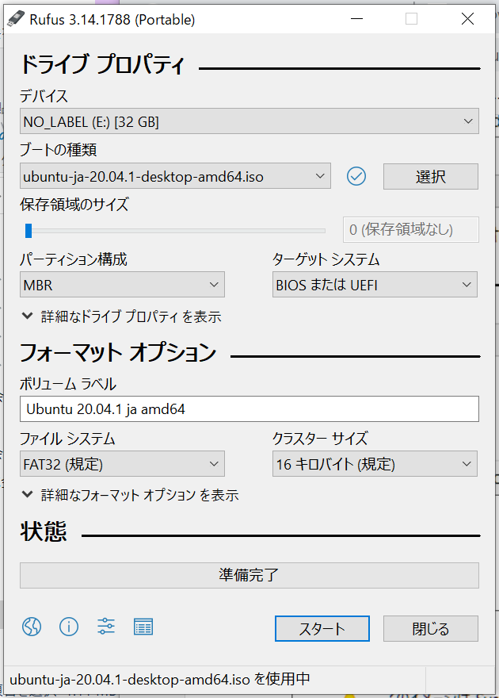

### ubuntuの設定方法

ubuntuのダウンロード


Rufusダウンロード　ポータブル版を使います



ISO書き込み


はいを選択


ブートusb作成できた。


ubuntuをインストールしたいPCにブートusbをさしてubuntuをインストールする

```
sudo apt update
sudo apt upgrade
sudo apt install net-tools
sudo apt install xrdp
pkill gnome-session
sudo apt install gparted
lsblk

#以下は試さない
sudo apt install fonts-takao-pgothic#しないほうが良さそう
sudo apt install --reinstall gnome-control-center
export XDG_CURRENT_DESKTOP=GNOME
sudo apt-get install gnome-panel
sudo apt-get update sudo apt-get install --reinstall gnome-control-center
sudo apt install -y gnome-tweak-tool

```

バックアップ用のイメージを作成する方法

